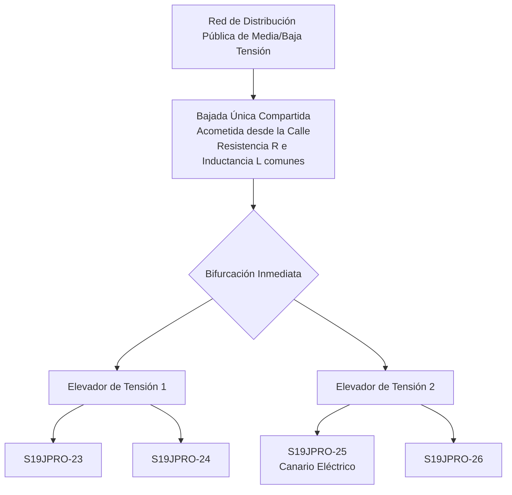
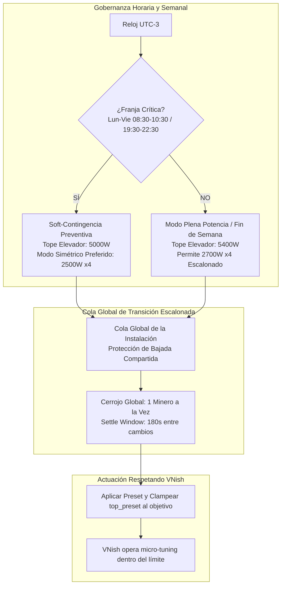

# PROP-012: Gobernanza Escalonada de Elevadores, Bajada Compartida y Soft-Contingencia Horaria

- **Fecha de Creación**: 2026-09-18 18:50 hs
- **Última Actualización**: 2026-09-18 19:10 hs
- **Autor**: Antigravity Engineering & Operador de Planta
- **Estado**: Propuesta Técnica y Diseño Arquitectónico Consensuado (Spec 077)
- **Alcance**: `app/governance/elevator_budget.py`, `app/governance/preset_balancer.py`, `app/governance/adaptive_contingency.py`, `app/miner_monitor.py`, `app/config.json`.
- **Relación**: Evolución directa de PROP-009 (Spec 074) y PROP-010 (Spec 075).

---

## 1. Contexto Físico de la Instalación y Revelaciones Eléctricas

La instalación posee una arquitectura eléctrica específica que determina de forma estricta su dinámica operativa:



### Factores Físicos Determinantes:
1. **La Bajada Compartida (*Shared Service Drop*)**:
   - Los dos elevadores son transformadores independientes pero **comparten la misma bajada de cable desde la calle**, bifurcándose justo antes de ingresar a los elevadores.
   - La corriente total $I_{total} = I_{el1} + I_{el2}$ circula por el mismo conductor de acometida.
   - A plena potencia (4x 2700W = 10.8 kW), circulan aproximadamente **50 Amperes continuos**:
     - **Caída de Tensión Común**: $\Delta V = I_{total} \times Z_{bajada}$. Una variación brusca en un elevador altera el voltaje de entrada en el otro.
     - **Efecto Térmico Joule ($I^2 R$)**: Bajo alta demanda, los cables de acometida elevan su temperatura, aumentando su resistividad ($\approx +12\%$ con $\Delta T = 30^\circ\text{C}$), lo que profundiza la caída de tensión.
     - **Inductancia Transitoria ($L \frac{di}{dt}$)**: Si dos mineros cambian de potencia o arrancan a la vez en cualquier punto de la instalación, la variación de corriente induce caídas de tensión que perturban a toda la flota.
2. **Prioridad del Balance Simétrico (2x 2500W vs 2700W + 2300W)**:
   - La potencia consumida es la misma ($5000\text{W}$ por elevador), pero **la salud del silicio y la eficiencia térmica son ampliamente superiores con dos mineros a 2500W**:
     - A 2500W: Chips a 68-72°C, ventiladores descansados al 70%, eficiencia óptima (~27.2 J/TH). Margen de seguridad amplio ante fluctuaciones.
     - Con 2700W + 2300W: El minero a 2700W trabaja al límite térmico extremo (chips a 80°C, ventiladores al 100%), vulnerable a desincronizaciones ante cualquier micro-variación.
   - **Regla de Oro**: Siempre preferir **equilibrio simétrico pareado (2500W + 2500W)** antes que asimetrías forzadas (2700W + 2300W).
3. **El Modo 2700W x4 es Posible en Condiciones Óptimas**:
   - No se debe prohibir el modo 2700W x4 de por vida. En ventanas de red estable (fines de semana, noches frías, siestas), la instalación tolera los 10.8 kW si la red externa acompaña y las transiciones se realizan escalonadas.
4. **Coexistencia Inteligente con VNish**:
   - VNish cuenta con años de desarrollo y un motor micro-térmico por chip y por placa excelente.
   - El monitor no combate a VNish ni anula su auto-tuning: **el monitor aporta el macro-contexto que VNish no tiene** (la bajada de cable, el límite del elevador, el reloj de la red provincial y el balance del compañero). Dentro del límite seguro fijado por el monitor (`top_preset`), VNish optimiza el silicio con total libertad.

---

## 2. Evidencia Empírica de la Base de Datos (`miner_alerts.db`)

El análisis de 30 minutos por intervalo en días hábiles (Lunes a Viernes) delimita las ventanas con precisión quirúrgica:

### Ventanas Críticas de la Red (Soft-Contingencia):
- **Pico Mañana**: **08:30 a 10:30 hs** (Pico de 29 reinicios entre 08:30 y 10:00 hs). Se normaliza rápidamente a las 10:30 hs.
- **Pico Tarde/Noche**: **19:30 a 22:30 hs** (Pico continuo con 55 reinicios acumulados; máximo a las 20:00 y 21:30 hs).
- **Duración Total de la Soft-Contingencia**: Solo **5 horas al día** en días hábiles (2h a la mañana y 3h a la noche). Las 19 horas restantes quedan libres para máxima potencia.

### Ventanas Libres de Máxima Potencia (Valle):
- **Madrugada**: 23:00 a 08:00 hs (apenas 2 a 4 reinicios promedio).
- **Siesta**: 12:30 a 15:00 hs y 17:00 a 19:00 hs (1 a 2 reinicios).
- **Fines de Semana Completos**: Sábados (24 reinicios en todo el día, 50% menos) y Domingos libres de Soft-Contingencia.

---

## 3. Los 4 Pilares Arquitectónicos de Spec 077



### Pilar 1: Presupuesto de Potencia y Preferencia Simétrica
- **Prioridad de Balance**: Dos mineros a 2500W tienen prioridad absoluta sobre 2700W + 2300W.
- **Modo Pico (Soft-Contingencia)**: Techo máximo por elevador en **5000W** (2500W + 2500W).
- **Modo Valle / Fin de Semana**: Techo máximo por elevador extendido a **5400W** (permitiendo escalar a 2700W x4 de forma gradual y monitoreada).

### Pilar 2: Cola Global de Transición Escalonada (*Facility-Wide Staggered Queue*)
- Debido a que ambos elevadores **comparten la misma bajada de cable**:
  - **Solo 1 minero en TODA la instalación puede transicionar de potencia a la vez**.
  - Se impone una **ventana de estabilización de 180 segundos (*Facility Settle Window*)** tras el cambio de cualquier minero.
  - Esto da tiempo a que la corriente en el cable de acometida se asiente, los conductores no sufran picos térmicos ni caídas inductivas $L \frac{di}{dt}$, y los servomotores/bobinas de los elevadores regulen el voltaje en régimen permanente antes de que el siguiente minero cambie.

### Pilar 3: Soft-Contingencia Quirúrgica por Horario y Día
- Horarios exactos y configurables en `config.json`:
  ```json
  "soft_contingency": {
    "enabled": true,
    "weekdays_only": true,
    "windows": [
      {"start": "08:30", "end": "10:30", "target_preset": "2500W"},
      {"start": "19:30", "end": "22:30", "target_preset": "2500W"}
    ],
    "settle_window_seconds": 180.0
  }
  ```
- **Transición suave**: Al entrar en la franja, los mineros que estén por encima de 2500W bajan a 2500W uno por uno con 180s de intervalo.
- **Métricas de Éxito**: Se audita si ocurren reinicios durante las franjas. Si se producen reinicios antes o después, el sistema provee telemetría para ajustar minutos hacia adelante o hacia atrás.

### Pilar 4: Co-Gobernanza con VNish (Macro-Infraestructura + Micro-Silicio)
- El supervisor determina la envolvente macro: `preset = X`, `top_preset = X`.
- VNish recibe la orden y gestiona su algoritmo interno: regulación por chip, modulación por sensores y balance térmico individual.
- Tomamos la madurez de VNish y le sumamos la inteligencia del entorno eléctrico que solo el supervisor posee.
