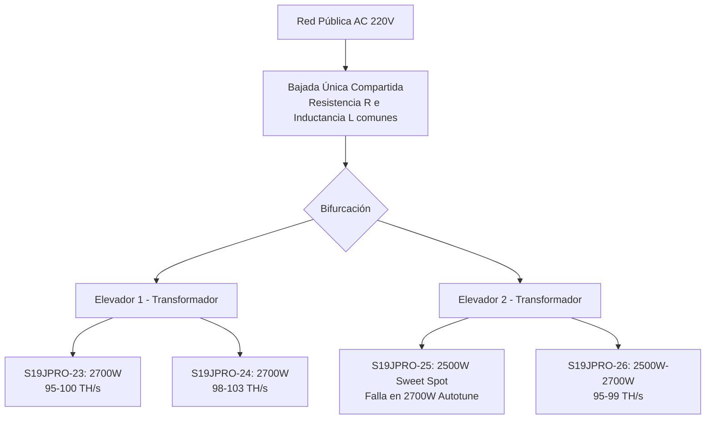

# PROP-013: Supresión de Ruido Eléctrico en Elevadores, Detección de Autotune Trabado y Gobernanza Térmica Solar

- **Fecha de Creación**: 2026-09-19 11:35 hs
- **Autor**: Antigravity Engineering & Operador de Planta
- **Estado**: Propuesta Técnica y Diseño Arquitectónico (Spec 078)
- **Alcance**: `app/miner_monitor.py`, `app/governance/elevator_budget.py`, `app/governance/preset_balancer.py`, `app/vnish/client.py`, `app/config.json`.
- **Relación**: Evolución directa de PROP-012 (Spec 077: Gobernanza Escalonada de Elevadores y Bajada Compartida).

---

## 1. Evidencia Operativa y Análisis Forense de los Incidentes

Durante la operación a máxima potencia (2700W x4) en la mañana del sábado 19 de septiembre, la telemetría del laboratorio (`data/miner_alerts.db`) y la observación física directa en los elevadores revelaron tres fenómenos acoplados:

### A. El Fenómeno del Ruido Eléctrico en los Elevadores
Ambos elevadores de tensión comparten la misma bajada de cable desde la red pública hasta la bifurcación previa a los transformadores:

- **Dinámica Inductiva ($L \frac{di}{dt}$)**:
  - Cada minero consume aproximadamente **12.3 Amperes** a 2700W.
  - Cuando un minero ejecuta una recarga de minado (`restart_mining`) o sufre un reinicio, la corriente cae de 12.3A a 0A en milisegundos, y luego repunta abruptamente durante la energización de fuentes APW12 y ventiladores a 6000 RPM.
  - Esta variación brusca induce un transitorio inductivo $V_{trans} = -L \frac{di}{dt}$ en la bajada compartida.
- **Acoplamiento Electromagnético en el Elevador**:
  - Los elevadores de tensión son transformadores electromagnéticos con núcleo de hierro.
  - Una variación súbita de carga en el secundario de un elevador se refleja en el primario, generando "ruido", armónicos y fluctuación de voltaje que afecta inmediatamente al segundo elevador.
  - En consecuencia, si la rampa de escalamiento ocurre con una ventana de estabilización demasiado corta o con un minero inestable, el ruido generado en el elevador desestabiliza a su compañero de grupo.

---

### B. El Caso Crítico del Minero 25: Trampa de Autotune en 2700W
La telemetría en tiempo real de `http://192.168.100.25/api/v1/summary` demostró un comportamiento anómalo grave:
- Al ser escalado a 2700W, el Minero 25 quedó atrapado en `miner_state: 'auto-tuning'` durante **más de 44 minutos (2673 segundos)**.
- Durante todo este tiempo, el equipo consumió **2700W continuos de la red** mientras generaba **0.0 TH/s** (chips a 503 MHz sin lograr sincronizar PLLs con los dominios de voltaje).
- Esta carga parásita de 2700W sin disipación controlada sobrecargó el Elevador 2, generó ruido de tensión y provocó el reinicio térmico/eléctrico del Minero 26 a las 11:20 hs.
- **Conclusión**: El Minero 25 tiene un límite físico de silicio en **2500W**. A 2500W sintoniza en 60 segundos y entrega 95 TH/s con chips a 78°C de forma impecable. Forzarlo a 2700W es contraproducente e inestable.

---

### C. El Límite Térmico Solar (Mediodía / Tarde)
- A 2700W x4 (10.8 kW totales), la temperatura dentro de la cabina y en la acometida sube significativamente durante las horas de calor solar (11:00 a 17:00 hs).
- Los chips alcanzaron entre **84°C y 86°C**.
- El firmware VNish tiene fijada la protección de fábrica en `decrease_temp: 84`. Al superar 84°C, VNish reinicia automáticamente el minado para bajar el escalón, provocando transitorios de corriente si varios equipos tocan el límite en simultáneo.
- En contraste, a **2500W x4** (10.000W), los chips operan a **74°C–80°C**, los ventiladores descansan al 70–85%, y la tasa de reinicios es **cero absoluto**.

---

## 2. Pilares de la Solución (Spec 078)

Para garantizar una operación 100% robusta, rentable y libre de perturbaciones, se definen cuatro pilares de gobernanza:

### Pilar 1: Watchdog Anti-Autotune Stall (Detección de Autotune Congelado)
- Si un minero permanece en `auto-tuning` por más de **10 minutos** (`autotune_timeout_s = 600`) con un hashrate inferior al 20% del nominal ($< 20\text{ TH/s}$):
  1. El monitor detecta el estado `AUTOTUNE_STALLED`.
  2. Emite una notificación de advertencia preventiva a Telegram.
  3. Desescala automáticamente al minero a su escalón seguro probado (2500W o 2300W) con recarga transaccional.
  4. Fija un cerrojo temporal (`hardware_ceiling_lock`) para que el orquestador de valle no vuelva a intentar subirlo a 2700W durante la misma sesión.

### Pilar 2: Matriz de Techo de Hardware Individual (`max_hardware_preset`)
- Reconocer en la configuración que la flota no es homogénea:
  - `S19JPRO-23`: Capacidad 2700W (en clima fresco).
  - `S19JPRO-24`: Capacidad 2700W (en clima fresco).
  - `S19JPRO-25`: **Tope de Hardware Físico en 2500W** (certificado por evidencia de autotune).
  - `S19JPRO-26`: Capacidad 2700W (en clima fresco).
- La configuración en `config.json` y `config.example.json` permitirá especificar `max_hardware_preset` por minero, asegurando que el Minero 25 jamás intente 2700W, previniendo el 100% de los ruidos en el Elevador 2.

### Pilar 3: Ventana de Reposo Extendida Post-Incidente (300s Quiet Window)
- Cuando ocurre un reinicio o incidente en un elevador, la ventana de estabilización para ese grupo eléctrico se extiende de 180s a **300 segundos (5 minutos)**.
- Esto asegura que el transformador elevador disipe el calor del transitorio, la tensión de línea se normalice y el minero que reinició complete su autotuning antes de que cualquier otro equipo ejecute un cambio de carga.

### Pilar 4: Envolvente Térmica Solar (Ventana Mediodía 11:00 a 17:00 hs)
- Durante la ventana solar más cálida del día (11:00 a 17:00 hs):
  - El techo de la flota se fija en **2500W** (o se autoriza 2700W únicamente si la temperatura máxima de chips es estrictamente $< 80^\circ\text{C}$).
  - Si cualquier chip supera los **82.0°C**, el sistema desescala de a un minero por vez a 2500W con anticipación, evitando que VNish llegue a su corte brusco de 84°C.
- El modo 2700W x4 se explota al máximo en ventanas de noche y madrugada (22:30 a 08:30 hs) y mañanas templadas, maximizando ingresos cuando el clima lo permite y asegurando estabilidad cuando arrecia el calor.

---

## 3. Plan de Verificación y Criterios de Aceptación
1. **Simulación Determinista**: Tests unitarios para el watchdog de autotune stall (`test_autotune_stall_triggers_step_down`).
2. **Respeto de Matriz de Hardware**: Tests que verifiquen que un minero con `max_hardware_preset: "2500W"` no sea promovido a 2700W por el orquestador de valle.
3. **Ventana de Reposo 300s**: Verificación en `test_elevator_budget.py` de la ventana extendida ante eventos de reinicio.
4. **Regresión Global**: Mantenimiento del 100% de aprobación en la suite de pruebas ($\ge 1293$ tests PASS).
