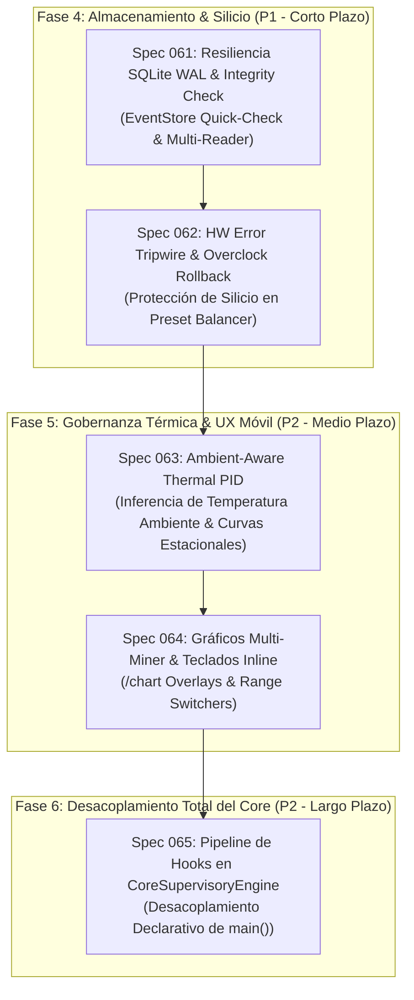

# 🚀 PLAN DE ACCIÓN POST-V5.0: RESILIENCIA, PROTECCIÓN DE SILICIO Y OBSERVABILIDAD AVANZADA (SPECS 061 A 065)

**Proyecto**: Miner Alerts Monitor
**Fecha**: 15 de Septiembre de 2026
**Línea Base**: Release V5.0 Arquitectura y Modularización Completa (935 tests PASS, Servicio Windows `MinerAlerts` activo, modularidad en `app/core/`, `app/network/`, `app/telegram/`, `app/governance/`)
**Objetivo**: Planificar la siguiente fase de desarrollo para blindar el almacenamiento contra fallos de alimentación, proteger el silicio contra degradación por errores de hardware, adaptar la refrigeración a la temperatura ambiente estacional, enriquecer la visualización gráfica en Telegram y completar la migración hacia hooks declarativos en el motor central.

> **[AUDITADO — Claude Sonnet 4.6 Thinking, 2026-09-15]**: Se incorporaron correcciones arquitectónicas a los cinco specs. Ver notas `⚠️ CORRECCIÓN` inline.

---

## 🗺️ 1. MAPA DE DEPENDENCIAS Y SECUENCIA DE IMPLEMENTACIÓN

---

## 📋 2. ESPECIFICACIÓN DETALLADA DE LAS INICIATIVAS

### Spec 061: Resiliencia de Almacenamiento SQLite WAL Mode & Integridad ante Apagones (ST-03)

* **Prioridad**: P1 (Alta) | **Riesgo**: Bajo | **Módulos**: `app/core/event_store.py`, `tools/event_store_backup.py`
* **Contexto y Problema**:
  - `EventStore` ya cuenta con `PRAGMA journal_mode=WAL` y `PRAGMA synchronous=NORMAL`. Sin embargo, tras cortes abruptos de suministro eléctrico (apagones en el galpón), no existe un chequeo de integridad estructural al arrancar.
  - Si una página se corrompe por fallo en sectores de disco o caída de energía intempestiva, el proceso entra en bucle de excepciones SQLite o bloquea las transacciones.
  - Adicionalmente, herramientas externas (como `tools/operations_dashboard.py` y `tools/metrics_exporter.py`) abren la misma base de datos sin un pool de solo lectura dedicado, pudiendo causar contención con las escrituras del monitor.
* **Componentes a Implementar**:
  1. **Quick-Check y Auto-Sanación en Arranque (ASÍNCRONO)**:
     - ⚠️ **CORRECCIÓN**: `PRAGMA quick_check` NO debe ejecutarse en `_initialize()` de forma sincrónica. En una DB de 90 días de telemetría (decenas de MB), puede tardar 100-500ms y retrasar el log de startup en Telegram.
     - Implementación correcta: lanzar un hilo daemon `_integrity_check_worker` desde `_initialize()`. Si `quick_check` devuelve algo distinto de `"ok"`, el worker atomicamente renombra el archivo corrupto a `data/miner_alerts_corrupt_<epoch>.db`, crea una nueva DB limpia con esquema v7, activa `self._integrity_failed = True` y emite alerta crítica. El monitor continúa operando en modo degradado (sin EventStore) durante la recuperación.
  2. **Gestión Determinista de Checkpointing en NTFS Windows**:
     - En el ciclo de mantenimiento horario: `PRAGMA wal_checkpoint(PASSIVE)` para reducción incremental del WAL sin bloquear lectores.
     - ⚠️ **CORRECCIÓN**: Agregar `PRAGMA wal_checkpoint(TRUNCATE)` en el ciclo de mantenimiento diario (ej. entre 03:00 y 05:00 según `scheduled_maintenance`), fuera de horas punta. En Windows NTFS, el checkpoint PASSIVE deja el WAL intacto si hay lectores activos (Grafana, exporters). El TRUNCATE libera el espacio en disco. Complementar con `PRAGMA max_page_count=262144` (límite blando de ~1GB) para prevenir crecimiento ilimitado.
  3. **Pool de Lectura Desacoplado con Manejo de `SQLITE_BUSY_SNAPSHOT`**:
     - Exponer `create_readonly_connection(db_path)` con `mode=ro` y `busy_timeout=3000` para Grafana, exporters y dashboards.
     - ⚠️ **CORRECCIÓN**: Documentar en el pool de lectura que bajo escritura concurrente + TRUNCATE checkpoint, SQLite puede devolver `SQLITE_BUSY_SNAPSHOT` (código 5). El pool de lectura debe implementar reintentos con backoff exponencial (máx 3 reintentos, 100ms/200ms/400ms) antes de propagar el error.
* **Pruebas y Validación Requeridas**:
  - Inyección de bytes corruptos en archivo SQLite de prueba y verificación de la auto-recuperación sin crash del monitor.
  - Test de concurrencia multi-lector bajo escritura continua (10 hilos simultáneos).
  - ⚠️ **NUEVO**: Test de `SQLITE_BUSY_SNAPSHOT` bajo checkpoint TRUNCATE concurrente con lectores activos.
  - Test de verificación de que `quick_check` asíncrono no bloquea el startup guard de 10 minutos.

---

### Spec 062: HW Error Tripwire & Rollback Automático de Overclock (GOV-01)

* **Prioridad**: P1/P2 (Alta/Media) | **Riesgo**: Medio | **Módulos**: `app/governance/preset_balancer.py`, `app/miner_monitor.py`
* **Contexto y Problema**:
  - Cuando el balanceador dinámico (Spec 040) eleva un minero a 2500W o 2700W, pequeñas variaciones de calidad de silicio, degradación de pasta térmica o caídas de tensión provocan *Hardware Errors* en CGMiner.
  - El equipo continúa consumiendo la máxima potencia eléctrica pero genera shares inválidos, degradando el hashrate efectivo y estresando innecesariamente el silicio.
* **Componentes a Implementar**:
  1. **Métrica de Errores de Hardware en `StabilityMetrics`**:
     - Añadir `hw_errors_delta_10m` y `hw_error_rate_pct` a las métricas evaluadas por `PresetBalancer`.
     - ⚠️ **CORRECCIÓN**: El delta NO debe calcularse en memoria (se pierde en reboot). Calcularlo comparando el último `hw_errors_total` del sample T contra el sample T-10m del `EventStore` (tabla `telemetry_samples`). Esto garantiza precisión post-reboot.
  2. **Regla de Disparo de Tripwire**:
     - ⚠️ **CORRECCIÓN DE THRESHOLD**: Para la escala S19j Pro (~90 TH/s), 50 HW errors en 10 minutos representa 0.000003% de tasa — **demasiado sensible, genera falsos positivos** durante el período de estabilización post-reboot. Umbral correcto: `hw_error_rate_pct > 0.5% AND hw_errors_delta_10m >= 200` (AND lógico, no OR). O bien, solo `hw_error_rate_pct > 0.5%` sin umbral absoluto.
     - Si el tripwire se dispara:
       - Acción: `ACTION_STEP_DOWN_HW_ERRORS`.
       - Desescalar inmediatamente 1 peldaño del preset ladder.
       - Fijar `hw_error_lock_until_ts = now + 48h` y `hw_error_locked_preset = target_preset` en `MinerState`, persistidos en `state.json`.
  3. **Interlocking Anti-Cascada (NUEVO — CRÍTICO)**:
     - ⚠️ **CORRECCIÓN**: El plan original no resuelve el bucle de cascada adversarial: Tripwire reduce preset → hashrate cae bajo `threshold_ths` → auto-reboot L2 → post-reboot el firmware restaura preset al default (2700W) → tripwire se anula → silicio se vuelve a estresar.
     - **Solución**: `hw_error_lock_until_ts` y `hw_error_locked_preset` deben persistir en `state.json`. Tras un reboot (L1 o L2), si `hw_error_lock_until_ts > now`, el bloque de inicialización de `MinerState` debe restaurar el preset al `hw_error_locked_preset` en lugar del default del firmware. Agregar este check a la lógica post-reboot en `miner_monitor.py`.
     - El auto-reboot L2 NO debe ser bloqueado por el tripwire — si el miner entra en `STATE_LOW` o `STATE_HASHBOARD`, el reboot procede normalmente. El tripwire sólo regula la potencia, no la decisión de reboot.
  4. **Notificación Telegram**:
     - Si el tripwire actúa, enviar tarjeta Mobile-First con advertencia de silicio inestable y motivo de protección.
* **Pruebas y Validación Requeridas**:
  - Simulación de ráfagas de HW errors con verificación de desescalado y respeto estricto del candado de 48 horas.
  - ⚠️ **NUEVO**: Test del ciclo completo adversarial: Tripwire activa → hashrate bajo → reboot L2 → restauración de preset desde `hw_error_locked_preset` en estado post-reboot.
  - Verificación de no-interferencia con los interlocks de auto-reboot ni contingencia de elevadores.

---

### Spec 063: Gobernador Térmico con Conciencia Estacional (Ambient-Aware Thermal PID) (GOV-02)

* **Prioridad**: P2 (Media) | **Riesgo**: Medio | **Módulos**: `app/governance/fan_governor.py`, `app/network/vnish_client.py`
* **Contexto y Problema**:
  - El gobernador de ventiladores (Spec 039) modula PWM buscando un objetivo fijo (82°C límite superior).
  - En invierno (5°C - 15°C en el galpón), los mineros pueden mantenerse a 65°C con coolers al 50%-60%, reduciendo drásticamente el ruido y el desgaste mecánico de los rodamientos.
  - En verano (30°C - 38°C), se requiere una rampa anticipatoria mucho más agresiva antes de que los disipadores alcancen 80°C.
* **Componentes a Implementar**:
  1. **Inferencia de Temperatura Ambiente ($T_{\text{amb}}$) SIN Request HTTP Adicional**:
     - ⚠️ **CORRECCIÓN**: `temp_in` (temperatura de entrada de aire) está disponible en la telemetría `/api/v1/summary` de Vnish, que ya se consulta en el ciclo de 30s a través del `stats_response` existente. El campo exacto es `"temp_pcb_in"` o `"temp_in"` según la versión de firmware.
     - Implementación correcta: Añadir `inlet_temp_c: Optional[float]` al resultado de `normalize_vnish_stats()` en `app/network/vnish_client.py` (o donde esté el parser). El Fan Governor ya recibe `vnish_telemetry` — sólo lee el nuevo campo. **Cero requests HTTP adicionales en el ciclo de 30s.**
     - Promediar `inlet_temp_c` entre los mineros del grupo que respondieron en el tick actual.
  2. **Ajuste Dinámico de Curvas y Pisos Mínimos**:
     - Si $T_{\text{amb}} < 18°C$: Modo "Conservación de Invierno" (piso de coolers en 45-50% PWM, objetivo 76°C).
     - Si $18°C \le T_{\text{amb}} \le 28°C$: Modo "Estándar" (comportamiento nominal actual).
     - Si $T_{\text{amb}} > 28°C$: Modo "Verano Intenso" (piso en 65% PWM, rampa acelerada de anticipación al 100%).
  3. **Guardarraíl Térmico Absoluto — INVARIANTE DE DISEÑO INVIOLABLE**:
     - ⚠️ **EXPLICITADO COMO INVARIANTE**: El modo estacional puede ajustar los umbrales de activación del PID y los pisos de PWM, pero **NUNCA** puede: (a) elevar el objetivo de temperatura por encima de 82°C, (b) deshabilitar o suavizar el Thermal Guard de emergencia a 85°C (100% PWM inmediato), ni (c) reducir el piso de PWM por debajo del 30% global mínimo definido en `GovernorConfig.min_fan_duty_percent`. Cualquier cambio de configuración estacional debe validarse contra estas tres restricciones antes de aplicarse.
* **Pruebas y Validación Requeridas**:
  - Suite de pruebas de regresión térmica simulando transiciones bruscas de $T_{\text{amb}}$.
  - ⚠️ **NUEVO**: Test de invariante: para cualquier combinación de modo estacional, temperatura de chip ≥ 85°C debe producir exactamente 100% PWM sin excepción.

---

### Spec 064: Telemetría Visual y Gráficos Comparativos Multi-Miner en Telegram (UX-01)

* **Prioridad**: P2 (Media) | **Riesgo**: Bajo | **Módulos**: `app/telegram/charts.py`, `app/telegram/commands/diagnostics.py`
* **Contexto y Problema**:
  - El comando actual `/chart <miner>` genera una imagen PNG para un único minero. Para evaluar un elevador (ej. Minero 23 vs Minero 24), el operador debe pedir dos gráficos separados.
* **Componentes a Implementar**:
  1. **Gráficos Superpuestos por Grupo y Flota**:
     - Soporte para `/chart elevator_1`, `/chart elevator_2` y `/chart fleet`.
     - Renderizado de dos ejes Y (Hashrate TH/s vs Temperatura de Chip °C) con líneas diferenciadas por color fijo.
  2. **Selector Interactivo de Rango Temporal**:
     - Teclado inline bajo el gráfico con botones: `[ 1h ] [ 6h ] [ 24h ] [ 7d ]`.
     - Actualización in-place mediante `editMessageMedia` de la API de Telegram, evitando spam en el canal.
     - ⚠️ **CORRECCIÓN TÉCNICA**: `editMessageMedia` requiere multipart/form-data con `attach://file_0` para imágenes generadas en memoria (BytesIO). No es un POST JSON estándar. La implementación debe usar `requests.post(url, files={"photo": buf}, data={"chat_id": ..., "message_id": ...})` para el `InputMediaPhoto` adjunto.
  3. **Gestión de Memoria matplotlib en Windows**:
     - ⚠️ **NUEVO — REQUISITO OBLIGATORIO**: Toda función de renderizado debe: (a) llamar `matplotlib.use('Agg')` al inicio del módulo (antes del primer `import matplotlib.pyplot`), (b) usar el patrón `fig, ax = plt.subplots(); ...; fig.savefig(buf); plt.close(fig)` — sin excepción, y (c) nunca usar `plt.show()` ni el modo interactivo. Sin `plt.close(fig)` explícito, matplotlib acumula figuras en memoria hasta que el proceso se reinicia.
* **Pruebas y Validación Requeridas**:
  - Generación de gráficos sintéticos multi-miner en staging sin leaks de memoria de matplotlib.
  - ⚠️ **NUEVO**: Test de leak: generar 100 gráficos consecutivos y verificar que `process.memory_info().rss` no crezca más del 5% entre el primer y el último render.

---

### Spec 065: Pipeline Declarativo de Hooks en CoreSupervisoryEngine (ST-04)

* **Prioridad**: P2 (Media) | **Riesgo**: Medio | **Módulos**: `app/core/engine.py`, `app/miner_monitor.py`
* **Contexto y Problema**:
  - En la Spec 060 se creó `CoreSupervisoryEngine` y se instanció `MonitorContext` en `main()`, pero el bucle de 30s dentro de `main()` aún contiene bloques de código procedural para satisfacer los tests legados basados en `inspect.getsource(main)`.
* **Componentes a Implementar**:
  1. **Extracción de Etapas del Ciclo a Hooks Registrables**:
     - `PersistenceHook` (PRIMERO — ya casi extraído via `_build_state_payload`/`_flush_state_payload`)
     - `GovernanceInterlockHook` (SEGUNDO — bajo riesgo, sin inspect.getsource dependency)
     - `ActuatorHook` (TERCERO)
     - `AcquisitionHook` y `IncidentDetectionHook` (ÚLTIMOS — mayor riesgo de tests de inspección)
  2. **Estrategia de Migración de Contratos de Test (REEMPLAZA la propuesta original)**:
     - ⚠️ **CORRECCIÓN ESTRATÉGICA**: NO refactorizar los tests de `inspect.getsource(main)` hasta tener tests de comportamiento equivalentes con paridad funcional documentada. La secuencia correcta es:
       a. **Fase A** (sin romper tests): Implementar hooks como decoradores sobre los bloques en `main()`. El código permanece en `main()`, los tests siguen pasando.
       b. **Fase B** (refactor gradual, uno a uno): Para cada test de inspección, crear primero el test de comportamiento equivalente sobre el hook/MockContext, luego — y solo entonces — eliminar el test de inspección y mover el código al hook.
     - Regla invariante: `len(tests_pass)` sólo puede ser constante o crecer, nunca decrecer entre commits.
  3. **Corrección al Modelo de Tiempo del Engine**:
     - ⚠️ **NUEVO — RIESGO IDENTIFICADO**: En `CoreSupervisoryEngine.run()` el `poll_seconds` es el sleep post-tick. Si `PersistenceHook` agrega latencia (fsync lento), el tick siguiente arranca antes de lo previsto. El modelo correcto es: `poll_seconds` = tiempo mínimo entre `tick_start` de ticks consecutivos (no tiempo de sleep puro). Implementar con `tick_start = time.monotonic(); ...; sleep_remaining = max(0, poll_seconds - (time.monotonic() - tick_start)); time.sleep(sleep_remaining)`. Ya implementado en `engine.py` — **verificar que permanece así en Fase B**.
* **Pruebas y Validación Requeridas**:
  - 100% de paridad funcional con el bucle procedural existente; 0 regresiones.
  - ⚠️ **NUEVO**: Test de timing: en un ciclo de 30s con un hook que tarda 25s, el siguiente tick debe iniciarse en t=30s (no en t=55s) — verificar que el modelo de tiempo monotónico es correcto.

---

## 🔒 3. MATRIZ DE RIESGO Y CONTROL DE CONCURRENCIA

| Iniciativa | Concurrencia Afectada | Bloqueos / Primitivas | Riesgo Principal | Mitigación |
| :--- | :--- | :--- | :--- | :--- |
| **Spec 061** | I/O SQLite (`EventStore`) | WAL mode + RLock interno | `SQLITE_BUSY_SNAPSHOT` bajo TRUNCATE + lectores externos | quick_check asíncrono (hilo daemon); pool de lectura con backoff 3x |
| **Spec 062** | Balancer + State mutation + Reboot L2 | `state_lock` (L1) + `state.json` | Bucle cascada: tripwire → STATE_LOW → reboot → reset preset → tripwire | `hw_error_locked_preset` persistido, restaurado post-reboot antes de firmware default |
| **Spec 063** | Fan Governor + Vnish REST | Conexiones HTTP 2.5s existentes | Ninguno adicional (reutiliza stats_response del tick) | `inlet_temp_c` extraído de stats_response en memoria, cero requests extra |
| **Spec 064** | Telegram UI rendering | Worker asíncrono + matplotlib | Leak de memoria de figuras matplotlib en Windows | `plt.close(fig)` obligatorio; backend `Agg`; test de leak 100 renders |
| **Spec 065** | Bucle principal de supervisión | `state_lock` + `engine.run()` | Regresión en orden de ejecución; timing de poll_seconds | Hooks secuenciales; migración Fase A→B conservadora; tiempo monotónico verificado |

---

## 📋 4. DEFINITION OF DONE PARA CADA ESPECIFICACIÓN POST-V5.0

1. **Pruebas Unitarias e Integración**: Nuevos tests dedicados con cobertura de casos nominales y extremos (zero regressions sobre los 935 tests actuales).
2. **Compilación Sintáctica**: `py_compile` limpio en todos los archivos modificados.
3. **Seguridad en Producción**: Preservación estricta de guardas QA (`qa_mode`, `qa_allow_actions`).
4. **Verificación en Staging / Servicio Windows**: Comprobación con el servicio `MinerAlerts` activo.
5. **Documentación & Registro**: Actualización de `ROADMAP.md`, `DEVELOPMENT_LOG.md` y `tasks.md`.
6. **⚠️ NUEVO (todos los specs)**: Cada spec debe incluir en `evidence.md` la evidencia del caso adversarial más crítico de su spec (ver correcciones inline arriba).

