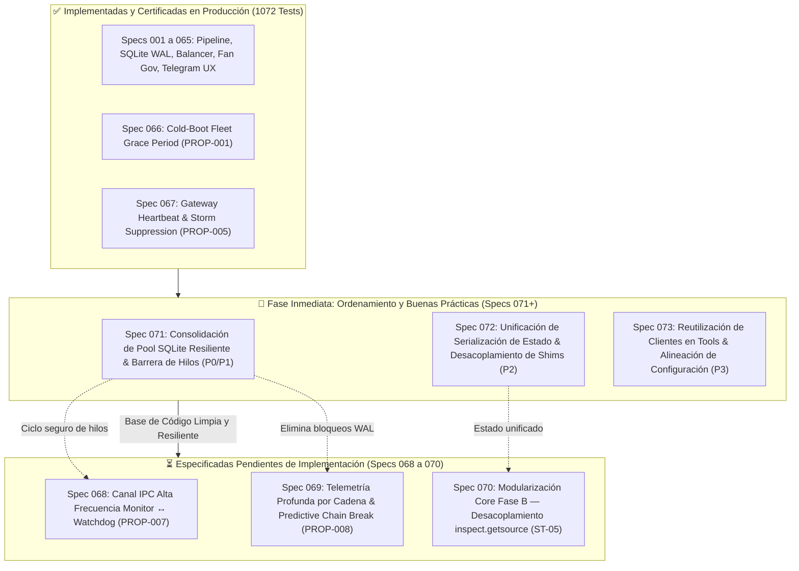

# 📋 PLAN DE ACCIÓN: SANEAMIENTO ARQUITECTÓNICO & SECUENCIA DE SPECS (V5.1+)

**Proyecto**: Miner Alerts Monitor  
**Fecha**: 16 de Septiembre de 2026  
**Línea Base Certificada**: 1072 tests PASS (0 fallos, 0 errores, 0 regresiones) | Windows Service `MinerAlerts` RUNNING  
**Objetivo**: Establecer la hoja de ruta de remediación de deuda técnica y buenas prácticas comenzando en la **Spec 071**, definiendo con absoluta claridad el estado de las specs especificadas pero **aún no implementadas (Specs 068, 069 y 070)** y los ajustes necesarios que recibirán tras este ordenamiento.

---

## 🧭 1. MAPA DE ESTADO DE ESPECIFICACIONES (CUADRO DE SITUACIÓN)



---

## 📌 2. SPECS ESPECIFICADAS PERO NO IMPLEMENTADAS (EN PAUSA PARA AJUSTE)

Las siguientes 3 especificaciones fueron diseñadas y documentadas end-to-end (`spec.md`, `plan.md`, `tasks.md`), pero **su código de producción NO ha sido implementado todavía**. Deberán recibir ajustes de diseño tras el saneamiento:

| Spec | Nombre | Prioridad Original | Estado Actual | Ajuste Necesario tras Saneamiento (Specs 071-073) |
| :---: | :--- | :---: | :---: | :--- |
| **Spec 068** | Canal IPC Monitor ↔ Watchdog vía Named Pipes (`PROP-007`) | P3 | **Especificada (No Implementada)** | Tras la Spec 071, se integrará directamente utilizando la factoría limpia de hilos daemon con captura de excepciones nativa y el nuevo protocolo de volcado forense, sin convivir con hilos huérfanos. |
| **Spec 069** | Telemetría Profunda por Cadena & Predictive Chain Break (`PROP-008`) | P1 | **Especificada (No Implementada)** | Depende críticamente de consultas SQLite históricas de 12h/24h. Tras la Spec 071, utilizará directamente el pool `EventStore.create_readonly_connection` con retry exponencial en vez de abrir conexiones ad-hoc vulnerables a `SQLITE_BUSY_SNAPSHOT`. |
| **Spec 070** | Modularización Core Fase B — Desacoplamiento de `inspect.getsource(main)` (`ST-05`) | P2 | **Especificada (No Implementada)** | Tras la unificación de estado (Spec 072) y eliminación de shims duplicados, el arnés de comportamiento (`test_supervisory_core_behavioral.py`) será mucho más simple de construir, reduciendo la superficie de pruebas de paridad dual. |

---

## 🚀 3. NUEVAS ESPECIFICACIONES DE SANEAMIENTO (HORIZONTE V5.1+)

### 🔹 Spec 071: Consolidación de Pool SQLite Resiliente & Barrera de Hilos Daemon (P0/P1)

* **ID**: 071  
* **Prioridad**: P0 (Inmediata) / P1 (Alta) | **Riesgo**: Bajo  
* **Módulos Afectados**:
  - `app/miner_monitor.py` (Línea 3226: `RestoreLock_{name}`)
  - `app/governance/energy_efficiency.py` (Línea 189)
  - `app/governance/fan_health.py` (Línea 300)
  - `app/governance/preset_balancer.py` (Líneas 389 y 761)
  - `app/telegram/charts.py` (Línea 36)
  - `app/telegram/daily_digest.py` (Línea 168)
  - `app/vnish/presets.py` (Línea 222)
* **Problema a Resolver**:
  1. El hilo daemon `RestoreLock_{m_name}` en `miner_monitor.py:3226` llama a `safe_set_miner_preset` sin envoltorio defensivo externo; si la red falla, el hilo muere silenciosamente sin registrar causa en el log estructurado.
  2. Siete módulos abren conexiones ad-hoc a SQLite con `sqlite3.connect(..., timeout=2.0)` y formateo manual de URI, sin la lógica de reintentos ni backoff exponencial ante `SQLITE_BUSY_SNAPSHOT` que posee `EventStore`.
* **Solución Técnica**:
  1. Envolver el target de `RestoreLock_{name}` en una función `_async_restore_locked_preset_tripwire()` con `try ... except Exception as exc: log(...)`.
  2. Refactorizar los 7 módulos para que utilicen `event_store.create_readonly_connection()` y `execute_readonly_with_retry()`, o proveer un helper estático universal `open_readonly_db(db_path)` en `app/core/event_store.py`.
* **Criterio de Aceptación**:
  - Cero llamadas a `sqlite3.connect` fuera de `app/core/event_store.py`.
  - Cero excepciones no capturadas en hilos daemon.
  - 1072/1072 tests PASS.

---

### 🔹 Spec 072: Unificación de Serialización de Estado & Desacoplamiento de Shims (P2)

* **ID**: 072  
* **Prioridad**: P2 (Media) | **Riesgo**: Bajo-Medio  
* **Módulos Afectados**:
  - `app/miner_monitor.py`
  - `app/core/state_manager.py`
  - `app/telegram/commands/diagnostics.py`, `fans.py`, `interventions.py`
  - `app/core/mining_quality.py`, `app/vnish/telemetry.py`
* **Problema a Resolver**:
  1. Doble serialización idéntica de `MinerState` (45 campos duplicados) en `miner_monitor.py:2597` y `state_manager.py:190`.
  2. Shims de delegación en `miner_monitor.py` (`read_summary`, `run_hashcore_cli`, etc.) que duplican firmas de `app/network/`.
  3. Lógica de resolución de mineros (`resolve_miner` + loop de assessments) copiada y pegada en 5 handlers de Telegram.
  4. Generador recursivo `_dicts()` duplicado idéntico en `mining_quality.py` y `vnish/telemetry.py`.
* **Solución Técnica**:
  1. Hacer que `miner_monitor._build_state_payload()` delegue directamente en `StateManager._serialize_state(st)` de `app/core/state_manager.py`, estableciendo una **fuente única de verdad** para el esquema de `state.json`.
  2. Extraer el helper unificado de búsqueda en Telegram: `find_assessment_by_target(assessments, target, miners)` en `app/telegram/context.py` o `app/telegram/help_center.py`.
  3. Centralizar `_dicts()` en `app/core/mining_quality.py` y re-exportar/importar en `vnish/telemetry.py`.
  4. Preservar las llamadas de `miner_monitor.py` apuntando directamente a los módulos formales de `app/network/`.
* **Criterio de Aceptación**:
  - Un único punto de serialización para `MinerState`.
  - Cero duplicación en handlers de comandos de Telegram.
  - Preservación estricta de los 37 tests constitucionales de `inspect.getsource(main)`.
  - $\ge 1072$ tests PASS.

---

### 🔹 Spec 073: Reutilización de Clientes en Tools & Alineación de Configuración (P3)

* **ID**: 073  
* **Prioridad**: P3 (Baja/Mantenibilidad) | **Riesgo**: Bajo  
* **Módulos Afectados**:
  - `tools/miner_diagnostics.py`
  - `tools/debug_4028.py`
  - `app/config.example.json` vs `app/config.json`
  - `tests/test_compact_format.py` vs `tests/test_compact_ux.py`
* **Problema a Resolver**:
  1. `tools/miner_diagnostics.py` y `tools/debug_4028.py` abren sockets TCP crudos reimplementando el protocolo CGMiner en vez de importar `app.network.cgminer_client`.
  2. Disparidad entre `config.example.json` (160 claves) y `config.json` (53 claves), ocultando qué parámetros están activos en producción.
  3. Tests duplicados con fixtures redundantes en formato compacto de Telegram.
* **Solución Técnica**:
  1. Refactorizar `tools/miner_diagnostics.py` para usar `query_cgminer` de `app.network.cgminer_client`.
  2. Crear una herramienta de auditoría de configuración `tools/audit_config.py` que valide paridad de tipos y reporte claves obsoletas o faltantes.
  3. Consolidar fixtures comunes de tests compactos en `tests/fixtures_compact_ux.py`.
* **Criterio de Aceptación**:
  - `tools/miner_diagnostics.py` reutiliza la biblioteca oficial de red.
  - Reporte de auditoría de configuración operativo.
  - $\ge 1072$ tests PASS.

---

## 📅 4. SECUENCIA DE EJECUCIÓN RECOMENDADA

```
1. Implementar Spec 071 (Consolidación SQLite WAL & Hilos P0/P1)
   └── Duración estimada: 1 sesión
   └── Impacto: Elimina riesgos de concurrencia en BD y caídas de hilos daemon.

2. Implementar Spec 072 (Unificación de Serialización & Limpieza DRY P2)
   └── Duración estimada: 1 sesión
   └── Impacto: Centraliza el esquema de estado y reduce deuda técnica.

3. Implementar Spec 073 (Herramientas & Configuración P3)
   └── Duración estimada: 1 sesión
   └── Impacto: Alinea herramientas de soporte y documentación de configuración.

4. AJUSTE & EJECUCIÓN DE SPECS EN PAUSA:
   ├── Re-auditar y afinar Spec 069 (Predictive Chain Break) sobre el nuevo pool SQLite limpio.
   ├── Implementar Spec 069 (P1 - Prioridad Operativa Minero 24).
   ├── Implementar Spec 068 (Canal IPC Monitor ↔ Watchdog en Windows).
   └── Implementar Spec 070 (Desacoplamiento de inspect.getsource con arnés de comportamiento).
```
