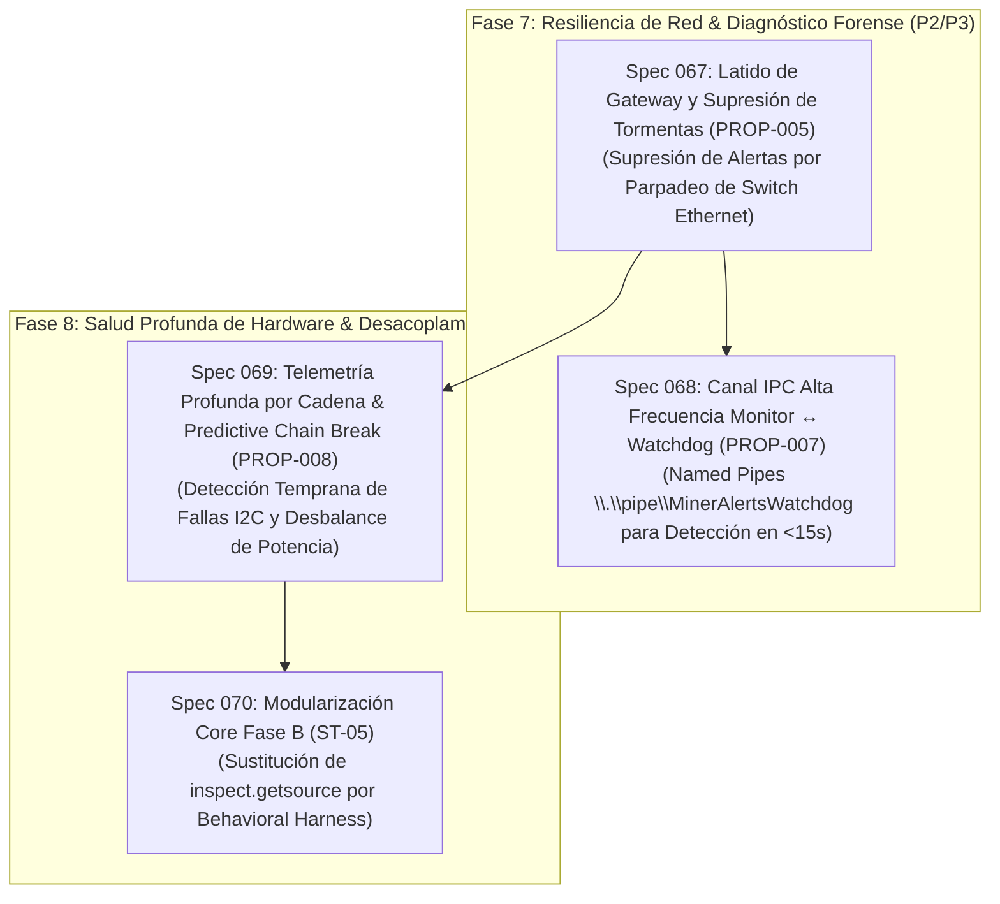

# 🚀 PLAN DE ACCIÓN HORIZONTE V5.1 & AUDITORÍA DE SEGURIDAD OPERATIVA (SPECS 067 A 070)

**Proyecto**: Miner Alerts Monitor  
**Fecha de Publicación**: 15 de Septiembre de 2026  
**Línea Base Certificada**: Release V5.0.3 (1062 tests PASS, 0 fallos, 0 regresiones, Windows Service `MinerAlerts` activo en PID de producción)  
**Objetivo del Documento**: Establecer el plan de acción exhaustivo, mapa de dependencias, auditoría de concurrencia y especificaciones técnicas para que **Claude Sonnet 4.6 (Thinking)** pueda auditar, realizar QA de alto razonamiento, proponer mejoras defensivas y guiar la implementación segura de las próximas especificaciones.

---

## 🗺️ 1. ESTADO ACTUAL Y BALANCE DE LO IMPLEMENTADO

Las iniciativas del ciclo post-V5.0 han sido completamente implementadas, auditadas y puestas en producción:

| Spec | Módulo Principal | Logro / Capacidad Incorporada | Estado | Tests Unitarios |
| :--- | :--- | :--- | :---: | :---: |
| **Spec 061** | `app/core/event_store.py` | Resiliencia SQLite WAL Mode, PRAGMA synchronous NORMAL, quick_check asíncrono en arranque, auto-aislamiento de base corrupta y pool multi-lector con retroceso exponencial ante `SQLITE_BUSY_SNAPSHOT`. | **Cerrado** | 11 tests PASS |
| **Spec 062** | `app/governance/preset_balancer.py` | HW Error Tripwire (`hw_error_rate_pct >= 0.5%` AND `hw_errors_delta_10m >= 200`), candado de 48h (`hw_error_locked_preset`), interlock anti-cascada post-reboot y tarjeta móvil <= 32 columnas. | **Cerrado** | 10 tests PASS |
| **Spec 063** | `app/governance/fan_governor.py` | Gobernador Térmico con Conciencia Estacional, extracción de `inlet_temp_c` sin requests HTTP extra, resolución pura `resolve_seasonal_parameters()` y 3 guardarraíles térmicos inviolables. | **Cerrado** | 14 tests PASS |
| **Spec 064** | `app/telegram/charts.py` | Gráficos visuales multi-miner por grupo eléctrico (`elevator_1`, `elevator_2`, `fleet`), renderizado en RAM con `matplotlib` (`Agg`), selectores inline `[1h][6h][24h][7d]` y actualización in-place `editMessageMedia`. | **Cerrado** | 11 tests PASS |
| **Spec 065** | `app/core/engine.py` | Pipeline declarativo de hooks en `CoreSupervisoryEngine` (`HookStage` 7 etapas ordenadas), contención individual defensiva de excepciones, modelo de tiempo monotónico estricto `poll_seconds = max(0, interval - elapsed)` y sincronización atómica de estado. | **Cerrado** | 48 tests PASS |
| **Spec 066** | `app/miner_monitor.py` | Cold-Boot Fleet Grace Period (`PROP-001`), ventana de gracia post-arranque de 180s (`WARMING_UP`), supresión activa de streaks y timers de falla durante el booteo de NAND y autotuning de ASICs, tarjeta unificada `🟢 FLOTA RESTABLECIDA` y cero falsas alarmas. | **Cerrado** | 15 tests PASS |

**Total Actual Certificado**: **1062 tests PASS** (34.4s). Cero fallos, cero regresiones.

---

## 🎯 2. INVENTARIO COMPLETO DE LO PENDIENTE (SPECS 067 A 070)



---

### Spec 067: Latido de Gateway y Supresión de Tormentas por Fallo de Red Local (`PROP-005`)

* **Prioridad**: P2 (Media) | **Riesgo**: Bajo | **Módulos**: `app/network/gateway_heartbeat.py`, `app/miner_monitor.py`
* **Contexto y Problema**:
  - El discriminador de caídas de fase (Spec 051) verifica la conectividad del gateway cuando ocurre una caída unísona.
  - Sin embargo, si un switch Ethernet local o access point hogareño sufre un microcorte o reinicio rápido (parpadeo de 5 a 10 segundos) o un recalculo de Spanning Tree Protocol (STP), las conexiones TCP API 4028 hacia los 4 mineros fallan simultáneamente por timeout de socket.
  - Esto puede originar conatos de alertas de desconexión antes de que el monitor certifique si el fallo es de los equipos o de la infraestructura de red local.
* **Arquitectura de Solución**:
  1. **Worker Ultraliviano de Latido de Gateway (`GatewayHeartbeatWorker`)**:
     - Hilo daemon independiente que ejecuta cada 5 segundos un intento de conexión TCP no bloqueante (timeout de 50 ms) hacia el router local (`192.168.100.1:80` o `:53`).
     - Mantiene un estado booleano atómico `gateway_online: bool` y marca de tiempo `last_gateway_loss_ts: Optional[float]`.
  2. **Ventana de Supresión de Tormentas (Storm Suppression Window)**:
     - Si `gateway_online` pasa a `False` o si la conectividad con el router se interrumpió en los últimos 15 segundos:
       - Se activa el estado de supresión de tormentas de red (`network_storm_suppression = True`).
       - Se congelan temporalmente los despachos de alertas `EPISODE_ALERT` hacia Telegram.
       - Si el enlace se restablece dentro de la ventana de 15 segundos, se registra un log estructurado `[NETWORK_STORM_SUPPRESSED] Transitorio de enlace Ethernet local absorbido (delta={elapsed:.1f}s)` y se descarta el conato sin alarmar al operador.
       - Si la pérdida de red supera los 15 segundos y los mineros continúan inaccesibles, se permite la propagación de la alerta correspondiente.
* **Puntos de Auditoría Requeridos para Sonnet**:
  - Garantizar que el socket connect de 50 ms nunca bloquee el GIL ni retrase el bucle principal.
  - Verificar que el cierre de sockets use `socket.close()` explícito para evitar leaks de descriptores de archivo (handles) en Windows.
  - Proteger contra gateways que tengan puertos HTTP deshabilitados (permitir configurar IP y puerto, fallback a DNS port 53 o ICMP ping opcional).

---

### Spec 068: Canal IPC de Alta Frecuencia Monitor ↔ Watchdog vía Named Pipes (`PROP-007`)

* **Prioridad**: P3 (Baja) | **Riesgo**: Medio | **Módulos**: `app/ipc/watchdog_pipe.py`, `tools/monitor_watchdog.py`
* **Contexto y Problema**:
  - Actualmente, el watchdog fuera de proceso ([`tools/monitor_watchdog.py`](file:///F:/02-ASIC%20-%20mineros/miner-alerts/tools/monitor_watchdog.py)) se invoca periódicamente mediante el Programador de Tareas de Windows leyendo `data/monitor_heartbeat.json` y ejecutando `sc.exe queryex`.
  - Aunque este mecanismo es robusto y desacoplado, su latencia de detección es de 2 a 5 minutos.
  - Si el monitor entra en un deadlock de hilos, bloqueo del GIL en una llamada nativa o bucle de CPU cerrado, el watchdog tarda demasiado en actuar.
* **Auditoría Arquitectónica Profunda**:
  1. **Evaluación de Transporte IPC (Windows)**:
     - *Opción A: Named Pipes nativos de Windows (`\\.\pipe\MinerAlertsWatchdog`)*:
       - Implementación mediante `ctypes.windll.kernel32.CreateNamedPipeW` y `ConnectNamedPipe` para **cero dependencias externas** (evita depender de `pywin32` en el venv de producción).
       - Seguridad: Permisos ACL restringidos al SID del usuario local y `NT AUTHORITY\SYSTEM` para evitar inyección de mensajes locales.
     - *Opción B: Socket TCP Loopback (`127.0.0.1:4029`)*:
       - Alternativa de bajísimo riesgo: usa la stdlib `socket`, soporta timeouts de 100ms de forma trivial con `settimeout()`, sin riesgo de cuelgue de buffers nativos de Windows.
     - *Decisión Arquitectónica*: Implementar servidor Named Pipe con fallback a Loopback Socket si la creación del pipe falla por permisos.
  2. **Protocolo Ping-Pong & Detección de Deadlock de Main Loop**:
     - El cliente watchdog envía: `PING <nonce>\n`.
     - El servidor responde: `PONG <nonce> <tick_sequence> <uptime> <last_tick_elapsed_s>\n` en $\le 100\text{ ms}$.
     - *Diferenciador Clave*: Si el servidor responde el PONG pero `tick_sequence` no se ha incrementado en $> 60\text{ s}$, el hilo IPC está vivo pero el **bucle principal de supervisión está colgado** (deadlock de `state_lock` o bloqueo en llamada socket).
  3. **Máquina de Estados de Fallo & Recolección Forense**:
     - **Intento 1 fallido**: Estado `WARNING`. Reintento a los 2 segundos.
     - **Intento 2 fallido**: Estado `CRITICAL`. Registro de alerta en `logs/watchdog.log`.
     - **Intento 3 fallido**: Estado `ACTION_REQUIRED`:
       * Si el proceso Python de Miner Alerts existe en Windows (`OpenProcess` / PID activo):
         - **Acción Forense Inmediata**: Invocar volcado de trazas de hilos en disco mediante `sys._current_frames()` escribiendo `logs/deadlock_forensics_<timestamp>.log`.
         - **Recuperación Automática**: Ejecutar reinicio del servicio Windows: `Restart-Service -Name MinerAlerts -Force`.
       * Si el proceso no existe: Notificar caída del servicio a Telegram y ejecutar `Start-Service -Name MinerAlerts`.

---

### Spec 069: Telemetría Profunda por Cadena & Diagnóstico Predictivo Chain Break (`PROP-008`)

* **Prioridad**: P1 (Alta) | **Riesgo**: Medio | **Módulos**: `app/governance/chain_health.py`, `app/vnish/chain_collector.py`, `tools/analyze_chain_breaks.py`
* **Contexto y Problema**:
  - Durante el incidente del 2026-09-12 (Evento 940), el Minero 24 sufrió un reinicio abrupto tras registrar `chain_break` en el firmware Vnish.
  - La inspección de `/api/v1/chains` reveló que el Minero 24 presenta un fallo persistente en el sensor térmico I2C de la **Cadena 2 (Board 2)**: `{"state": "error", "board": 39, "chip": 54, "loc": 28}`.
  - Actualmente, el colector registra muestras en la tabla `chain_telemetry_samples` y `app/governance/chain_health.py` evalúa la salud granular, pero falta la **regla de alerta preventiva continua y correlación de red eléctrica**.
* **Auditoría Arquitectónica Profunda**:
  1. **Optimización de Consultas en SQLite WAL**:
     - Para evaluar el histórico de 12h y 24h sin superar los $15\text{ ms}$ de latencia, se requiere un índice compuesto específico:
       ```sql
       CREATE INDEX IF NOT EXISTS ix_chain_telemetry_miner_chain_time
           ON chain_telemetry_samples(miner_key, chain_id, observed_ts DESC);
       ```
     - Consulta de evaluación ejecutada en el pool de solo lectura con `execute_readonly_with_retry` para jamás bloquear transacciones concurrentes.
  2. **Reglas de Detección Matemática & Filtro de Falsos Positivos**:
     - **Regla 1 (Fallo Persistente de Bus I2C)**:
       * Condición: En una ventana de 12 horas, $\ge 90\%$ de las muestras de la cadena reportan `sensors_error_count > 0` con la misma ubicación física (`loc 28`).
       * Acción: Emitir alerta preventiva a Telegram (deduplicada, máx. 1 vez cada 24h):
         `⚠️ ALERTA PREVENTIVA: Minero 24 Cadena 2 — Sensor I2C (loc 28) en fallo continuo por >12h. Riesgo de parada por chain_break.`
     - **Regla 2 (Déficit Aislado de Placa vs Flota)**:
       * Condición: `hr_deficit_pct >= 10.0%` en una placa durante $\ge 3\text{ horas}$ continuas mientras las otras dos placas del mismo minero operan con déficit $\le 2.0\%$.
       * Diagnóstico: Degradación localizada de chips (ASIC throttled o dominio descalibrado).
  3. **Discriminador de Causa Eléctrica (Elevador) vs Silicio (Placa)**:
     - Si $\ge 2$ mineros del mismo grupo eléctrico (`elevator_1` o `elevator_2`) sufren caídas simultáneas de hashrate en un intervalo de 60 segundos:
       * Clasificación: `POWER_DISTURBANCE` (Perturbación eléctrica en línea/tensión).
       * Se suprime la alerta individual de fallo de silicio de la placa.

---

### Spec 070: Modularización del Core Fase B — Desacoplamiento Seguro de `inspect.getsource(main)` (`ST-05`)

* **Prioridad**: P2 (Media) | **Riesgo**: Alto (Regresión de Tests Legados) | **Módulos**: `app/miner_monitor.py`, `app/core/engine.py`, `tests/`
* **Contexto y Problema**:
  - Actualmente, 4 suites de tests verifican la estructura textual de `main()` mediante `inspect.getsource(main)` (37 tests en total):
    1. `tests/test_auto_reboot_signal_gate.py`: 8 tests verificando el reseteo de `state.low_since_ts = None` y orden de compuertas.
    2. `tests/test_hashboard_auto_reboot.py`: 8 tests verificando `elif (\n new_state == STATE_HASHBOARD` y el orden de los 6 interlocks.
    3. `tests/test_reboot_safety.py`: 13 tests verificando el orden jerárquico (`startup < sustained < interlocks < cooldown < window < hashcore`).
    4. `tests/test_vnish_hashboard_detection.py`: 8 tests verificando que `active_boards < expected_boards` preceda a `rate_ths < threshold_ths`.
  - Este acoplamiento textual actúa como una barrera rígida que impide modularizar el loop procedural de `main()` en `AcquisitionHook`, `DetectionHook` y `ActuatorHook`.
* **Auditoría Arquitectónica & Estrategia de Migración de Riesgo Cero**:
  1. **Fase 1: Construcción del Arnés de Comportamiento (`Behavioral Test Harness`)**:
     - Crear `tests/test_supervisory_core_behavioral.py`.
     - En lugar de inspeccionar el código fuente como texto, el arnés instancia `CoreSupervisoryEngine` con un `MonitorContext` mockeado y ejecuta `execute_tick()`.
     - Se reproducen de forma determinística los escenarios exactos de los 37 tests:
       * Minero en arranque dentro del grace period $\rightarrow$ auto-reboot bloqueado.
       * Minero con caída sostenida $\rightarrow$ secuencia de 6 interlocks evaluada en orden idéntico.
       * Interlock fallido $\rightarrow$ acción cancelada y `reboot_requested = False`.
       * Cooldown activo $\rightarrow$ acción suprimida.
  2. **Fase 2: Certificación de Paridad Dual**:
     - Ambas suites de pruebas coexisten en el repositorio:
       $$\text{Suite Original (37 tests de inspección)} + \text{Suite de Comportamiento (37 tests funcionales)}$$
     - La suite global pasa de **1072 tests a 1109 tests PASS**.
     - Cero modificaciones a `main()` en esta fase.
  3. **Fase 3: Refactorización Modular & Deprecación Gradual**:
     - Con la suite de comportamiento garantizando la invariante funcional al 100%, se extraen de forma segura los bloques de `main()` hacia hooks desacoplados.
     - Se actualizan los 4 archivos de test legados para apuntar a los métodos de evaluación del motor en lugar de examinar cadenas de texto plano de `main`.

---

## 🔍 3. GUÍA DE AUDITORÍA DE SEGURIDAD & QA PARA CLAUDE SONNET 4.6 (THINKING)

Cuando Claude Sonnet tome el control de la sesión, debe ejecutar una auditoría de alto razonamiento sobre los siguientes puntos críticos:

### A. Auditoría de Concurrencia y Jerarquía de Locks
1. **Verificación de Bloqueos L1 y L2**:
   - `state_lock` (RLock, Nivel 1): Protege el diccionario `states` en memoria.
   - `_SAVE_STATE_LOCK` (Lock, Nivel 2): Protege la escritura en disco de `state.json`.
   - **Regla Inviolable**: Ninguna operación de I/O bloqueante (disco, red, socket, `fsync`) debe realizarse manteniendo adquirido `state_lock`. Verificar que `state_manager.save()` extrae el snapshot bajo lock y ejecuta el volcado fuera de él.
2. **Ciclo de Vida de Hilos Daemon**:
   - Auditar todos los hilos lanzados con `daemon=True`:
     * `AutoRestart_{name}`
     * `TripwireRestore_{name}`
     * `ChainTelemetryReactive_{name}`
     * `ChainTelemetryTransition_{name}`
     * `telegram_sender_worker`
     * `telegram_polling_worker`
   - Verificar que **cada uno de ellos** posea una barrera total de captura de excepciones `try ... except Exception as exc:` con log estructurado para evitar caídas silenciosas o hilos huérfanos.

### B. Auditoría de Estado y Sincronización en el Pipeline de Hooks
1. **Sincronización Context ↔ Globals**:
   - Comprobar que en `miner_monitor.py` antes de invocar `_supervisory_engine.execute_tick()`, todos los objetos mutables compartidos se sincronicen:
     ```python
     monitor_ctx.last_daily_digest_date = _LAST_DAILY_DIGEST_DATE
     monitor_ctx.governance = _GLOBAL_INTERVENTION_GOV
     ```
   - Verificar que los hooks lean preferentemente de `tick_data` (inyectado en el ciclo) antes que de atributos potencialmente congelados en `context`.
2. **Garantía Invariante de Etapa PERSISTENCE**:
   - Comprobar que en `app/core/engine.py:execute_tick`, la etapa `PERSISTENCE` se ejecute indefectiblemente antes de `POST_TICK` y que ambas se ejecuten incluso si todas las etapas anteriores arrojan excepciones simuladas.

### C. Auditoría de Protocolo de Red & Sockets en Windows
1. **Timeouts Acotados**:
   - Comprobar que ninguna llamada de socket (`Api4028Transport`, `VnishClient`, `HashcoreClient`) quede sin timeout explícito ($\le 5.0\text{s}$).
2. **Subprocess Windowless en Windows**:
   - Comprobar que toda invocación de `subprocess.run` o `subprocess.Popen` en Windows (`hashcore_client.py`, `monitor_watchdog.py`) incluya el flag `creationflags=subprocess.CREATE_NO_WINDOW` para evitar la aparición de ventanas de consola parpadeantes.

---

## 🛠️ 4. COMANDOS DE VALIDACIÓN Y SUITES DE PRUEBA CERTIFICADAS

Para verificar la integridad del repositorio en cualquier momento, ejecutar:

```powershell
# 1. Chequeo de sintaxis Python (0 errores requeridos)
& ".\.venv\Scripts\python.exe" -m py_compile app\miner_monitor.py app\core\engine.py app\core\state_manager.py

# 2. Higiene de formato Git (0 errores de espacios en blanco)
git diff --check

# 3. Script de Preflight QA de Miner Alerts (Status: PASS requerido)
& powershell.exe -ExecutionPolicy Bypass -File .agents\skills\speckit-qa\scripts\preflight.ps1 -RunBuilds

# 4. Verificación de Invariantes Constitucionales (37 tests PASS)
& ".\.venv\Scripts\python.exe" -m unittest tests.test_auto_reboot_signal_gate tests.test_hashboard_auto_reboot tests.test_reboot_safety tests.test_vnish_hashboard_detection -v

# 5. Suites Enfocadas de Hooks y Grace Period (66 tests PASS)
& ".\.venv\Scripts\python.exe" -m unittest tests.test_supervisory_hooks tests.test_startup_grace_period -v

# 6. Suite Completa de Regresión del Proyecto (1062 tests PASS en ~34s)
& ".\.venv\Scripts\python.exe" -m unittest discover tests

# 7. Estado del Servicio de Producción en Windows
Get-Service -Name MinerAlerts
Get-Content -Path logs\out.log -Tail 30
```

---

*Plan de Acción archivado formalmente en `docs/speckit/ACTION_PLAN_V5_1_HORIZON.md` como base de trabajo certificada para la auditoría y ejecución de Claude Sonnet 4.6 (Thinking).*
