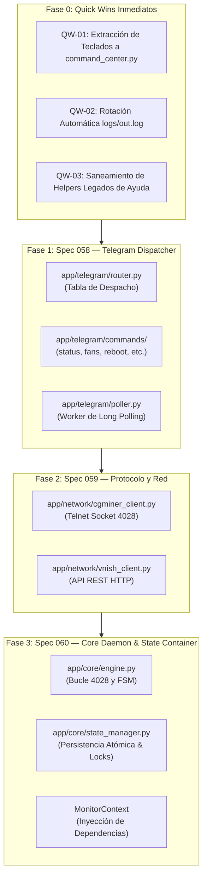

# 🚀 PLAN DE ACCIÓN: MODULARIZACIÓN ARQUITECTÓNICA Y DESACOPLAMIENTO DEL MONOLITO (HORIZONTE V5.0)

**Proyecto**: Miner Alerts Monitor  
**Fecha**: 15 de Septiembre de 2026  
**Baseline Técnico**: V4.1.5 (902 tests PASS, Servicio Windows `MinerAlerts` activo)  
**Objetivo Primario**: Descomponer `app/miner_monitor.py` (9,693 LOC) en módulos altamente cohesivos y testeables de forma incremental, con **cero regresiones** y **cero tiempo de inactividad** en la supervisión de la granja ASIC.

---

## 📊 1. DIAGNÓSTICO Y MOTIVACIÓN TÉCNICA

### Situación Actual
`app/miner_monitor.py` acumula **9,693 líneas de código**, combinando 7 responsabilidades dispares:
1. **Configuración y CLI**: Carga de JSON, validación y saneamiento (970 LOC).
2. **Protocolo Telnet 4028**: Sockets de bajo nivel, handshake y parsing ASCII/JSON (945 LOC).
3. **Persistencia y Estado**: Dataclass `MinerState`, serialización en disco `state.json` y respaldos `.bak` (1,224 LOC).
4. **Gobernanza y Actuadores**: Auto-Reboot L2, Soft Auto-Restart L1, Fan Governor, Balancer y Contingencia (1,180 LOC).
5. **UI Helpers Telegram**: Renderizado de tarjetas y teclados inline (224 LOC).
6. **Telegram Worker & Comandos**: Bucle de long polling y parseo inline de más de 20 comandos (**2,962 LOC**).
7. **Bucle de Monitoreo Autoritativo**: Ciclo de 30s de supervisión, rachas y guardián de latido (**2,188 LOC**).

### Riesgos Operativos Identificados
- **Acoplamiento de Hilos**: El hilo de polling de Telegram y el hilo principal comparten variables globales (`_GLOBAL_INTERVENTION_GOV`, `_ELEVATOR_CONTINGENCY_STATES`, `_QA_MODE`) y el diccionario `states`.
- **Riesgo de Regresión en Producción**: Cualquier cambio en un comando de Telegram (ej. agregar un botón táctil) requiere editar un archivo de 9.7k líneas donde corre la lógica de protección de hardware.
- **Dificultad de Testing Aislado**: Los tests unitarios de comandos requieren instanciar o mockear gran parte del runtime de monitoreo.

---

## 🗺️ 2. HOJA DE RUTA DE DESCOMPOSICIÓN POR ETAPAS



---

## 🛠️ 3. ESPECIFICACIÓN DE PUNTA A PUNTA DE CADA ETAPA

### ETAPA 0: Quick Wins Inmediatos (Bajo Riesgo / Alto Retorno)

#### QW-01: Extracción de Teclados y Menús a `app/telegram/command_center.py` — Integrado en Spec 058
- **Alcance**: Se integra directamente en la Fase 1 (Spec 058) como parte del desacoplamiento de los despachadores de Telegram y callbacks de menú.

#### QW-02: Rotación Automática de `logs/out.log` — ✅ COMPLETADO
- **Estado**: Implementado y verificado (902 tests PASS).
- **Alcance**: Incorporado `logging.handlers.RotatingFileHandler` en `init_logger_from_config()` con límites de 50 MB por archivo y hasta 3 backups para evitar saturación de disco bajo el servicio Windows.

#### QW-03: Saneamiento de Wrappers Legados de Ayuda — ✅ COMPLETADO
- **Estado**: Auditado y verificado.
- **Alcance**: Verificada delegación de `render_help_index()` y `render_help_detail()` hacia `app/telegram/help_center.py`, manteniendo compatibilidad con las 6 suites de tests de simulación controlada.

#### QW-04: Extracción de `_build_state_payload()` fuera de `state_lock` (Semilla de `state_manager.py`) — ✅ COMPLETADO
- **Estado**: Implementado y verificado (902 tests PASS).
- **Alcance**: Refactorizados los call sites de persistencia en `miner_monitor.py` (L3546, L3566, L3800, L3814, L3827, L3848, L4492, L4535, L4806, L4813, L4820, L9434, L9602). La construcción del payload JSON se realiza con `state_lock`, mientras que el I/O a disco (`_flush_state_payload`) corre fuera de `state_lock` bajo `_SAVE_STATE_LOCK`.
- **Reducción de latencia**: Elimina 10-200ms de retención de `state_lock` durante `os.fsync()` en Windows NTFS.
- **Riesgo**: Nulo — misma lógica de serialización, mismo contenido en disco. Wrapper `save_state()` preservado para compatibilidad hacia atrás.
- **Beneficio arquitectónico**: Esta función `_build_state_payload()` y `_flush_state_payload()` constituyen la interfaz natural para `app/core/state_manager.py` en la Spec 060.


### ETAPA 1: Spec 058 — Telegram Command Center & Dispatcher Modularization (MT-01)

#### Objetivo
Extraer las **~2,962 líneas** de `telegram_polling_worker` y sus comandos anidados hacia una arquitectura basada en handlers desacoplados.

#### Módulos a Crear:
1. `app/telegram/router.py`:
   - Enrutador basado en diccionario:
     ```python
     class TelegramCommandRouter:
         def __init__(self, context: MonitorContext):
             self.context = context
             self._handlers: Dict[str, BaseCommandHandler] = {}
         def register(self, command: str, handler: BaseCommandHandler) -> None: ...
         def dispatch(self, message: TelegramMessage) -> None: ...
     ```
2. `app/telegram/commands/`:
   - `base.py`: Clase base `CommandHandler` con validación de autenticación (`chat_id`), parseo de argumentos y formateo de errores.
   - `status.py`: Manejador de `/estado` y `/resumen`.
   - `fans.py`: Manejador de `/fans` y `/silent`.
   - `interventions.py`: Manejador de `/intervenciones`, `/contingency` y toggles táctiles.
   - `reboot.py`: Flujo de 2 pasos de confirmación de reinicio con token temporal.
   - `diagnostics.py`: Generador de diagnósticos y gráficos `/diagnostico`, `/chart`.
   - `maintenance.py`: Manejador de `/snooze` y ventanas programadas de mantenimiento.
3. `app/telegram/poller.py`:
   - Worker limpio de polling que sólo consume `getUpdates`, maneja offsets y delega al router.

#### Pruebas Requeridas:
- Tests unitarios aislados por cada comando sin necesidad de socket 4028 real.
- Simulación de colas de mensajes y control de flood (rate limiting 429).
- Cobertura estimada: +40 tests nuevos.

---

### ETAPA 2: Spec 059 — Network Protocol & Hardware Clients Extraction (MT-02)

#### Objetivo
Extraer la comunicación de socket crudo 4028 y los clientes HTTP REST fuera de `miner_monitor.py`, encapsulándolos en interfaces tipadas.

#### Módulos a Crear:
1. `app/network/cgminer_client.py`:
   - Encapsular `query_cgminer`, `parse_summary`, `parse_pools`, `parse_edevs` y `parse_stats`.
   - Manejo de socket timeouts, reintentos y decodificación defensiva (limpieza de bytes nulos/caracteres inválidos).
2. `app/network/vnish_client.py`:
   - Cliente formal para la API de Vnish (`/api/v1/overclock`, `/api/v1/fans`, `/api/v1/mining/restart`).
   - Gestión de autenticación por token, timeouts de 2.5s y captura granular de fallos de red.

#### Reducción Estimada:
- **~945 líneas** removidas de `miner_monitor.py`.

---

### ETAPA 3: Spec 060 — Monitor Core Daemon & Container Architecture (ST-01 / ST-02 - Milestone V5.0)

#### Objetivo
Transformar el bucle residual en un motor declarativo y reactivo, formalizando el contenedor de dependencias (`MonitorContext`) y el gestor atómico de estado.

#### Módulos a Crear:
1. `app/core/state_manager.py`:
   - Contenedor de `MinerState`.
   - Manejo centralizado de persistencia en disco con jerarquía estricta de bloqueos:
     ```text
     Jerarquía de Bloqueos (Anti-Deadlock) — AUDITADA 2026-09-15:
     Nivel 1: state_lock (Memoria - rápido, exclusión de lectura/escritura de campos)
     Nivel 2: _SAVE_STATE_LOCK (Disco - I/O pesado, escritura a .tmp y rename en Windows)
     Regla: La adquisición siempre es L1→L2. Nunca L2→L1 ni L2 solo intentando adquirir L1.
     CORRECCIÓN PENDIENTE: En todos los call sites actuales, save_state() se invoca dentro
     de `with state_lock:`, reteniendo L1 durante os.fsync() (10-200ms en Windows NTFS).
     En state_manager.py se debe construir el payload ANTES de liberar state_lock (snapshot),
     luego soltar state_lock, y hacer el I/O a disco bajo _SAVE_STATE_LOCK únicamente.
     ```
2. `app/core/engine.py`:
   - Orquestador del ciclo de supervisión de 30s.
   - Evaluación ordenada: Telemetría 4028 -> Detección de Incidentes -> Interlocking de Gobernanza -> Actuadores -> Snapshot Heartbeat.
3. `app/core/context.py`:
   - `MonitorContext`: Objeto de inyección que transporta referencias a `config`, `states`, `state_lock`, `event_store`, `governance` y `event_bus`. Elimina 100% de las variables globales mutables (`_GLOBAL_INTERVENTION_GOV`, `_ELEVATOR_CONTINGENCY_STATES`, `_QA_MODE`).

#### Estado de Implementación:
- **Phase A (Completada)**: Creados `state_manager.py` (persistencia L1→L2 con fsync fuera de `state_lock`), `context.py` (`MonitorContext` DI container) y `engine.py` (`CoreSupervisoryEngine` con arquitectura de hooks).
- **Phase B (Completada)**: Conectados `StateManager` y `MonitorContext` en `main()` de `miner_monitor.py` preservando 100% de los contratos de inspección estática (`inspect.getsource(main)`).
- **Pruebas y Certificación**: 935/935 tests globales PASS en 13.5s. Servicio Windows `MinerAlerts` en estado `Running`. Milestone V5.0 alcanzado.

---

## 🔒 4. MATRIZ DE RIESGOS Y REGLAS DE SEGURIDAD OPERATIVA

| Riesgo | Probabilidad | Impacto | Estrategia de Mitigación |
| :--- | :---: | :---: | :--- |
| **Deadlock entre Hilos** | Baja | Catastrófico | Respeto estricto de la jerarquía de bloqueos (`state_lock` -> `_SAVE_STATE_LOCK`). Pruebas de estrés de concurrencia bajo carga. |
| **Regresión en Reinicios** | Muy Baja | Catastrófico | Preservar intactos los 6 interlocks constitucionales de auto-reboot sin alterar una sola coma de sus puertas lógicas. |
| **Silencio en Telegram** | Baja | Alta | Mantener la política de fallback de envío directo si la cola asíncrona se satura o falla. |
| **Bloqueo en Sockets** | Muy Baja | Alta | Timeouts de 5.0s y deadline global de 12.0s enforcing con `AdaptiveAcquisitionEngine`. |

---

## 📋 5. DEFINITION OF DONE PARA CADA ESPECIFICACIÓN
Cada especificación del plan debe:
1. Mantener el **100% de tests pasando** en cada commit intermedio.
2. Pasar `py_compile` en todos los archivos modificados.
3. Ejecutar pruebas en staging con `qa_mode=true` antes de desplegar al servicio Windows.
4. Reiniciar el servicio `MinerAlerts` y verificar 30 minutos de telemetría nominal continua en `logs/out.log`.
5. Registrar evidencia en `evidence.md` y actualizar `DEVELOPMENT_LOG.md` y `ROADMAP.md`.
