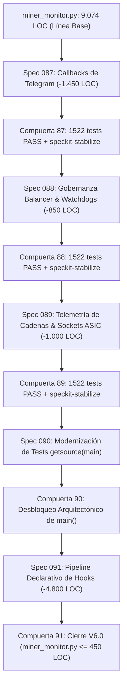

# Programa Maestro de Modularización Arquitectónica del Monolito
## Secuencia de 5 Specs para la Reducción de `app/miner_monitor.py` (9.074 L -> <500 L)

**Documento Rector**: `docs/speckit/MONOLITH_DECOUPLING_MASTER_PLAN.md`
**Estrategia de Ejecución**: 1 Spec = 1 Unidad Bounded = 1 Estabilización Formal
**Línea Base Técnica**: 1522 tests PASS, 75 subtests PASS, Windows Service en producción
**Objetivo**: Dividir la descomposición en 5 specs independientes para preservar el control quirúrgico, evitar sobrecarga de contexto y eliminar el riesgo operativo.

---

### 1. La Secuencia de 5 Specs Independientes

---

### 2. Inventario y Alcance por Spec

| Spec | Nombre de la Spec | Directorio Objetivo | Reducción LOC | Riesgo | Compuerta de Estabilización |
| :--- | :--- | :--- | :---: | :---: | :--- |
| **Spec 087** | **Telegram Callbacks Decoupling** | `app/telegram/` | **~1.450 L** | Muy Bajo | Tests de callbacks y simulación Telegram PASS. |
| **Spec 088** | **Governance Balancer & Watchdogs** | `app/governance/` | **~850 L** | Medio | Tests de balancers, autotune y thread-safety PASS. |
| **Spec 089** | **Chain Telemetry & ASIC Sockets** | `app/hardware/`, `app/network/` | **~1.000 L** | Bajo | Tests de hardware, salud de cadenas y sockets PASS. |
| **Spec 090** | **Test Invariants Modernization** | `tests/` | **0 L** (Desbloqueo) | Cero | Tests funcionales desacoplados de strings en `main()`. |
| **Spec 091** | **Core Daemon Hookification** | `app/core/engine.py` | **~4.800 L** | Medio | Suite global $\ge 1522$ tests PASS, `miner_monitor.py` $\le 450$ L. |

---

### 3. Detalle de Implementación por Spec

#### Spec 087: Desacoplamiento de Callbacks de Telegram (`087-telegram-callbacks-decoupling`)
* **Problema**: 1.450 líneas de `_handle_command_center_callback`, `_handle_diagnostic_callback` y `_handle_callback_query` viven en `miner_monitor.py`.
* **Solución**: Moverlos a `app/telegram/command_center.py` y `app/telegram/callbacks.py`. `app/telegram/router.py` despacha internamente sin requerir `miner_monitor.py`. Se dejan shims de re-export de 1 línea.
* **Resultado**: `miner_monitor.py` baja de 9.074 L a ~7.620 L. Cero riesgo a hardware.

#### Spec 088: Desacoplamiento de Gobernanza (`088-governance-cycles-decoupling`)
* **Problema**: `execute_balancer_cycle` (252 L) y `check_autotune_watchdog` (140 L) residen en el archivo principal.
* **Solución**: Extraer a `app/governance/balancer_cycle.py` y `app/governance/autotune_watchdog.py`, preservando `_orchestrator_state.py` y los locks.
* **Resultado**: `miner_monitor.py` baja a ~6.770 L.

#### Spec 089: Telemetría de Cadenas & Clientes Socket (`089-hardware-telemetry-decoupling`)
* **Problema**: `_async_collect_chain_telemetry` y copias duplicadas de funciones de socket raw 4028 (`read_summary`, etc.) están en el monitor.
* **Solución**: Reutilizar el cliente canónico existente `app/network/cgminer_client.py` y mover la recolección asíncrona a `app/hardware/chain_collector.py`.
* **Resultado**: `miner_monitor.py` baja a ~5.770 L.

#### Spec 090: Modernización de Contratos de Test Invariantes (`090-test-invariants-modernization`)
* **Problema**: `tests/test_startup_grace_period.py:222` contiene `inspect.getsource(main)` buscando strings como `elif startup_guard_active`, bloqueando la reducción de `main()`.
* **Solución**: Modernizar la prueba para evaluar el comportamiento funcional con `SupervisoryBehavioralHarness` (igual a como se hizo en Spec 070).
* **Resultado**: Cero cambios en código de producción; desbloqueo arquitectónico 100% de `main()`.

#### Spec 091: Pipeline Declarativo de Hooks & Cierre V6.0 (`091-core-daemon-hookification`)
* **Problema**: `main()` tiene 3.076 líneas procedurales continuas en un `while True:`.
* **Solución**: Conectar las etapas a los 7 hooks ya existentes en `app/core/engine.py` (`PreTick`, `Acquisition`, `Detection`, `Governance`, `Actuator`, `Persistence`, `PostTick`). `main()` se convierte en un runner de $\le 100$ líneas.
* **Resultado Final**: `miner_monitor.py` alcanza $\le 450$ líneas. Fin definitivo del monolito.

---

### 4. Protocolo de Ejecución por Spec

Para cada spec de la secuencia:
1. Asegurar `.specify/feature.json` apuntando a la spec activa.
2. Implementar los cambios acotados de esa spec.
3. Validar sintaxis con `py_compile`.
4. Validar suite completa con `pytest -q` ($\ge 1522$ tests PASS).
5. Ejecutar `preflight_stabilize.ps1` (8/8 gates PASS).
6. Reiniciar servicio NSSM en Windows (`Restart-Service MinerAlerts`).
7. Registrar entrada en `docs/audit/DEVELOPMENT_LOG.md`.
8. Ejecutar `speckit-stabilize` y realizar commit y push feature-scoped.
9. Avanzar a la siguiente spec.
