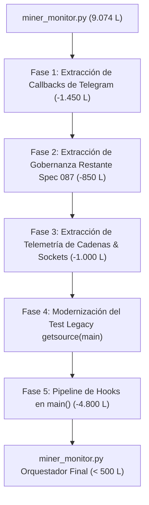

# Plan Maestro de Modularización Arquitectónica del Monolito
## Desacoplamiento Gradual de `app/miner_monitor.py` (9.074 L -> <500 L)

**Documento Rector de Arquitectura**: `docs/speckit/MONOLITH_DECOUPLING_MASTER_PLAN.md`  
**Estado Actual**: Planificación Estratégica Aprobada  
**Línea Base Técnica**: 1520 tests PASS, 75 subtests PASS, NSSM Windows Service en producción  
**Objetivo Final**: Reducir `app/miner_monitor.py` a un orquestador declarativo de $\le 500$ líneas mediante 5 fases acotadas, minimizando el margen de error y con 0 riesgo de parada operativa.

---

### 1. Diagnóstico de Causa Raíz: ¿Por qué sigue teniendo 9.074 líneas?

La auditoría forense determinó con exactitud por qué los refactors previos no redujeron el tamaño global:

1. **Desacoplamientos a medias**:
   - Se crearon los paquetes modulares (`app/core/`, `app/governance/`, `app/telegram/`, `app/network/`), pero `miner_monitor.py` retuvo funciones duplicadas y shims de compatibilidad en lugar de delegar completamente en ellos.
   - En la **Spec 085**, se extrajo exitosamente el *Fan Governor* a `app/governance/governor_cycle.py` (reduciendo 572 líneas), pero la extracción del *Preset Balancer* y el *Autotune Watchdog* se postergó formalmente para la **Spec 087**.
2. **Cuerpo Monolítico de Telegram**:
   - Más de **1.420 líneas** de manejo de callbacks de Telegram (`_handle_command_center_callback`, `_handle_help_callback`, `_handle_diagnostic_callback`, `_handle_callback_query`) siguen viviendo adentro de `miner_monitor.py`, en lugar de residir en `app/telegram/`.
3. **El Bucle Procedural Gigante (`main()` = 3.568 líneas)**:
   - La función `main()` contiene un único bloque `while True:` de **3.076 líneas** continuas que ejecuta en serie 18 lógicas de negocio distintas (adquisición, evaluación de racha, guardias térmicas, contingencias, FGA, bajadas compartidas, etc.).
4. **El Freno de los Tests Legacy de `inspect.getsource(main)`**:
   - Existe una prueba heredada (`tests/test_startup_grace_period.py:222`) que utiliza `inspect.getsource(main)` e inspecciona literalmente que ciertas cadenas y condiciones `elif` aparezcan en un orden estricto de índices (`source.index(...)`).
   - Esto intimidó a los refactors previos, impidiendo extraer bloques de `main()` por miedo a romper la suite de pruebas.

---

### 2. Principios de Diseño para Minimizar el Margen de Error

Para que este proceso sea 100% seguro y esté dentro de las capacidades de ejecución paso a paso:

1. **Aislamiento por Dominios de Riesgo**:
   - No se toca el bucle de control de hardware de los mineros mientras se desacopla Telegram.
   - Cada fase se ejecuta en una unidad de trabajo acotada ("bounded turn") con su propio ciclo de verificación.
2. **Invariante de Cero Regresiones**:
   - Cada fase debe mantener los **1520 tests al 100% PASS** antes de avanzar a la siguiente.
3. **Preservación Operativa en Caliente**:
   - El servicio Windows NSSM (`MinerAlerts`) debe poder recargarse limpiamente en producción sin que los mineros sufran cortes de tensión o reinicios espurios.

---

### 3. Las 5 Fases de Modularización Bounded



---

#### Fase 1: Desacoplamiento Total de Callbacks de Telegram
* **Objetivo**: Mover todo el código de UI interactiva y despacho de botones de Telegram fuera de `miner_monitor.py`.
* **Archivos origen**:
  - `_handle_command_center_callback` (L3755–L4261, ~506 líneas)
  - `_handle_diagnostic_callback` (L4308–L4547, ~240 líneas)
  - `_handle_callback_query` (L4548–L5228, ~680 líneas)
  - `_handle_help_callback` (L4262–L4307, ~45 líneas)
* **Destino**: `app/telegram/callbacks.py` y `app/telegram/command_center.py`.
* **Reducción neta estimada**: **~1.450 líneas**.
* **Riesgo**: **Muy Bajo** (no interactúa con el algoritmo de enfriamiento ni con el socket de potencia).
* **Criterio de salida**: Suite de tests de callbacks (`test_telegram_callbacks.py`, `test_controlled_telegram_simulation.py`) en 100% PASS.

---

#### Fase 2: Extracción de Gobernanza Restante (Spec 087)
* **Objetivo**: Extraer los dos algoritmos de control que quedaron pendientes en la Spec 085.
* **Archivos origen**:
  - `execute_balancer_cycle` (L3362–L3614, ~252 líneas) $\rightarrow$ mover a `app/governance/preset_balancer.py`.
  - `check_autotune_watchdog` (L3615–L3754, ~140 líneas) $\rightarrow$ mover a `app/governance/autotune_watchdog.py`.
  - Clases auxiliares de decisión de balanceo $\rightarrow$ `app/governance/`.
* **Reducción neta estimada**: **~850 líneas**.
* **Riesgo**: **Medio** (requiere mantener la thread-safety del estado usando `_orchestrator_state.py`).
* **Criterio de salida**: `test_governor_cycle.py`, `test_autotune_watchdog.py` y suite completa PASS.

---

#### Fase 3: Extracción de Telemetría de Cadenas y Clientes ASIC Socket 4028
* **Objetivo**: Extraer la recolección asíncrona de chips y las llamadas directas de bajo nivel.
* **Archivos origen**:
  - `_async_collect_chain_telemetry` y `_async_evaluate_predictive_chain_break` (L2944–L3361, ~418 líneas) $\rightarrow$ `app/hardware/chain_collector.py`.
  - Wrappers de sockets raw (`_read_command`, `read_summary`, `read_stats_snapshot`, `read_pools`, `read_version`, L1078–L1107, ~300 líneas) $\rightarrow$ `app/network/cgminer_client.py`.
  - Formateadores de texto (`build_stability_health_text`, `build_mining_quality_text`, L2150–L2436, ~280 líneas) $\rightarrow$ `app/forensics/` y `app/telegram/fleet_cards.py`.
* **Reducción neta estimada**: **~1.000 líneas**.
* **Riesgo**: **Bajo/Medio**.
* **Criterio de salida**: `test_chain_health.py`, `test_mining_quality.py`, suite completa PASS.

---

#### Fase 4: Modernización del Contrato de Pruebas `inspect.getsource(main)`
* **Objetivo**: Reemplazar la aserción estricta de cadenas en `tests/test_startup_grace_period.py:222` por una verificación de comportamiento (igual a la que implementó exitosamente la Spec 070 en `tests/test_supervisory_core_behavioral.py`).
* **Justificación técnica**: Mientras un test verifique que `elif startup_guard_active` esté en la línea X de `main()`, nadie puede mover esa lógica a un Hook. Modernizar el test permite evaluar el contrato funcional sin atar el código a una estructura de texto rígida.
* **Reducción de acoplamiento**: **Crítica** (desbloquea formalmente la Fase 5).
* **Riesgo**: **Muy Bajo** (solo afecta un archivo de tests sin impacto en runtime).

---

#### Fase 5: Conversión del Bucle `main()` en Pipeline Declarativo de Hooks
* **Objetivo**: Reducir las 3.076 líneas del bucle `while True:` procedural a un ciclo limpio de 7 etapas utilizando `CoreSupervisoryEngine` (`app/core/engine.py`):
  1. `StagePreTick`: Sincronización temporal y liveness heartbeat.
  2. `StageAcquisition`: Adquisición paralela adaptativa de telemetría (API 4028 y VNish).
  3. `StageDetection`: Clasificación de estados (OK, LOW, OFFLINE, HASHBOARD), racha y candidatos a reinicio.
  4. `StageGovernance`: Fan Governor, Preset Balancer, Contingencia de Elevadores, Bajada Compartida, FGA.
  5. `StageActuator`: Ejecución segura de reinicios escalonados, paradas y cambios de preset.
  6. `StagePersistence`: Escritura atómica a disco de `state.json` y commit a SQLite EventStore.
  7. `StagePostTick`: Sincronización de digest diario y espera de evento (`_WAKEUP_EVENT.wait()`).
* **Estructura final de `app/miner_monitor.py`**:
  ```python
  def main() -> None:
      config = load_config()
      engine = CoreSupervisoryEngine(config)
      engine.register_standard_hooks()
      engine.run_forever()
  ```
* **Líneas finales de `miner_monitor.py`**: **$\le 450$ líneas**.
* **Reducción neta**: **~4.800 líneas**.
* **Riesgo**: **Medio/Alto** (mitigado al haber ejecutado las Fases 1 a 4 previamente).

---

### 4. Cronograma Sugerido y Siguientes Pasos

1. **Paso Inmediato**: Esperar a que **Gemini 3.8 Flash High** concluya en la otra terminal el despliegue de las tareas de producción de `prompt.txt` (normalización de S19JPRO-26 y plan de parada/reanudación).
2. **Paso Siguiente**: Registrar formalmente la **Fase 1 (Extracción de Callbacks de Telegram)** en `docs/speckit/ROADMAP.md` y preparar la primera unidad de trabajo bounded.
3. **Ejecución Iterativa**: Desarrollar una fase por sesión, validando 1520 tests PASS en cada cierre antes de tocar la siguiente.
