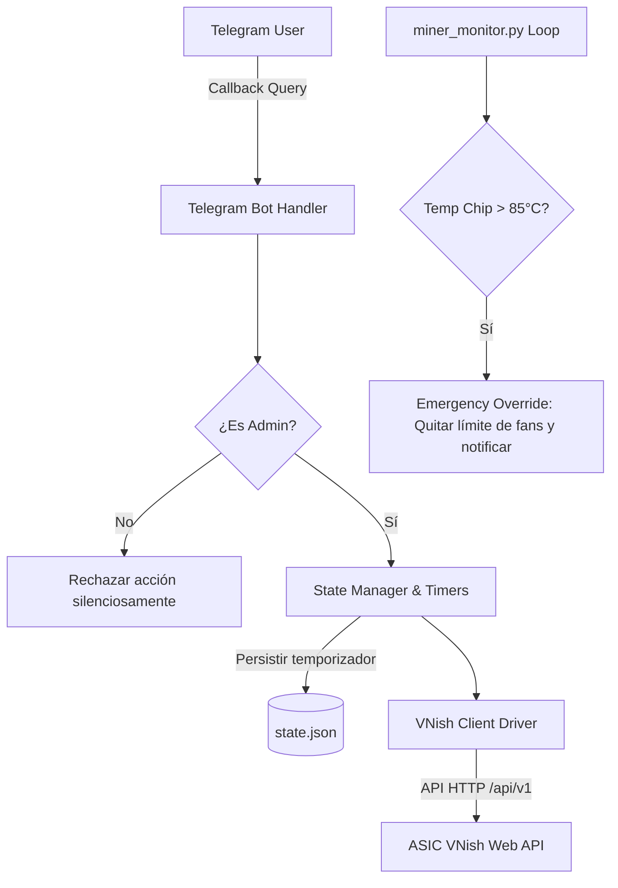

# RFC: Telegram Interactive Command Center & Remote Control (VNish)
**Estado:** BORRADOR PARA AUDITORÍA  
**Fecha:** 2026-09-08  
**Autor Inicial:** Gemini 3.8 Flash High  
**Revisor Designado:** Claude Sonnet 4.6 (Thinking)  
**Ubicación:** `docs/speckit/RFC_TELEGRAM_INTERACTIVE_CONTROL.md`

---

## 1. Contexto y Objetivos (Problem Statement)
### 1.1 Situación Actual (Baseline V3.0.0)
- `miner-alerts` actúa primordialmente como demonio de alerta unidireccional y diagnóstico pasivo vía polling de texto (`/status`, `/reboot`).
- Cualquier ajuste operativo (ajuste de ventiladores, bajada de potencia para visitas o mantenimiento, cambio de perfiles) requiere acceso local LAN o VPN al panel web de VNish.
- Si el operador silencia los mineros manualmente en VNish, con frecuencia olvida volver a subir la potencia horas más tarde, perdiendo hashrate.

### 1.2 Objetivos
1. **Centro de Control Táctil:** Convertir el bot en un dashboard interactivo con botones inline (`InlineKeyboardMarkup`) para operar en 1 o 2 clicks desde el móvil.
2. **Modo Silencio / Visitas Inteligente con Temporizador:**
   - Limitar fans entre 40% y 70%.
   - Regular target de potencia/frecuencia para no superar los 82°C en chips con ventilación reducida.
   - Definir duración (30m, 1h, 2h, 4h, 6h, etc.) y **revertir automáticamente** a máxima potencia al expirar el tiempo con aviso por Telegram.
3. **Safety Guard (Seguridad Térmica):** Watchdog prioritario que anula el Modo Silencio si cualquier chip supera los 85°C.
4. **Alertas Accionables:** Cada alerta de caída o sobrecalentamiento incluirá botones de acción inmediata (`[🔄 Reiniciar]`, `[🔍 Diagnóstico]`, `[🔕 Silenciar Alerta]`).

---

## 2. Diseño de Experiencia de Usuario (Telegram UI/UX)

### 2.1 Menú Principal Persistente (`/menu`)
```text
╔══════════════════════════════════════╗
║   ⛏️ MINER-ALERTS COMMAND CENTER    ║
╚══════════════════════════════════════╝

🟢 ESTADO: Todos Minando (3/3)
⚡ Hashrate: 342.5 TH/s  |  🔌 10,240 W
🌡️ Temp Max: 78.4°C      |  🌪️ Fans: 62% - 68%

[ 📊 Métricas Detalladas ]   [ ⚙️ Cambiar Perfil ]
[ 🔇 Modo Silencio (Visitas) ] [ 🔄 Acciones / Reinicios ]
[ ⏱️ Temporizadores Activos ] [ 🔔 Configurar Alertas ]
```

### 2.2 Flujo de Activación del Modo Silencio
1. **Click en `[ 🔇 Modo Silencio (Visitas) ]`**  
   Telegram edita el mensaje en caliente:
   ```text
   🔇 MODO SILENCIO / VISITAS
   - Límite de ventiladores: 40% - 70%
   - Temp Target chips: <= 82°C
   - Potencia: Regulada automáticamente

   ¿Por cuánto tiempo deseas activarlo?
   [ ⏱️ 30 min ]   [ ⏱️ 1 hora ]   [ ⏱️ 2 horas ]
   [ ⏱️ 4 horas ]  [ ⏱️ 6 horas ]  [ ⏱️ 8 horas ]
   [ ♾️ Sin límite ]               [ ❌ Cancelar ]
   ```
2. **Click en `[ ⏱️ 2 horas ]`**
   - El bot invoca el endpoint de VNish para aplicar el perfil / límite de fans.
   - Registra en `state.json`: `{"silent_mode": true, "revert_at": "2026-09-08T20:30:00Z", "prev_profile": "MaxHash"}`.
   - Mensaje editado a: *✅ Modo Silencio ACTIVADO (Fans max 70% | 82°C). Reversión programada a las 20:30 hs (en 2h).*
3. **Expiración del Temporizador:**
   - Restaura el perfil de producción normal.
   - Notifica a Telegram: *🔔 ⏱️ Modo Silencio finalizado. Mineros restaurados a perfil de máxima potencia.*

---

## 3. Arquitectura Técnica & Alternativas



### 3.1 Alternativas de Control de VNish
- **Opción A (Recomendada - Presets VNish):** Guardar en VNish los perfiles `Produccion_Max` y `Silent_Visitas`. El bot solo conmuta perfiles por API REST (`/api/v1/profile`). Es la más estable porque el auto-tune interno de VNish calibra voltajes de forma segura.
- **Opción B (Dinámica):** Modificar directamente endpoints de fans y target power en caliente. Más flexible, pero mayor riesgo de fluctuación térmica.

### 3.2 Concurrencia y Temporizadores
- Los temporizadores no deben depender de un `sleep()` bloqueante en Python.
- Deben registrarse marcas de tiempo Unix en `app/state.json` para que, si el script o la PC se reinician, el temporizador persista y sepa si debe seguir activo o revertir.

---

## 4. Análisis de Riesgos y Seguridad Operativa
1. **Riesgo Térmico:** Si el ambiente está caluroso y los fans tienen un tope del 60%, los chips pueden dispararse.
   - *Mitigación:* **Safety Thermal Guard** hardcodeado en el monitor. A 85°C se anula cualquier límite de ventilación automáticamente.
2. **Riesgo de Concurrencia en Telegram:** El polling actual de Telegram no debe colgarse ni retrasar el loop de lectura de sockets de los ASICs.
   - *Mitigación:* Los callbacks de comandos pesados se ejecutan de forma asíncrona o desacoplada con timeout estricto de 3s en llamadas HTTP a VNish.
3. **Riesgo de Seguridad / Permisos:**
   - *Mitigación:* Validación de `user_id == config.telegram.admin_chat_id` en cada recepción de `callback_query`. Botones de confirmación obligatorios para acciones de parada o reinicio.

---

## 5. Programa de Specs Propuesto (Roadmap)

1. **Spec 039: Telegram Inline Keyboards & Interactive Menus**
   - Manejo de `InlineKeyboardMarkup`, `CallbackQuery` y menú jerárquico.
   - Alertas con botones contextuales.
   - Asignado a: **Gemini 3.8 Flash High** (Diseño de datos, templates) + **Claude Sonnet 4.6** (Loop de polling y concurrencia).
2. **Spec 040: Driver de Control Remoto VNish API**
   - Módulo cliente REST para autenticación y llamadas a endpoints de VNish (`/api/v1/profile`, `/api/v1/settings`).
   - Mock tests deterministas y validación de timeouts.
   - Asignado a: **Gemini 3.8 Flash High**.
3. **Spec 041: Modo Silencio con Temporizador Persistente y Thermal Guard**
   - Lógica de estados en `state.json`, temporizador en background, rollback automático y guardián térmico a 85°C.
   - Asignado a: **Claude Sonnet 4.6 (Thinking)** (Lógica crítica de FSM y protección de hardware).

---

## 6. Auditoría Arquitectónica — Claude Sonnet 4.6 (Thinking)

**Auditado**: 2026-09-08  
**Baseline auditado**: V3.0.0 post-Spec 042 — 587/587 tests PASS  
**Código inspeccionado**: `app/miner_monitor.py`, `app/telegram/callbacks.py`, `app/telegram/snooze.py`, `app/governance/fan_governor.py`, `app/vnish/client.py`

---

### 6.1 Veredicto Global

✅ **RFC APROBADO con 4 condiciones de implementación** (ver §6.5).  
El diseño es sólido en sus grandes líneas. Los riesgos identificados son resolubles dentro del modelo de concurrencia existente, sin necesidad de rediseñar la arquitectura de hilos.

---

### 6.2 Concurrencia Telegram Polling vs. Callbacks de Botones

**Arquitectura actual (verificada en código)**:
- Hilo `telegram_polling_worker` (daemon, línea 5765 de `miner_monitor.py`): único consumidor de updates de Telegram.
- Hilo `telegram_sender_worker` (daemon, línea 5758): único productor de `sendMessage`.
- Hilo principal (`main()`): loop de adquisición 4028 + `execute_governor_cycle`.
- Sincronización: `state_lock` (threading.Lock) para mutaciones quirúrgicas; `_TELEGRAM_QUEUE` (Queue, maxsize=200) para mensajes salientes.

**Evaluación de la propuesta RFC**:

El RFC propone que el callback de `[ 🔇 Modo Silencio ]` invoque la API REST de VNish directamente desde el hilo de polling. Esto **crea un bloqueo de hasta 3s × N-mineros** dentro del hilo de polling, durante el cual Telegram no puede responder al `answerCallbackQuery` (debe ocurrir en < 30s según la API de Telegram, pero la latencia visible al usuario es inmediata).

**Riesgo real: Bajo** — con 4 mineros y timeouts de 2.5s cada uno, el bloqueo máximo en serie es 10s (aunque idealmente en paralelo con el patrón `ThreadPoolExecutor` ya establecido en `execute_governor_cycle`). El usuario verá el spinner del botón durante 2–10s, lo cual es aceptable para una operación de cambio de modo.

**Recomendación C1** (obligatoria): Reutilizar el patrón `ThreadPoolExecutor + shutdown(wait=False)` ya implementado en `execute_governor_cycle()` para los callbacks que despachan escrituras a VNish. El hilo de polling no debe hacer más que: (a) parsear, (b) autenticar, (c) responder `answerCallbackQuery` inmediatamente, (d) encolar la acción real en `_TELEGRAM_QUEUE` o en una cola de acciones separada de baja prioridad.

---

### 6.3 Persistencia de Temporizadores ante Reinicios

**Análisis del modelo existente**:

El RFC propone persistir en `state.json`:
```json
{"silent_mode": true, "revert_at": "2026-09-08T20:30:00Z", "prev_profile": "MaxHash"}
```

**Evaluación frente a la implementación actual de snooze**:

El módulo `app/telegram/snooze.py` ya implementa exactamente este patrón para silenciar alertas: `state.snooze_until_ts` (float Unix timestamp) es persistido en `state.json` vía `save_state()` y recuperado en `load_state()`. Este mecanismo ha probado ser robusto ante reinicios del servicio NSSM.

**Gaps identificados**:

1. **Snooze ≠ Modo Silencio**: El snooze actual silencia *alertas* (inhibe notificaciones y auto-reboots). El Modo Silencio propuesto es físicamente diferente: cambia el hardware (fans + frecuencia). Son dos FSM distintas que deben vivir en campos de `MinerState` separados para no interferir entre sí.

2. **Reversión de perfil tras reinicio**: Si el servicio se reinicia mientras Modo Silencio está activo, `load_state()` recuperará `silent_mode_active: True` y `revert_at: <timestamp>`. El código de inicialización del loop **debe verificar** si `revert_at < now()` y, en ese caso: (a) si ya expiró → restaurar perfil máximo y registrar en log, (b) si aún vigente → reactivar el temporizador en memoria. Esta lógica **no se implementa sola**: debe ser explícita en el primer tick.

3. **Perfil anterior (`prev_profile`)**: Persistir el nombre del perfil de producción es correcto, pero VNish no garantiza que el perfil "MaxHash" siga existiendo si el firmware fue actualizado entre el reinicio y la restauración. Se recomienda persistir los parámetros concretos (frecuencia objetivo, duty PWM máximo) además del nombre del perfil, como respaldo fallback.

**Recomendación C2** (obligatoria): Agregar campos de `MinerState` separados del snooze existente:
```python
silent_mode_active: bool = False
silent_mode_revert_ts: Optional[float] = None   # Unix timestamp de expiración
silent_mode_prev_duty: Optional[int] = None      # PWM antes del modo silencio
silent_mode_prev_freq_mhz: Optional[float] = None
```
Y verificarlos explícitamente en el primer tick (`first_tick = True`).

---

### 6.4 Race Conditions entre Governor y Modo Silencio

**Riesgo crítico identificado**:

El Fan Governor (`execute_governor_cycle`, invocado al final de cada tick del main loop) evalúa `governor_last_temp_c` y puede emitir `STEP_DOWN` commands a VNish **incluso cuando el Modo Silencio ya ha reducido el PWM al límite configurado**. Si el Modo Silencio establece `duty = 50%` y el Governor luego intenta subir a `STEP_UP: 53%` porque la temperatura subió por el PWM reducido, el operador obtiene un comportamiento incoherente: dos sistemas de control intentando controlar el mismo actuador.

**Caso de carrera concreto**:
```
T=0s:   Modo Silencio activado → VNish: duty=50%
T=30s:  Tick del Governor: T_max=83.5°C → EMERGENCY_SPIKE → VNish: duty=100%  ← correcto
T=120s: T_max=79°C → STEP_DOWN → VNish: duty=98%  ← rompe el límite de silencio
```

La regla de emergencia (`EMERGENCY_SPIKE` a 83°C) **debe** tener prioridad absoluta sobre el Modo Silencio (esto ya está correctamente modelado en `fan_governor.py`). El problema es el comportamiento post-emergencia: ¿quién restaura el Modo Silencio?

**Recomendación C3** (obligatoria): El `GovernorConfig` debe recibir, en el tick donde Modo Silencio está activo, un `min_fan_duty_percent` dinámico igual al piso del Modo Silencio y un `max_fan_duty_percent` dinámico igual al techo del Modo Silencio (ej. 40–70%). Esto hace que el Governor opere dentro del rango del Modo Silencio, en lugar de competir con él. La excepción es el `EMERGENCY_SPIKE` que siempre va a 100% (ignora max_fan_duty_percent por diseño).

Implementación: antes de construir `GovernorConfig` en `execute_governor_cycle`, leer el estado de `silent_mode_active` del `MinerState` correspondiente y ajustar `min_fan_duty_percent` y `max_fan_duty_percent` en consecuencia.

---

### 6.5 Safety Thermal Guard (Protocolo de Anulación a 85°C)

**Evaluación del diseño propuesto**:

El RFC propone un watchdog que anule el Modo Silencio si cualquier chip supera 85°C. Esta lógica ya existe parcialmente: `fan_governor.py` tiene `ACTION_EMERGENCY_SPIKE` a 83°C (margen 2°C antes del umbral de seguridad de hardware de 85°C).

**Gap**: La anulación a 83°C del Governor es correcta y opera en el *tick del main loop*. Pero el RFC necesita una anulación a 85°C del *Modo Silencio como estado*, que además persiste en `state.json`. El Governor puede subir el PWM a 100% en caliente, pero el `silent_mode_active = True` sigue en `state.json`. Si el servicio se reinicia mientras T > 85°C y antes de que el Governor haya podido actuar, el primer tick restaurará Modo Silencio con duty 50% — potencialmente peligroso.

**Recomendación C4** (obligatoria): Cuando el Governor emite `EMERGENCY_SPIKE` o `FAILSAFE_FAULT`, debe setear `state.silent_mode_active = False` y borrar `state.silent_mode_revert_ts = None` como parte del update bajo `state_lock`. Esto garantiza que el estado persiste consistente: si el servicio se reinicia, no hay Modo Silencio activo para restaurar. Enviar notificación Telegram inmediata: *⚠️ Modo Silencio ANULADO por Guardián Térmico (T={max_temp:.1f}°C ≥ 83.0°C). Ventiladores a 100%.*

---

### 6.6 Evaluación de Alternativas de Control VNish (§3.1 del RFC)

**Opción A (Presets VNish)** es correcta como enfoque primario.  
**Sin embargo**, la Opción A asume que el endpoint `/api/v1/profile` existe y es estable en Vnish 1.2.7–1.2.9. La experiencia con la Spec 039 mostró que el endpoint real es `/api/v1/settings` con el bloque `miner.cooling.mode`. Verificar que el endpoint de perfil está disponible y documentarlo en el contrato antes de implementar Spec 040.

Si los perfiles no están disponibles vía API, la Opción B (ajuste directo de fans + frecuencia) es viable con el cliente `app/vnish/client.py` ya existente, reutilizando `safe_set_fan_duty()` para fans y extendiendo con `set_frequency_profile()` para la limitación de potencia.

---

### 6.7 Resumen de Condiciones de Implementación

| ID | Condición | Fase Afectada | Prioridad |
|----|-----------|---------------|-----------|
| **C1** | Callbacks a VNish desde polling deben usar cola desacoplada o `ThreadPoolExecutor` | Spec 041 (Modo Silencio) | P0 — Bloqueante |
| **C2** | `MinerState` con campos `silent_mode_*` separados del snooze; verificación en primer tick | Spec 041 | P0 — Bloqueante |
| **C3** | Governor recibe `min/max_fan_duty_percent` dinámicos del Modo Silencio; coexistencia segura | Spec 041 (integración) | P0 — Bloqueante |
| **C4** | `EMERGENCY_SPIKE` desactiva `silent_mode_active` en `state.json` y notifica vía Telegram | Spec 041 (Thermal Guard) | P0 — Bloqueante |

**Condiciones informativas (no bloqueantes)**:
- Verificar disponibilidad real del endpoint de perfiles VNish 1.2.7–1.2.9 antes de diseñar Spec 040.
- Persistir parámetros concretos (`prev_duty`, `prev_freq_mhz`) además del nombre del perfil para restauración fallback.
- La numeración de Specs en §5 del RFC es incorrecta: Spec 039 ya está implementada (Fan Governor). Las nuevas specs deben ser 043, 044, 045 o similares según el estado real del ROADMAP.

**Modelo recomendado para implementación**:  
- Spec de Inline Keyboards (menú, botones accionables): **Gemini 3.8 Flash High** (diseño puro, sin concurrencia de hardware).  
- Spec de Modo Silencio + Thermal Guard (FSM, persistencia, integración con Governor): **Claude Sonnet 4.6 (Thinking)**.
