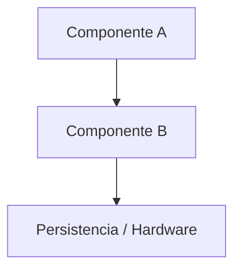

# RFC: [Nombre Descriptivo de la Feature o Refactor]
**Estado:** BORRADOR / EN AUDITORÍA / APROBADO  
**Fecha:** YYYY-MM-DD  
**Autor Inicial:** [Gemini 3.8 Flash High / Claude Sonnet 4.6]  
**Revisor Designado:** [Claude Sonnet 4.6 (Thinking) / Opus 4.6]  
**Ubicación:** `docs/speckit/RFC_[NOMBRE_CORTO].md`

---

## 1. Contexto y Justificación (Problem Statement)
### 1.1 Situación Actual (Baseline)
- Descripción del estado actual del sistema o código.
- Limitaciones, puntos de fricción o riesgos operativos actuales.

### 1.2 Objetivos y Alcance
- Qué resuelve esta propuesta.
- Qué queda explícitamente FUERA de alcance (Non-Goals).

---

## 2. Visión Funcional & UX (Experience Design)
### 2.1 Flujo de Usuario / Operador
- Interacción paso a paso.
- Casos de uso típicos.

### 2.2 Wireframes / Mockups (CLI, Telegram, Logs)
```text
[Boceto del formato de mensajes, botones inline o salidas de log]
```

---

## 3. Arquitectura Técnica & Alternativas Evaluadas
### 3.1 Diagrama de Componentes o Flujo


### 3.2 Alternativas de Diseño y Trade-offs
- **Alternativa A (Recomendada):** [Descripción, Pros, Contras].
- **Alternativa B:** [Descripción, Pros, Contras].

### 3.3 Integración con Estado y Persistencia
- Cambios en `state.json`, `config.json` o contratos de red.
- Manejo de fallos, timeouts y reinicios del proceso.

---

## 4. Análisis de Riesgos y Seguridad Operativa (Safety First)
1. **Riesgos de Hardware / Térmicos:** [Efecto sobre ASICs, mitigaciones, watchdogs].
2. **Riesgos de Concurrencia y Carrera:** [Sockets, hilos, async, bloqueos de I/O].
3. **Seguridad y Permisos:** [Autenticación de operadores, confirmaciones destructivas].

---

## 5. Programa de Specs Propuesto (Roadmap & Handoff)
1. **Spec 0XX: [Subtarea 1]** - Alcance, entregable, modelo asignado (`Gemini` / `Claude`).
2. **Spec 0YY: [Subtarea 2]** - Alcance, entregable, modelo asignado.
3. **Criterios Globales de Aceptación (Definition of Done)**.

---

## 6. Sección de Auditoría de Claude (Handoff Review)
- [ ] Revisión de concurrencia y deadlocks.
- [ ] Validación de la persistencia de estado ante fallos.
- [ ] Resiliencia de red y timeouts de APIs externas.
- [ ] Aportes y recomendaciones arquitectónicas:
  *(Comentarios del auditor aquí)*
