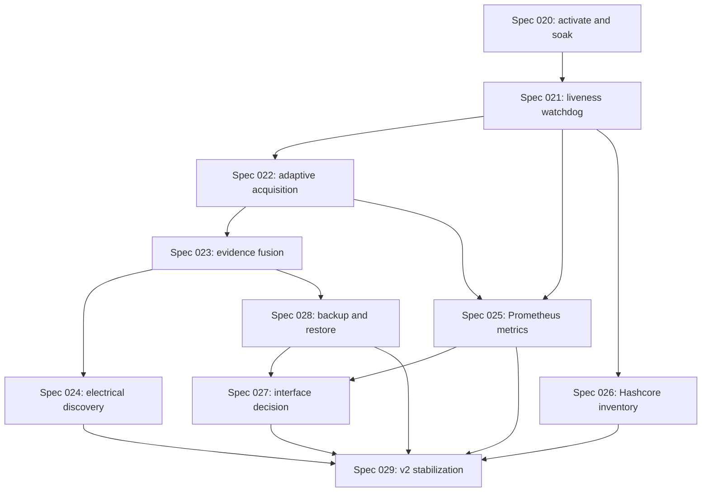

# Miner Alerts Specification Program

**Planning baseline**: 2026-08-13
**Program horizon**: 2026-08-13 to 2026-12-20
**Active production gate**: `specs/020-episode-alerts`
**Canonical schedule**: `docs/speckit/DELIVERY_PLAN.md`

## Purpose

This program converts the approved roadmap into implementation-ready Speckit
packages. It defines sequence, dependencies, safety class, technology gates and
the evidence required before each package may close. It is planning only: the
presence of a spec does not mean that its code, rollout or runtime behavior has
been completed.

## Current Baseline

- The Windows service remains the production runtime and `app/miner_monitor.py`
  remains the only monitor/action authority.
- API 4028 polling is the authoritative miner-health acquisition path.
- Vnish WebSocket collection is bounded, scheduled and read-only; it enriches
  evidence but does not replace API 4028 or authorize actions.
- SQLite schema v5 is the durable incident, sample, firmware and decision store.
- Telegram is the remote control surface; the static operations dashboard is
  read-only.
- Spec 020 is implemented and pushed, but its elevated service activation,
  runtime smoke and observation gate are still open. No later monitor-runtime
  spec may roll out until that gate is closed.

## Decisions Made In This Planning Pass

1. **No Spec 021 is created merely to close Spec 020.** Spec 020 already owns
   rollout and soak task T020. Duplicating that ownership would make evidence
   ambiguous.
2. **API 4028 polling remains authoritative.** The deployed protocol is
   request/response. WebSockets are retained only where Vnish actually publishes
   asynchronous firmware evidence.
3. **Adaptive acquisition separates authoritative samples from diagnostic
   probes.** Faster temporary probes may improve visibility but must not advance
   state streaks, sustained-LOW timers or auto-reboot eligibility.
4. **Monitor liveness is supervised out of process.** The watchdog reads a
   bounded heartbeat and service state, can notify, and has no miner or Hashcore
   action path.
5. **Prometheus/Grafana are the preferred observability stack.** A local-only
   exporter reads durable/read-only state; it is not embedded as a second action
   surface in the monitor.
6. **Docker is limited to auxiliary observability services.** The Windows monitor
   and Hashcore integration stay native because they depend on Windows service,
   local paths and Toolkit execution.
7. **FastAPI is conditional.** Static HTML plus Grafana are evaluated first. A
   local-only read API/MVP is built only if a measured operator workflow remains
   unsolved; React is not a default dependency.
8. **Electrical telemetry begins with source discovery.** AC input voltage is
   never inferred from hashboard/chain voltage. SNMPv3, Modbus TCP, vendor HTTPS
   or MQTT are selected only after a real PDU/UPS/meter publisher is identified.
9. **Hashcore expansion starts with a read-only inventory.** Unknown commands are
   classified as mutating until proven otherwise. Existing reboot/restart scope
   does not expand in Spec 026.
10. **OpenTelemetry is deferred.** One Windows process, one auxiliary collector
    and local Prometheus metrics do not yet justify an OTLP collector pipeline.
11. **SQLite backup uses the SQLite backup interface, not a blind live file
    copy.** Restore is first rehearsed to a staging path and never overwrites the
    live database automatically.
12. **Every production-affecting spec has a separate observation/fix window.**
    Calendar pressure moves dates; it cannot remove runtime evidence gates.

## Program Inventory

| Order | Spec | Priority | Risk | Depends on | Outcome |
| --- | --- | --- | --- | --- | --- |
| Gate | 020 Episode Alerts closeout | P0 | HIGH | Current runtime | Activate, smoke-test and soak the already implemented release. |
| 1 | 021 Monitor Liveness Watchdog | P0 | HIGH | Spec 020 gate | Detect process death, stalled ticks and stale workers independently. |
| 2 | 022 Adaptive Acquisition | P1 | HIGH | 021 | Improve freshness and poll evidence without changing action semantics. |
| 3 | 023 Incident Evidence Fusion | P1 | MEDIUM | 022 | Correlate durable miner, Vnish, quality and fleet evidence conservatively. |
| 4 | 024 Electrical Source Discovery | P1 | MEDIUM | 023; real hardware | Prove or block a trustworthy AC power telemetry source. |
| 5 | 025 Prometheus Metrics | P1 | MEDIUM | 021, 022 | Export bounded local metrics and provision Grafana read-only views. |
| 6 | 026 Hashcore Capability Inventory | P2 | MEDIUM | 021; Toolkit present | Produce a sanitized command/risk map without new actions. |
| 7 | 028 Backup Retention Restore | P1 | HIGH | Stable schema after 023 | Create verified SQLite backups and a staging restore drill. |
| 8 | 027 Operator Interface Decision | P2 | MEDIUM | 025, 028 | Decide whether Grafana/static HTML suffice; conditional local FastAPI MVP. |
| 9 | 029 V2 Release Stabilization | P0 | HIGH | All accepted packages | Cross-feature regression, restore proof, docs audit and release candidate. |

The directory numbers preserve the roadmap concepts created before this program.
Execution order is governed by dependencies and priority, so Spec 028 is
scheduled before conditional Spec 027.

## Dependency Graph



## Shared Architecture Boundaries

### Action Authority

- Only the existing monitor may call Hashcore reboot/restart paths.
- Watchdog, exporter, dashboard, backup tooling and discovery probes are
  read-only with respect to miners.
- No new web, metrics, MQTT, SNMP or electrical signal may authorize automatic
  action in this program.

### Source Of Truth

- Current miner signal: authoritative API 4028 sample.
- Confirmed state/action eligibility: existing state machine and safety gates.
- Firmware context: bounded Vnish collector evidence.
- Historical incidents/decisions: SQLite.
- Monitor liveness: independent heartbeat plus process/service observation.
- Electrical facts: selected external device with source timestamp and quality.

### Runtime Topology

```text
Windows native
|-- MinerAlerts service: polling, state machine, Telegram, action authority
|-- Vnish collector task: bounded read-only firmware evidence
|-- Monitor watchdog task: heartbeat/service checks and liveness notification
|-- Backup task: SQLite online backup and manifest
`-- Metrics exporter: localhost read-only endpoint

Optional Docker
|-- Prometheus
`-- Grafana
```

## Shared Validation Gates

Every spec must apply the gates relevant to its risk class.

| Gate | LOW | MEDIUM | HIGH |
| --- | --- | --- | --- |
| Requirements checklist and cross-artifact analysis | Required | Required | Required |
| Targeted unit/contract tests | If executable behavior changes | Required | Required, test-first |
| Full Python regression and `py_compile` | If Python changes | Required | Required |
| QA no-action proof | Not applicable | If command/diagnostic path touches action context | Required |
| Controlled Windows service activation | No | If long-lived service changes | Required |
| D+1/D+3 runtime review | No | Required for long-lived components | Required |
| Rollback/restore evidence | Documented | Required where persisted/runtime state changes | Required |
| Core invariant comparison | No | Scoped | State machine, polling offset and auto-reboot required |

## Spec Definition Of Done

A future spec is complete only when all of the following are true:

1. `spec.md`, `plan.md`, `research.md`, `data-model.md`, `contracts/`,
   `quickstart.md`, `tasks.md`, `checklists/requirements.md` and `evidence.md`
   agree on names, scope and validation.
2. Every task is checked only after its evidence is recorded.
3. Unverified production behavior is marked pending or blocked.
4. Real config, state, database copies, logs, credentials and miner addresses are
   absent from Git.
5. `ROADMAP.md`, `DELIVERY_PLAN.md`, strategy docs and the newest-first
   development log are synchronized in the same closeout.
6. Production-affecting work completed its observation/fix window with no open
   P0/P1 regression.

## Documentation Sweep Protocol

The program requires three documentation sweeps.

### Sweep 1 - After Spec Generation

- Validate all 021-029 artifact sets and requirement/task coverage.
- Resolve naming, dependency, risk and technology conflicts.
- Recalculate dates from the real current date, never from an expired estimate.

### Sweep 2 - Cross-Spec Consistency

- Compare contracts for heartbeat, acquisition quality, incidents, metrics,
  power samples, backups and interface reads.
- Confirm no secondary service gains action authority.
- Confirm Telegram, static HTML, Grafana and optional FastAPI use consistent
  operator terms and freshness semantics.

### Sweep 3 - Final Governance

- Synchronize this program, roadmap, delivery calendar, strategy docs, runbook,
  README and constitution references.
- Verify links, statuses, dates, local-only boundaries and secret hygiene.
- Record why any spec was added, split, reordered or deferred.

## Changes To The Earlier Roadmap

- Dates from the 2026-07-22 draft were expired and are recalculated from
  2026-08-13.
- Spec 020 closeout remains its own task rather than being renamed as Spec 021.
- Backup/retention/restore is promoted into dedicated Spec 028 instead of being
  hidden inside the final stabilization window.
- Final cross-feature release work is made explicit as Spec 029.
- Interface work remains conditional and moves after backup proof.
- OpenTelemetry, continuous Vnish WebSockets, MQTT without a publisher and web
  action controls remain deferred because their prerequisites are not present.

## Planning Audit Record - 2026-08-13

### Sweep 1 - Artifact Quality

- Validated 81 artifacts across nine planned specs: 27 user stories, 96
  functional requirements, 45 measurable success criteria and 129 ordered
  tasks.
- Confirmed every package has research, data model, contract, quickstart,
  requirements checklist, rollback boundary and initial evidence record.
- Found and corrected one cross-template omission: risk classification was
  explicit in specs/tasks but not in plans.
- No unresolved clarification, TODO or TBD marker remains in the planned
  artifacts.

### Sweep 2 - Cross-Spec Consistency

- Verified dependency references, program order and roadmap/calendar date
  ranges for Specs 020-029.
- Confirmed API 4028 authority, diagnostic-only Vnish/electrical evidence,
  one monitor action authority and conditional interface boundaries across all
  contracts.
- Clarified Spec 021 as `READY / GATED`, marked every future quickstart as a
  planned procedure, and made Spec 029 dependencies explicit.
- Preserved the deliberate Spec 028-before-027 execution order and the
  no-build outcome for optional interface work.

### Sweep 3 - Governance And Hygiene

- Verified local Markdown links, active-feature pointer, canonical dates,
  planned/implemented status language and absence of real tokens or private
  miner addresses in new planning artifacts.
- Synchronized roadmap, delivery calendar, strategy documents, README,
  Speckit guide, agent instructions and constitution references.
- Confirmed this pass changes documentation/specification artifacts only; it
  does not change runtime code, local config/state, Git history or the running
  Windows service.

### Open External Gates

- Spec 020 elevated activation and runtime observation remain the immediate
  blocker.
- Spec 024 requires actual PDU/UPS/meter identity and documented read access.
- Spec 025 requires Docker availability or an approved native validation path.
- Spec 026 requires the installed Toolkit and proven safe discovery commands.
- Windows service/watchdog rollout requires an elevated maintenance window.

## Program State

- Specs 021-029 are **Planned**, not active and not implemented.
- `.specify/feature.json` intentionally continues to point to Spec 020 until its
  runtime gate closes.
- This multi-spec planning pass does not execute the Speckit Git feature hook:
  creating nine branches would misrepresent planned work as active work and the
  user explicitly excluded Git operations from this task.
