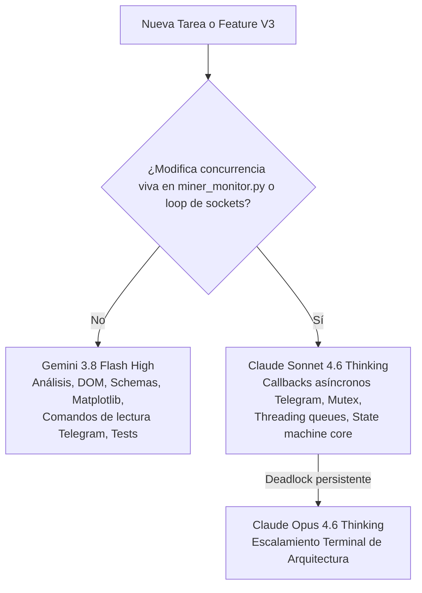

# Miner Alerts — Plan de Expansión V3 y Maximización de Capacidades

**Fecha de creación**: 2026-09-07  
**Estado**: Documento Estratégico de Mejoras Futuras  
**Línea base actual**: Release v2.0.0 Certificado (Specs 001–030 cerradas)  
**Gobernanza**: Constitución v1.5.0 (Gemini 3.8 Flash High + Claude Sonnet/Opus 4.6 Thinking)  

---

## 1. El Salto Cualitativo: ¿Qué podemos hacer en V2 que antes era imposible?

Con la culminación de las 30 especificaciones del programa V2, Miner Alerts pasó de ser un script lineal de alertas a un **sistema de monitoreo y telemetría de grado industrial**:

| Capacidad | En V1 (Inicial) | En V2.0.0 (Actual) |
|---|---|---|
| **Interfaz Gráfica** | Inexistente (solo texto plano en logs y Telegram). | **Dashboard HTML operativo** (`tools/operations_dashboard.py`) con sparklines SVG, Stability Advisor y Mining Quality. Stack **Prometheus + Grafana** para series temporales. |
| **Persistencia de Datos** | Archivo plano volátil `app/state.json`. | **Base de datos SQLite EventStore v5** con historial forense de muestras, eventos, calidad, telemetría Vnish y registro inmutable de decisiones. |
| **Respaldo y Seguridad** | Inexistente (riesgo de pérdida de historial). | **Backups online en caliente** (`tools/event_store_backup.py`) sin detener el servicio, rotación 14/8/12, checksums SHA-256 y simulacros de restore en staging probados. |
| **Supervisión de Caídas** | Si el proceso fallaba, quedaba caído silenciosamente. | **Watchdog independiente** (`tools/monitor_watchdog.py`) fuera de proceso con supervisión SCM de Windows; autorrecuperación en 60s tras caídas. |
| **Calidad de Alertas** | Falsos positivos (a veces alertaba OFFLINE con hashrate positivo). | **Agrupación de episodios y deduplicación estricta**. Jamás emite falsos OFFLINE. Recordatorios periódicos en 5, 10, 15, 30, 60 y 120 min. |
| **Diagnóstico Forense** | Alerta ciega ("hashrate bajo"). | **Fusión de evidencia multi-fuente (`/diagnose`)**: cruza API 4028, logs de firmware Vnish, estado de placas y baselines históricos para dar la causa raíz. |
| **Control Operativo** | Texto libre sin protección. | **Acciones click-safe (`/rb<ID>`, `/reboot_no_ok`, `/c<code>`)** con códigos temporales de 60s y ventanas de enfriamiento para evitar dobles reinicios. |
| **Concurrencia de Red** | Sondeo secuencial bloqueante. | **Adquisición adaptativa**: aislamiento por minero. Si un ASIC cuelga el socket 4028, los demás continúan sondeándose sin retraso. |

---

## 2. Maximización de Telegram: Próximas Funcionalidades (Iniciativa Telegram Max)

Telegram es la terminal de control principal del operador. En la versión actual responde a comandos de texto y enlaces click-safe. Podemos elevarlo al siguiente nivel:

### A. Botones Interactivos en Alertas (Inline Keyboards con 1-Tap)
En lugar de forzar al operador a escribir comandos o códigos, las alertas críticas incluirán botones táctiles interactivos:

```text
🚨 [EPISODIO] Minero 23 — LOW HASHRATE (42.1 TH/s)
Causa probable: Placa 2 con temperatura anómala (82°C).
------------------------------------------------------
[ 🩺 Diagnosticar ]   [ 📊 Ver Gráfico ]
[ 🔄 Reiniciar Minero 23 ]   [ 🔕 Silenciar 1h ]
```
*Al pulsar `[ 🔄 Reiniciar Minero 23 ]`, el mensaje se edita en vivo mostrando `[ ✅ Confirmar ]` y `[ ❌ Cancelar ]`, ejecutando la acción de forma segura con un solo toque.*

### B. Generación y Envío de Gráficos Nativos al Chat (`/chart`)
Implementar la generación ligera de gráficos PNG en memoria (sin dependencias pesadas de servidor web):
- Comando `/chart <miner>`: envía una imagen con la curva de hashrate, temperaturas de boards y fluctuación de los últimos 60 minutos o 24 horas.
- Comando `/chart fleet`: imagen comparativa del hashrate total de la flota vs el umbral nominal.
- Gráficos adjuntos automáticamente en alertas de resolución de episodios largos.

### C. Modo Silenciar / Mantenimiento Temporal (`/snooze`)
Durante tareas de mantenimiento físico, limpieza o cambio de fuentes:
- Comando `/snooze <miner> <minutos>` (ej. `/snooze 23 60`).
- Suprime recordatorios y alertas automáticas de ese minero durante la ventana establecida, restaurando la supervisión normal automáticamente al expirar el tiempo.

### D. Reporte Ejecutivo Diario Programado (Daily Digest)
Un resumen consolidado enviado a una hora fija (ej. 08:00 AM):
```text
☀️ Miner Alerts — Reporte Diario (07/09/2026)
━━━━━━━━━━━━━━━━━━━━━━━━━━━━━━━━━━━━
• Uptime Flota: 100% (4/4 mineros OK)
• Hashrate Promedio: 401.5 TH/s (Nominal: 400 TH/s)
• Eficiencia Promedio: 26.8 J/TH
• Shares: 99.98% aceptados (0.02% rechazos)
• Eventos en 24h: 0 anomalías, 0 reinicios
• Backup SQLite: ✅ Verificado (23.2 MB a las 03:00)
━━━━━━━━━━━━━━━━━━━━━━━━━━━━━━━━━━━━
```

---

## 3. Capacidades Avanzadas de Monitoreo en el Núcleo (Monitor Engine V3)

### A. Detección Temprana de Fuga Térmica y Falla de Ventiladores (Fan Health)
- Cruzar la velocidad de los ventiladores (RPM) con el delta de temperatura chip-ambiente.
- Si los ventiladores alcanzan el 100% de RPM de forma sostenida pero las temperaturas continúan en aumento con hashrate constante, emitir una alerta preventiva de **"Limpieza Requerida o Degradación de Fan"** antes de que ocurra el thermal throttle del firmware.

### B. Métrica de Eficiencia Energética en Tiempo Real (J/TH)
- Calcular y persistir el ratio de eficiencia:
  $$\text{Eficiencia (J/TH)} = \frac{\text{Potencia de Cadena (Watts)}}{\text{Hashrate (TH/s)}}$$
- Permite detectar tempranamente desgaste en fuentes o degradación de chips antes de que caiga el hashrate.

### C. Seguimiento de Presets y Autotuning de Vnish
- Extraer del firmware el preset de consumo/frecuencia activo.
- Si el autotuning dinámico de Vnish reduce automáticamente el perfil de minado por inestabilidad de voltaje o temperatura, alertar al operador sobre el cambio de preset.

### D. Actualización Automática y Periódica del Dashboard HTML
- Incorporar una tarea programada liviana que invoque `tools/operations_dashboard.py` cada 5 o 10 minutos.
- Al abrir `diagnostics/operations_dashboard.html` en cualquier navegador de la red local, los datos y gráficos SVG siempre estarán al día sin necesidad de ejecución manual.

---

## 4. Matriz de Asignación de Modelos Multi-Agente (Constitución v1.5.0)

Para ejecutar este plan con la máxima eficiencia y sin sobrecargar ningún modelo, se aplicará el siguiente reparto estricto:



1. **Gemini 3.8 Flash High (Motor Primario)**:
   - Implementación de comandos de consulta `/chart`, `/snooze`, `/digest`.
   - Generación de gráficos PNG en memoria y cálculo de métricas J/TH.
   - Scripts de renderizado y auto-refresh del Dashboard HTML.
   - Creación de suites de tests exhaustivos (unitarios, deterministas, fixtures).
   - Documentación y seguimiento SpecKit.

2. **Claude Sonnet 4.6 (Thinking) (Escalamiento On-Demand)**:
   - Implementación del despachador de `callback_query` para los botones interactivos de Telegram (Inline Keyboards) dentro del hilo de red de `miner_monitor.py`.
   - Modificación de la máquina de estados para la lógica de timeout y carreras de confirmación táctil.
   - Cualquier ajuste a los sockets multi-hilo de la API 4028.

3. **Claude Opus 4.6 (Thinking) (Escalamiento Terminal)**:
   - Reservado estrictamente para bloqueos arquitectónicos o rediseños estructurales mayores.
