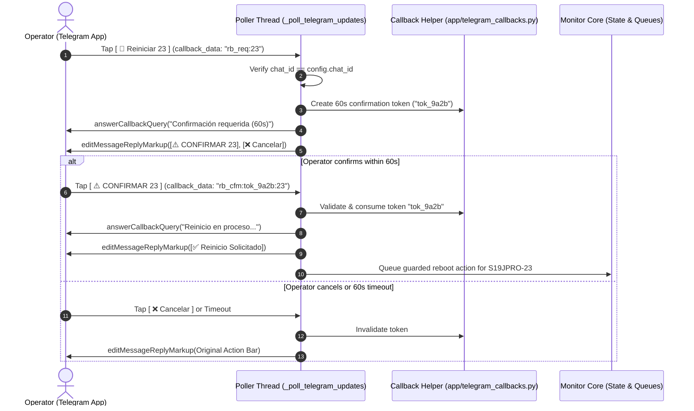

# Implementation Plan: Telegram Interactive Callbacks & Inline Keyboards

**Branch**: `codex/031-telegram-interactive-callbacks` | **Date**: 2026-09-07 | **Spec**: [spec.md](spec.md)

---

## Summary

Introduce interactive 1-Tap Inline Keyboards to Telegram alerts and an asynchronous callback query dispatcher in the monitor's polling thread. Enables instant diagnostics and safe, two-step interactive reboot confirmations with zero manual typing, while strictly preserving all existing text command paths and production safety interlocks.

---

## Technical Context

**Language/Version**: Python 3.14.x  
**Primary Dependencies**: Standard library (`json`, `secrets`, `time`, `threading`) and existing `requests`; no external Telegram frameworks.  
**Storage**: Bounded in-memory token registry (max 10 active tokens, 60s TTL). No SQLite schema migrations needed.  
**Testing**: `unittest` with mock Telegram responses, token generation/expiry, unauthorized callback rejection, and full regression against all existing 416 unit tests.  
**Target Platform**: Windows service (NSSM), PowerShell virtualenv.  
**Performance Goals**: `answerCallbackQuery` acknowledgment < 500 ms; zero extra latency added to miner acquisition loop.  
**Risk Classification**: MEDIUM-HIGH — touches Telegram polling loop and action confirmation flow.  
**Assigned Engine**: **Claude Sonnet 4.6 (Thinking)** for live `miner_monitor.py` multi-threaded callback dispatcher; **Gemini 3.8 Flash High** for pure helpers (`telegram_callbacks.py`), test suites, schemas, and SpecKit tracking.

---

## Constitution Check

- **Production Safety First**: PASS. 2-Step interactive confirmation (`rb_req` -> `rb_cfm`) prevents accidental single-tap reboots. Cooldowns and hardware safety gates remain intact.
- **Single Source Of Truth**: PASS. Config remains in `app/config.json`, no secrets committed.
- **Telegram Operational Controls**: PASS. Strict `chat_id` authentication; unauthorized users cannot trigger actions.
- **Windows Compatibility**: PASS. Pure Python standard library + requests.
- **Evidence-Based Completion**: PASS. Test-first validation, py_compile, and simulated callback execution before production rollout.

---

## Planned Source Scope

```text
app/telegram_callbacks.py          # Pure helper: token registry, callback_data parser/builder, inline keyboard layouts
app/miner_monitor.py               # Dispatcher integration: poll getUpdates callback_query, answerCallbackQuery, editMessageReplyMarkup
app/alert_episodes.py              # Attach inline keyboard markup to episode alerts
tests/test_telegram_callbacks.py   # Unit test suite covering all callback grammar, expiry, and authorization
README.md                          # Document interactive button capabilities
docs/speckit/RUNBOOK.md            # Add operator instructions for 1-Tap buttons
```

---

## Design & Architecture



---

## Rollback And Failure Boundary

- If Telegram Bot API rejects `reply_markup` (e.g. malformed or network glitch), the message sends as plain text without crashing.
- If callback answering fails due to Telegram API timeout, the monitor logs a warning and proceeds without blocking the polling thread.
- If `telegram_callbacks.py` fails, falling back to pure text commands (`/rb23`, `/diagnose 23`, `/c<code>`) requires zero downtime or data migration.
