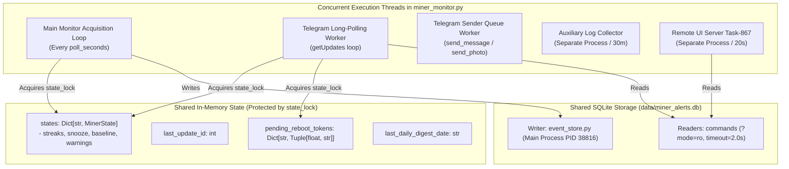

# Implementation Plan: V3 Release Stabilization & Concurrency Hardening (Spec 038)

**Feature**: V3 Core Concurrency & Release Stabilization  
**Risk Class**: HIGH  
**Assigned Engine**: **Claude Sonnet 4.6 (Thinking)**  
**Gate**: Release Candidate V3 (v3.0.0)  

---

## Architecture & Concurrency Audit Scope

---

## Detailed Phases

### Phase 1: Static Concurrency & Mutex Audit
1. Inspect every read and write to `state.snooze_until_ts`, `state.cooling_streak`, `state.last_cooling_warning_ts`, `state.efficiency_streak`, `state.last_efficiency_warning_ts`, `state.baseline_frequency_mhz`, `state.last_preset_warning_ts` in `miner_monitor.py`.
2. Ensure consistent acquisition of `state_lock` across both the polling loop and Telegram command handlers (`/snooze`, `/fans`, `/efficiency`, `/presets`, `/digest`, `/status`).
3. Verify `save_state()` creates atomic snapshots without dirty dictionary iterations.

### Phase 2: Callback Query Dispatcher & Token Concurrency
1. Verify `pending_reboot_tokens` thread-safety under concurrent `rb_req`, `rb_cfm`, and `rb_ccl`.
2. Ensure token expiry (60s) is strictly enforced and expired tokens are cleaned up to prevent memory leakage.
3. Validate that `answer_callback_query` network failures cannot stall the long-polling loop.

### Phase 3: SQLite Connection Lifecycle & Timeout Safeguards
1. Audit all SQLite `connect()` calls in `telegram_charts.py`, `daily_digest.py`, `fan_health.py`, `energy_efficiency.py`, `vnish_presets.py`.
2. Verify strict `?mode=ro`, `timeout=2.0s` and deterministic `try ... finally: conn.close()` in every module.

### Phase 4: Deterministic Concurrency Test Suite
1. Create `tests/test_v3_concurrency.py`.
2. Simulate concurrent access:
   - Simultaneous `/snooze` invocation while monitor loop evaluates an auto-reboot condition.
   - Simultaneous `/presets` and `/efficiency` table renders while monitor loop mutates streaks and baselines.
   - Rapid multi-tap callback token generation and confirmation.
3. Confirm zero deadlocks, zero uncaught exceptions, and zero state corruption.

### Phase 5: Release Candidate V3 Certification
1. Verify 100% test suite passage (all existing + new concurrency tests).
2. Verify production PID 38816 continuous soak health.
3. Update version metadata and SpecKit documentation.
