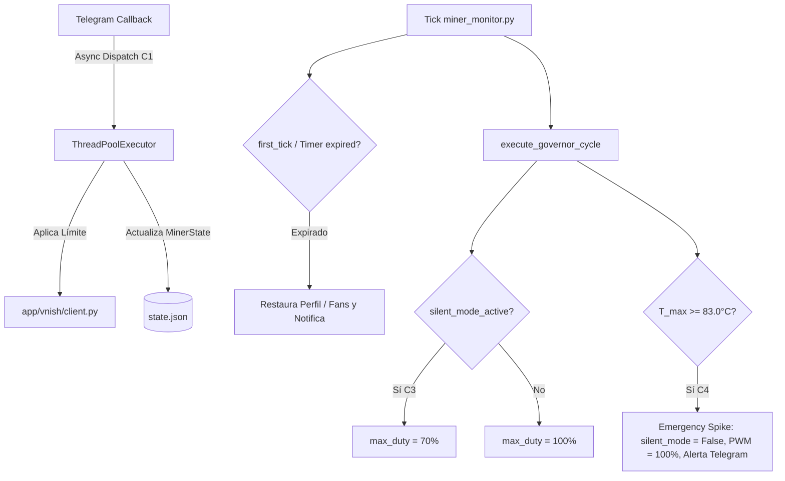

# Plan de Implementación: Spec 044 - Modo Silencio Inteligente con Temporizador Persistente y Thermal Guard

## 1. Arquitectura y Componentes Involucrados

El Modo Silencio opera en la intersección de tres subsistemas clave:
1. **`app/telegram/command_center.py` & `callbacks.py`**: Interfaz de activación táctil con selector de duración.
2. **`app/governance/fan_governor.py`**: Modulación en lazo cerrado respetando límites dinámicos (Condición C3).
3. **`app/core/` & `miner_monitor.py`**: Loop principal de adquisición, verificación en `first_tick` (C2), temporizador en background y Thermal Guard (C4).

---

## 2. Fases de Implementación

### Fase 1: Extensión de Modelo de Estado y Persistencia (Condición C2)
- Extender dataclass `MinerState` en `app/core/` con campos `silent_mode_*`.
- Implementar serialización / deserialización en `save_state()` y `load_state()`.
- Agregar verificación de temporizador en `first_tick` dentro de `miner_monitor.py`.

### Fase 2: Despacho Asíncrono de Control (Condición C1)
- Crear función desacoplada `dispatch_silent_mode_action(miner_id, duration_minutes, target_duty)` en `app/telegram/callbacks.py` o módulo de gobernanza.
- Utilizar `ThreadPoolExecutor` para interactuar con la API de VNish sin bloquear el hilo de polling.
- Responder de forma síncrona `answerCallbackQuery` notificando inicio de la acción.

### Fase 3: Integración Dinámica con Fan Governor (Condición C3)
- Modificar el punto de construcción de `GovernorConfig` en `miner_monitor.py` / `execute_governor_cycle`.
- Si `silent_mode_active == True`, setear `max_fan_duty_percent = state.silent_mode_target_max_duty` (default 70%).
- Permitir modulación descendente o ascendente dentro del corredor seguro [40%, 70%].

### Fase 4: Thermal Guard y Protocolo de Emergencia (Condición C4)
- En el branch de `ACTION_EMERGENCY_SPIKE` o `FAILSAFE_FAULT` de `execute_governor_cycle`:
  - Resetear `state.silent_mode_active = False` y `state.silent_mode_revert_ts = None`.
  - Persistir `save_state()` inmediatamente bajo `state_lock`.
  - Forzar comando a VNish con duty al 100%.
  - Encolar mensaje de alerta de emergencia a `_TELEGRAM_QUEUE`.

### Fase 5: Expiración Automática y Notificación
- En cada ciclo del loop principal de `miner_monitor.py`, evaluar si algún minero en silencio tiene `revert_ts <= time.time()`.
- Restaurar automáticamente el duty previo / preset y enviar mensaje:
  `🔔 ⏱️ MODO SILENCIO FINALIZADO: Mineros restaurados a máxima potencia de producción.`

### Fase 6: Pruebas Exhaustivas y Certificación
- Implementar `tests/test_silent_mode.py`:
  - Test de no bloqueo con mock de VNish lento (C1).
  - Test de recuperación de estado tras reinicio (C2).
  - Test de coexistencia con el Governor (C3).
  - Test de Thermal Guard a 83.0°C (C4).
- Suite global completa: 587+ tests PASS.

---

## 3. Asignación de Modelo (Protocolo Multi-Modelo)
- **Fase de Implementación Crítica**: Delegar a **Claude Sonnet 4.6 (Thinking)** para la manipulación de concurrencia en hilos, cerrojos `state_lock`, estados en `MinerState` y coexistencia del Governor.
- **Fase de Tests y Documentación**: **Gemini 3.8 Flash High**.
