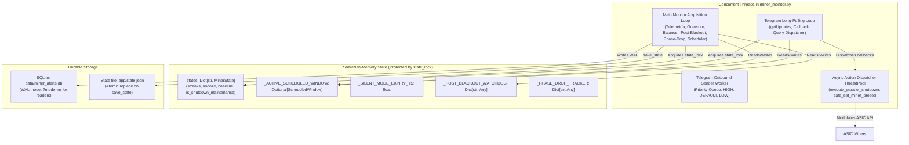

# Implementation Plan: V4 Governance Concurrency Hardening & Release Stabilization (Spec 053)

**Feature**: V4 Core Governance Concurrency & Release Stabilization  
**Risk Class**: HIGH  
**Assigned Engine**: **Gemini 3.8 Flash High**  
**Gate**: Release Candidate V4 (v4.0.0)  

---

## 1. Concurrency Architecture & Interaction Model

---

## 2. Detailed Execution Phases

### Phase 1: Static Concurrency Audit & Code Hardening
- Audit `app/miner_monitor.py`:
  * Ensure all access to `_ACTIVE_SCHEDULED_WINDOW` in Telegram command handlers (`/schedule_maintenance`, `/scheduled`, callback `sch:cancel`) and main loop is thread-safe.
  * Verify `save_state()` creates atomic shallow copies of `states` and dictionaries before writing to disk, avoiding `RuntimeError` during concurrent modification.
  * Verify callback queries answer Telegram promptly before spawning background operations (`answer_callback_query` latency < 1.0s).

### Phase 2: Comprehensive Mobile Compliance Validator
- Implement `tests/test_mobile_compliance.py`:
  * Systematically invoke every card generator function across `app/common/mobile_layout.py`, `app/governance/fleet_shutdown.py`, `app/governance/post_blackout.py`, `app/governance/phase_drop_discriminator.py`, `app/governance/maintenance_scheduler.py`, etc.
  * Assert that for every single line returned, `visible_line_width(line) <= 32`.

### Phase 3: High-Contention Concurrency Test Suite
- Implement `tests/test_v4_concurrency.py`:
  * Test concurrent calls to `save_state()` while multiple threads mutate `MinerState` and scheduled maintenance windows.
  * Test simultaneous callback processing and command handling under simulated queue delay.
  * Verify zero deadlocks, zero uncaught exceptions, and zero state corruption under 50+ concurrent iterations.

### Phase 4: Full Regression Suite & Release Audit
- Execute complete project test suite (target $\ge 795$ tests PASS).
- Verify 100% clean execution with zero failures, errors, or regressions.

### Phase 5: Release Certification & Governance Closeout
- Update `DEVELOPMENT_LOG.md` with newest entry.
- Update `ROADMAP.md` and `SPEC_PROGRAM.md`.
- Finalize `tasks.md` and `evidence.md`.
- Execute local Git commit and remote push for V4 Release Stabilization.
