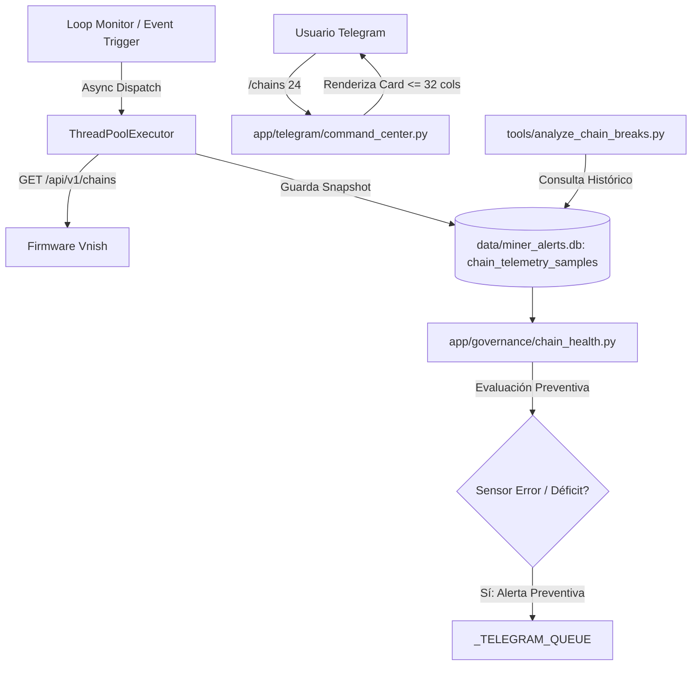

# Plan de Implementación: Spec 054 - Telemetría Profunda por Cadena y Diagnóstico Predictivo de Hashboard

## 1. Arquitectura y Componentes Involucrados

---

## 2. Fases de Implementación

### Fase 1: Esquema de Base de Datos y Migración v7
- Implementar migración v6 -> v7 en `app/core/event_store.py` (o módulo de base de datos) para crear la tabla `chain_telemetry_samples` con índices optimizados.
- Crear funciones de inserción y consulta en `app/core/`.

### Fase 2: Colector Asíncrono de Cadenas Vnish
- Crear módulo desacoplado `app/vnish/chain_collector.py`:
  - `fetch_miner_chains(host, password, timeout=2.5) -> List[ChainTelemetry]`
  - Manejo estricto de timeouts, códigos HTTP y parseo resiliente de JSON.
- Integrar ejecución en `app/miner_monitor.py`:
  - Disparo periódico en background (cada 15 a 30 minutos).
  - Disparo reactivo inmediato ante eventos `reboot_detected`, `state_transition` a `HASHBOARD`/`LOW` o eventos de firmware `chain_break`.

### Fase 3: Motor de Salud y Diagnóstico Predictivo
- Crear `app/governance/chain_health.py`:
  - `assess_chain_health(samples: List[ChainTelemetry]) -> ChainHealthAssessment`
  - Detección de fallas de sensores I2C (`sensors_error_count > 0`).
  - Detección de déficits crónicos de rendimiento por placa.
  - Enriquecimiento de contexto en incidentes `restart_detected` (aislamiento de placa culpable).

### Fase 4: Interfaz de Usuario y Comando `/chains`
- Agregar comando `/chains [minero]` en `app/telegram/command_center.py` y catálogo de ayuda.
- Renderizar tarjetas Mobile-First verticales respetando la regla `visible_line_width <= 32`.
- Botón interactivo de refresco en 1 toque.

### Fase 5: Herramienta Analítica de Historial
- Crear herramienta de línea de comandos `tools/analyze_chain_breaks.py` para análisis de correlación retrospectiva sobre los datos acumulados en SQLite.

### Fase 6: Pruebas Unitarias, Integración y Certificación
- Crear suite `tests/test_chain_health.py` y `tests/test_chain_collector.py`.
- Validar compilación con `py_compile`.
- Certificar ejecución limpia de la suite completa de pruebas sin regresiones.
