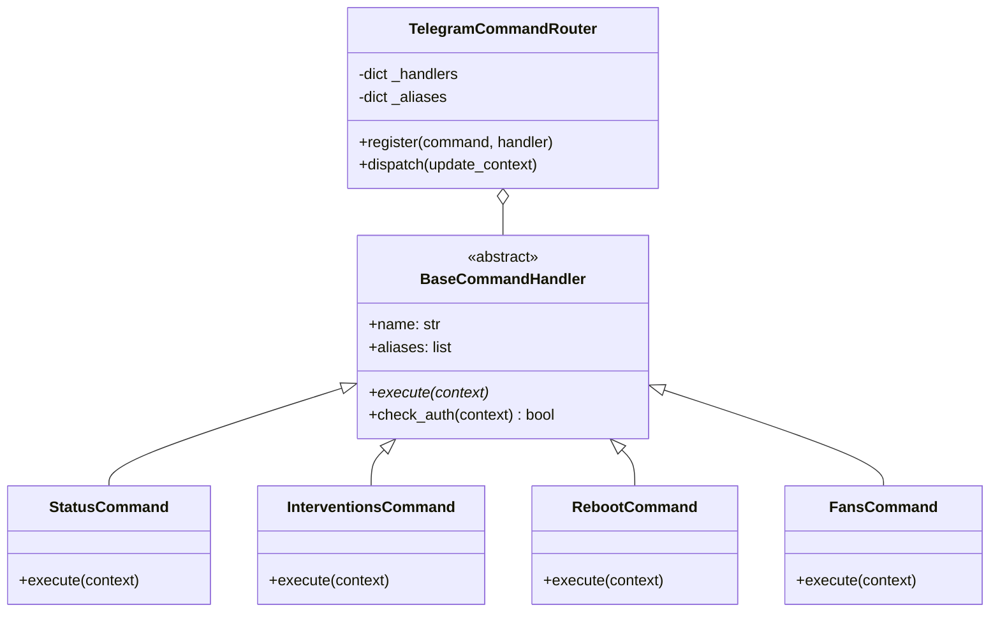

# Feature Specification: Spec 058 — Telegram Command Center & Dispatcher Modularization (MT-01)

**Feature Directory**: `specs/058-telegram-dispatcher-modularization`  
**Created**: 2026-09-15  
**Status**: Draft  
**Initiative**: MT-01 (Horizonte V5.0 — Modularización Arquitectónica)  
**Input**: Desacoplar el bucle procedural y los manejadores de comandos y callbacks de Telegram (hoy ~3,500 LOC en `app/miner_monitor.py`) en una arquitectura limpia y modular basada en router y command handlers independientes (`app/telegram/router.py`, `app/telegram/commands/*`, `app/telegram/poller.py`), reduciendo drásticamente la deuda técnica del monolito con 100% de retrocompatibilidad, cero regresiones operativas y preservando la suite de 902 tests.

---

## User Scenarios & Testing

### User Story 1 - Despacho Modular de Comandos de Texto (Priority: P1)

Como operador de la granja minera que interactúa a diario vía Telegram enviando comandos (`/estado`, `/resumen`, `/fans`, `/intervenciones`, `/ayuda`, `/diagnostico`, `/snooze`, `/calidad`, `/estabilidad`, etc.), deseo que cada comando sea procesado de forma idéntica y transparente por un módulo handler especializado y aislado, para garantizar que un fallo o cambio en un comando nunca comprometa ni congele el hilo de Telegram ni el ciclo de supervisión de los mineros.

**Why this priority**: Es la superficie de control principal del operador. Extraer los 20+ comandos inline fuera de `telegram_polling_worker` elimina ~2,000 líneas de código espagueti de `miner_monitor.py`.

**Independent Test**: Enviar cualquier comando de texto (ej. `/status`, `/help`, `/fans`, `/interventions`) y verificar que la respuesta, formato markdown, teclado inline asociado y tiempos de entrega sean exactamente iguales al baseline previo.

**Acceptance Scenarios**:
1. **Given** el bot en ejecución con el nuevo router, **When** el operador autorizado envía `/estado`, **Then** el router despacha a `StatusCommand`, el cual consulta `states` con el lock adecuado y devuelve la tarjeta de estado Mobile-First en menos de 500 ms.
2. **Given** un usuario no autorizado (chat_id no coincide), **When** envía cualquier comando, **Then** el guardián de autenticación del router rechaza la solicitud de inmediato sin invocar los actuadores ni revelar datos de la flota.
3. **Given** un comando desconocido o malformado, **When** el operador lo envía, **Then** el router envía el mensaje de ayuda de fallback sin generar excepciones no controladas.

---

### User Story 2 - Despacho Desacoplado de Callbacks Táctiles e Inline Keyboards (Priority: P1)

Como operador que utiliza los botones táctiles del Command Center (`/menu`), confirmaciones de reinicio en dos pasos (`rb_req`, `rb_cfm`), selectores de mantenimiento (`sd_*`, `res_*`) y silenciado (`snz:*`), deseo que las pulsaciones sean reconocidas instantáneamente (<50 ms con `answerCallbackQuery`) y ejecutadas por despachadores dedicados, de modo que la interfaz táctil permanezca ultra-fluida.

**Why this priority**: Los callbacks táctiles concentran la lógica más delicada de interacción: confirmaciones de reinicio con tokens de seguridad efímeros y comandos de apagado/reanudación en paralelo.

**Independent Test**: Tocar un botón de navegación en `/menu` (ej. `Métricas` o `Intervenciones`) o un toggle táctil, y verificar la actualización in-place del mensaje sin parpadeo y con respuesta inmediata de la UI.

**Acceptance Scenarios**:
1. **Given** un mensaje con teclado inline del Command Center, **When** el operador toca un botón de navegación (`cc:nav:metrics`), **Then** el router de callbacks ejecuta `handle_command_center_callback`, responde el ACK en <50 ms y actualiza el texto y teclado del mensaje en tiempo real.
2. **Given** una solicitud de reinicio de dos pasos (`rb_req`), **When** el operador solicita reiniciar, **Then** se genera un token criptográfico efímero de confirmación con teclado de 1 toque `[ ✅ Confirmar Reinicio ]` / `[ ❌ Cancelar ]`, idéntico al comportamiento constitucional.

---

### User Story 3 - Worker de Long Polling Limpio y Robusto (Priority: P2)

Como administrador del sistema de monitoreo, deseo que el bucle de recepción de Telegram (`telegram_polling_worker`) sea un proceso conciso de menos de 150 líneas dedicado exclusivamente a consumir `getUpdates`, gestionar offsets, controlar la tasa de peticiones y delegar el mensaje al `TelegramCommandRouter`, para que el hilo sea fácil de supervisar, depurar y reiniciar.

**Why this priority**: Actualmente `telegram_polling_worker` en `miner_monitor.py` tiene casi 3,000 líneas. Un error sintáctico o de excepción no capturada en un comando anidado corre el riesgo de tirar abajo el polling.

**Independent Test**: Simular ráfagas de mensajes y desconexiones de red, verificando que el worker limpia la cola sin fugas de memoria y recupera la conexión automáticamente con backoff exponencial.

**Acceptance Scenarios**:
1. **Given** un corte temporal de acceso a la API de Telegram, **When** el poller falla con timeout de red, **Then** reintenta con backoff exponencial sin saturar los logs y sin afectar al hilo autoritativo 4028.

---

## Functional Requirements

1. **FR-01 (Arquitectura del Router)**:
   - Crear `app/telegram/router.py` con una clase `TelegramCommandRouter` que registre mapeos entre identificadores canónicos de comandos/alias y sus respectivos `CommandHandler`.
   - La resolución de alias debe soportar comandos en español e inglés (`estado`/`status`, `reiniciar`/`reboot`, `intervenciones`/`interventions`, `silencio`/`silent`).

2. **FR-02 (Interfaz Base de Comandos)**:
   - Crear `app/telegram/commands/base.py` con la clase abstracta `BaseCommandHandler` que formalice el contrato:
     * `can_handle(cmd_name: str) -> bool`
     * `execute(context: TelegramRequestContext) -> None`
     * Validación unificada de autenticación (`chat_id`).

3. **FR-03 (Paquete de Comandos Especializados)**:
   - Modularizar los comandos en `app/telegram/commands/`:
     * `status.py`: Comandos `/status`, `/estado`, `/resumen`, `/metrics`.
     * `fans.py`: Comandos `/fans`, `/silent`, `/silencio`.
     * `interventions.py`: Comandos `/interventions`, `/intervenciones`, `/contingency`.
     * `reboot.py`: Comandos `/reboot`, `/reiniciar`, `/reboot_no_ok`, `/cancel_reboot`.
     * `diagnostics.py`: Comandos `/diagnose`, `/diagnostico`, `/chart`, `/health`, `/quality`.
     * `maintenance.py`: Comandos `/snooze`, `/schedule_maintenance`, `/cancel_maintenance`.
     * `help.py`: Comando `/help`, `/ayuda`.

4. **FR-04 (Despacho Unificado de Callbacks)**:
   - Integrar el despacho de callbacks (`cc:*`, `help:*`, `diag:*`, `rb_*`, `snz:*`) bajo un router dedicado `TelegramCallbackRouter`.
   - Preservar la función existente `_handle_command_center_callback` en `miner_monitor.py` como facade delegatoria hacia `app/telegram/callbacks.py` para garantizar 100% de compatibilidad con los tests existentes.

5. **FR-05 (Reducción de Líneas en Monolito)**:
   - Reducir `app/miner_monitor.py` en al menos **2,500 líneas de código**, dejando únicamente las delegaciones y el ciclo principal de supervisión.

---

## Success Criteria

1. **SC-01**: La suite completa de pruebas unitarias y de integración (**902 tests**) debe pasar al 100% sin una sola regresión.
2. **SC-02**: Se incorporan al menos **25 tests nuevos** dedicados a probar unitariamente los command handlers y el router sin dependencias de red.
3. **SC-03**: `app/miner_monitor.py` reduce su tamaño desde 9,724 líneas a menos de 7,200 líneas en esta especificación.
4. **SC-04**: El tiempo de respuesta de cualquier comando de Telegram no supera los 500 ms en condiciones nominales.
5. **SC-05**: El servicio de Windows `MinerAlerts` opera de forma continua y sin interrupción tras el despliegue.

---

## Key Entities & Architecture Diagram

---

## Assumptions & Boundaries

- **Preservación de Estado**: `states` sigue siendo la fuente de verdad en memoria, protegido por `state_lock`. Los handlers reciben una referencia segura o snapshot.
- **Jerarquía Anti-Deadlock**: Toda persistencia originada en los handlers invocará `_build_state_payload()` con `state_lock` y `_flush_state_payload()` fuera del lock, respetando la regla establecida en QW-04.
- **No-Silence Policy**: Si un handler falla internamente con una excepción imprevista, el router capturará el error y enviará una notificación de fallo amigable al operador, evitando dejarlo en silencio.
