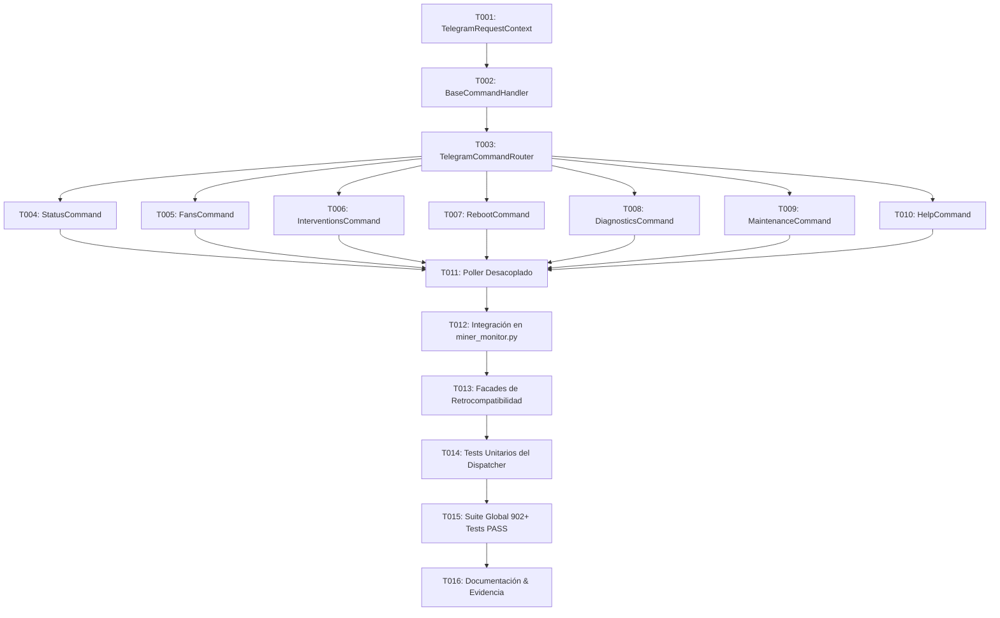

# Tasks: Spec 058 — Telegram Command Center & Dispatcher Modularization (MT-01)

**Branch**: `codex/022-adaptive-acquisition` | **Date**: 2026-09-15 | **Plan**: [plan.md](plan.md)  
**Status**: Ready for Implementation  

---

## Task Dependencies & Flow

---

## Tasks

### Iteración 1: Interfaces, Contexto y Router Central

- [x] **T001**: Crear `app/telegram/context.py` implementando `TelegramRequestContext` con campos para `config`, `bot_token`, `chat_id`, `miners`, `states`, `state_lock`, `state_path`, `event_store`, `hashcore_cfg`, `qa_mode`, `qa_allow_actions`, `token_registry`, y helpers de persistencia `save_state_safely()`.
- [x] **T002**: Crear `app/telegram/commands/base.py` con `BaseCommandHandler`, manejando parseo de tokens, verificación estricta de autorización por `chat_id`, y manejo defensivo de excepciones.
- [x] **T003**: Crear `app/telegram/router.py` con `TelegramCommandRouter` (registro de comandos, resolución de alias en español/inglés, despacho) y `TelegramCallbackRouter`.

### Iteración 2: Handlers de Comandos Modulares

- [x] **T004**: Implementar `app/telegram/commands/status.py` gestionando `/status`, `/estado`, `/resumen`, `/metrics` y tarjetas Mobile-First.
- [x] **T005**: Implementar `app/telegram/commands/fans.py` gestionando `/fans`, `/silent`, `/silencio`.
- [x] **T006**: Implementar `app/telegram/commands/interventions.py` gestionando `/interventions`, `/intervenciones`, `/contingency` y temporizadores de reactivación.
- [x] **T007**: Implementar `app/telegram/commands/reboot.py` gestionando `/reboot`, `/reiniciar`, `/reboot_no_ok`, `/cancel_reboot` y flujo en dos pasos.
- [x] **T008**: Implementar `app/telegram/commands/diagnostics.py` gestionando `/diagnose`, `/diagnostico`, `/chart`, `/health`, `/quality`.
- [x] **T009**: Implementar `app/telegram/commands/maintenance.py` gestionando `/snooze`, `/schedule_maintenance`, `/cancel_maintenance`.
- [x] **T010**: Implementar `app/telegram/commands/help.py` gestionando `/help`, `/ayuda`.

### Iteración 3: Worker de Polling y Conexión en `miner_monitor.py`

- [x] **T011**: Crear `app/telegram/poller.py` con `run_telegram_poller` limpio (<150 LOC) gestionando `getUpdates`, offsets, colas y backoff exponencial de red.
- [x] **T012**: Conectar el nuevo router en `app/miner_monitor.py` dentro de `telegram_polling_worker`, eliminando el bloque procedural redundante.
- [x] **T013**: Asegurar fachadas de retrocompatibilidad en `app/miner_monitor.py` (`_handle_command_center_callback`, etc.) para proteger todos los tests existentes.

### Iteración 4: Certificación, Pruebas y Cierre

- [x] **T014**: Crear `tests/test_telegram_dispatcher.py` con cobertura completa de ruteo, alias, validación de autenticación y fallbacks.
- [x] **T015**: Ejecutar la suite completa de pruebas unitarias y de integración asegurando **902+ tests PASS**.
- [x] **T016**: Actualizar `docs/audit/DEVELOPMENT_LOG.md`, `docs/speckit/ROADMAP.md` y generar `specs/058-telegram-dispatcher-modularization/evidence.md`.
