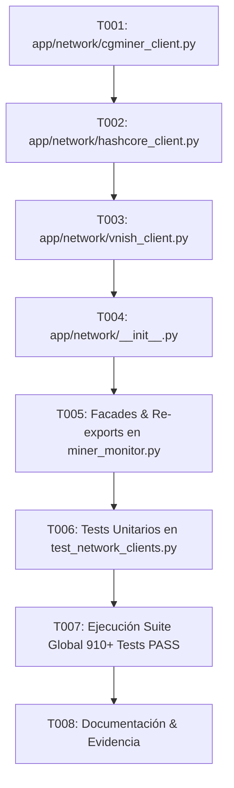

# Tasks: Spec 059 — Network Protocols & Hardware Clients Extraction (MT-02)

**Branch**: `codex/022-adaptive-acquisition` | **Date**: 2026-09-15 | **Plan**: [plan.md](plan.md)  
**Status**: Completed (928/928 Tests PASS)  

---

## Task Dependencies & Flow

---

## Tasks

### Iteración 1: Extracción de Clientes de Red y Hardware

- [x] **T001**: Crear `app/network/cgminer_client.py` implementando:
  - Clase `CGMinerClient` encapsulando la conexión TCP 4028.
  - Función `query_cgminer(host, port, command, parameter=None, timeout=5.0)`.
  - Funciones de lectura: `read_summary`, `read_stats_snapshot`, `read_stats_active_boards`, `read_pools`, `read_version`.
  - Helpers puros: `count_active_boards`, `extract_temps`, `fw_hint` y sus alias retrocompatibles (`_count_active_boards`, `_extract_temps`, `_fw_hint`).
  - Manejo robusto de errores de red (socket timeouts, JSONDecodeError, stripping de `\x00`).
- [x] **T002**: Crear `app/network/hashcore_client.py` implementando:
  - Clase `HashcoreClient` encapsulando la ejecución del toolkit CLI.
  - Funciones standalone: `run_hashcore_cli`, `run_hashcore_discovery`, `get_hashcore_cli_path` (y alias `_hashcore_cli_path`).
  - Respeto a banderas de seguridad QA (`qa_mode`, `qa_allow_actions`) y ejecución en Windows sin apertura de consolas con `CREATE_NO_WINDOW = 0x08000000`.
- [x] **T003**: Crear `app/network/vnish_client.py` implementando:
  - Clase `VnishClient` estructurada para control y telemetría de mineros Vnish.
  - Métodos tipados para unlock, lock, enfriamiento, autotuning/overclock y soft restart de minado.
  - Re-exportación íntegra de las funciones primitivas de `app/vnish/client.py`.
- [x] **T004**: Crear `app/network/__init__.py` exponiendo todas las clases y funciones públicas del paquete.

### Iteración 2: Conexión y Fachadas en `miner_monitor.py`

- [x] **T005**: Reemplazar las definiciones procedurales de socket 4028 y Hashcore CLI en `app/miner_monitor.py` por importaciones y fachadas desde `app.network`:
  - Re-exportar `read_summary`, `read_stats_snapshot`, `read_stats_active_boards`, `read_pools`, `read_version`, `_read_command`, `_count_active_boards`, `_extract_temps`, `_fw_hint`.
  - Re-exportar `run_hashcore_cli`, `run_hashcore_discovery`, `_hashcore_cli_path`.
  - Preservar exactamente los nombres y contratos que las suites de pruebas inspeccionan en `miner_monitor.py` y `main()`.

### Iteración 3: Pruebas, Validación y Certificación

- [x] **T006**: Crear `tests/test_network_clients.py` con pruebas unitarias exhaustivas para:
  - `CGMinerClient` y parsers (summary, stats, pools, version, conteo de placas, temperaturas).
  - `HashcoreClient` (bloqueo en modo QA, generación de argumentos de comando, manejo de subprocess).
  - `VnishClient` (métodos orientados a objetos y manejo de errores de red).
- [x] **T007**: Ejecutar `py_compile` en todos los archivos modificados y correr la suite completa de pruebas unitarias asegurando **928 tests PASS** (910 baseline + 18 nuevos).
- [x] **T008**: Actualizar `evidence.md`, `ROADMAP.md`, `DEVELOPMENT_LOG.md` y `prompt.txt`.
