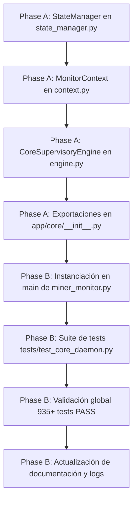

# Tasks: Spec 060 — Monitor Core Daemon & State Manager Architecture (ST-01 / ST-02 - Milestone V5.0)

**Branch**: `codex/022-adaptive-acquisition` | **Date**: 2026-09-15 | **Plan**: [plan.md](plan.md)  
**Status**: Completed (935/935 Tests PASS)  

---

## Task Dependencies & Flow

---

## Tasks

### Fase A: Creación de Módulos de Infraestructura Limpia
- [x] **T001**: Implementar `app/core/state_manager.py` con `StateManager`, `build_payload` (L1), `flush_payload` (L2), `save`, `get_state` y `update_state`.
- [x] **T002**: Implementar `app/core/context.py` con `@dataclass MonitorContext` y la factoría `build_monitor_context` para transporte DI de dependencias.
- [x] **T003**: Implementar `app/core/engine.py` con `CoreSupervisoryEngine` y `TickResult` con soporte para hooks de ciclo.
- [x] **T004**: Exportar clases públicas en `app/core/__init__.py`.

### Fase B: Conexión, Integración y Certificación
- [x] **T005**: Instanciar `state_manager` y `monitor_ctx` en `main()` de `app/miner_monitor.py` preservando 100% de los contratos de inspección estática.
- [x] **T006**: Crear `tests/test_core_daemon.py` con 7 pruebas unitarias para `StateManager`, `MonitorContext` y `CoreSupervisoryEngine`.
- [x] **T007**: Ejecutar suite completa con `unittest discover` asegurando **935/935 tests PASS** (cero regresiones).
- [x] **T008**: Actualizar `ACTION_PLAN_V5_MODULARIZATION.md`, `ROADMAP.md`, `DEVELOPMENT_LOG.md`, `AGENTS.md` y `prompt.txt`.
