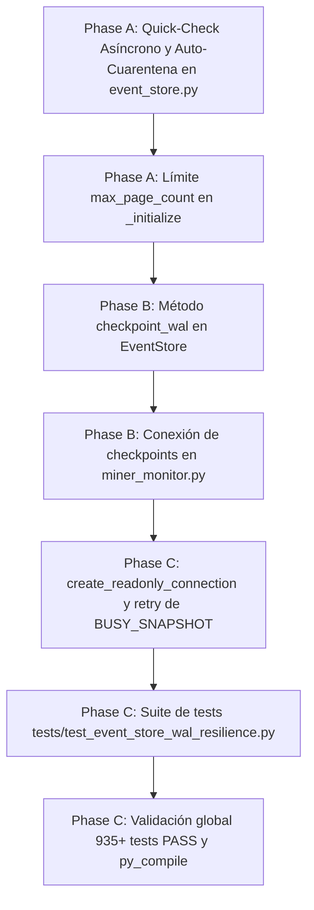

# Tasks: Spec 061 — Resiliencia SQLite WAL Mode & Integrity Check (ST-03)

**Branch**: `codex/022-adaptive-acquisition` | **Date**: 2026-09-15 | **Plan**: [plan.md](plan.md)
**Status**: Completed

---

## Task Dependencies & Flow

---

## Tasks

### Fase A: Integridad Asíncrona y Prevención de Corrupción en Arranque
- [x] **T001**: Implementar `_integrity_check_worker` como hilo daemon en `app/core/event_store.py` que ejecute `PRAGMA quick_check;` de forma asíncrona, con aislamiento atómico a `miner_alerts_corrupt_<epoch>.db` y auto-recreación limpia del esquema v7 si hay corrupción.
- [x] **T002**: Configurar `PRAGMA max_page_count = 262144;` (~1 GB límite blando) en `EventStore._initialize()` para prevenir saturación de disco en Windows NTFS.

### Fase B: Gestión Determinista de Checkpointing
- [x] **T003**: Implementar `EventStore.checkpoint_wal(mode="PASSIVE") -> Tuple[int, int, int]` en `app/core/event_store.py`, devolviendo `(busy, log_frames, checkpointed_frames)`.
- [x] **T004**: Conectar la invocación periódica de `checkpoint_wal("PASSIVE")` en el mantenimiento horario y `checkpoint_wal("TRUNCATE")` en la ventana de mantenimiento diario en `app/miner_monitor.py`.

### Fase C: Concurrencia Multi-Lector y Suite de Pruebas
- [x] **T005**: Implementar `create_readonly_connection(db_path: Path, timeout: float = 3.0)` y helper `execute_readonly_with_retry` con backoff exponencial (100ms, 200ms, 400ms) ante `SQLITE_BUSY_SNAPSHOT` en `app/core/event_store.py`.
- [x] **T006**: Desarrollar suite de pruebas unitarias y de estrés en `tests/test_event_store_wal_resilience.py` cubriendo integridad asíncrona, cuarentena, checkpoints PASSIVE/TRUNCATE y concurrencia multi-lector bajo escritura continua.
- [x] **T007**: Ejecutar `py_compile`, verificar que los 935 tests base sigan pasando (cero regresiones) y validar que el servicio Windows `MinerAlerts` continúe en estado `Running`.
