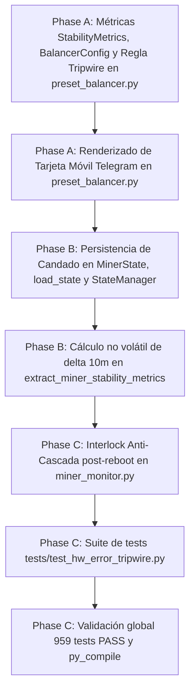

# Tasks: Spec 062 — HW Error Tripwire & Rollback Automático de Overclock (GOV-01)

**Branch**: `codex/022-adaptive-acquisition` | **Date**: 2026-09-15 | **Plan**: [plan.md](plan.md)
**Status**: Completed

---

## Task Dependencies & Flow

---

## Tasks

### Fase A: Dominio Puro de Balancer y Regla de Tripwire
- [x] **T001**: Extender `StabilityMetrics` y `BalancerConfig` con métricas y umbrales de HW errors en `app/governance/preset_balancer.py`, e implementar la regla de disparo `ACTION_STEP_DOWN_HW_ERRORS` e inhibición de step-up bajo candado en `evaluate_balancer_step()`.
- [x] **T002**: Implementar la función de renderizado `render_hw_error_tripwire_card()` con restricción estricta de ancho de línea `<= 32` columnas.

### Fase B: Persistencia de Candado y Extracción de Métricas SQLite
- [x] **T003**: Añadir `hw_error_lock_until_ts` y `hw_error_locked_preset` a `MinerState` en `app/miner_monitor.py`, y actualizar `load_state`, `_build_state_payload` y `_serialise_miner_state` en `app/core/state_manager.py`.
- [x] **T004**: Implementar en `extract_miner_stability_metrics()` de `app/governance/preset_balancer.py` la consulta a `telemetry_samples` de SQLite para calcular `hw_errors_delta_10m` y `hw_error_rate_pct` comparando el sample $T$ contra el sample $T - 10\text{m}$.

### Fase C: Interlock Anti-Cascada y Batería de Pruebas
- [x] **T005**: Conectar en `execute_periodic_balancer()` la activación del candado de 48 horas al decidir `ACTION_STEP_DOWN_HW_ERRORS`, y en el ciclo de monitoreo de `app/miner_monitor.py` la restauración defensiva de `hw_error_locked_preset` post-reboot si el firmware vuelve al default.
- [x] **T006**: Desarrollar suite completa de pruebas unitarias y de integración en `tests/test_hw_error_tripwire.py` cubriendo disparo de tripwire, umbrales absolutos y porcentuales, candado de 48h, ciclo anti-cascada adversarial post-reboot y tarjeta móvil.
- [x] **T007**: Ejecutar `py_compile`, verificar que los 946 tests base sigan pasando (cero regresiones, 959 tests PASS) y validar que el servicio Windows `MinerAlerts` continúe en estado `Running`.
