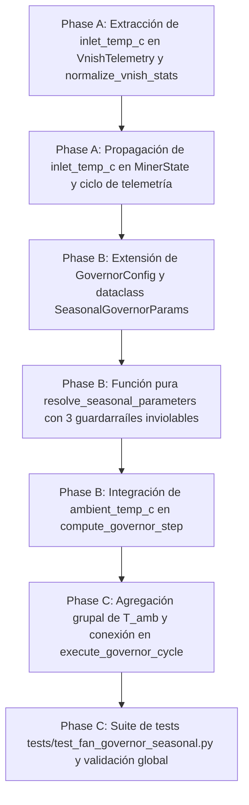

# Tasks: Spec 063 — Gobernador Térmico con Conciencia Estacional (Ambient-Aware Thermal PID) (GOV-02)

**Branch**: `codex/022-adaptive-acquisition` | **Date**: 2026-09-15 | **Plan**: [plan.md](plan.md)
**Status**: Completed

---

## Task Dependencies & Flow

---

## Tasks

### Fase A: Extracción de Telemetría de Entrada
- [x] **T001**: Añadir `inlet_temp_c: Optional[float] = None` a `VnishTelemetry` y soportar la extracción de sensores de entrada (`temp_in`, `temp_pcb_in`, `temp_inlet`) en `normalize_vnish_stats()` de `app/vnish/telemetry.py`.
- [x] **T002**: Añadir `inlet_temp_c: Optional[float] = None` a `MinerState` en `app/miner_monitor.py` y actualizar la asignación tras invocar `normalize_vnish_stats()`.

### Fase B: Dominio Puro y Guardarraíles Inviolables
- [x] **T003**: Extender `GovernorConfig` en `app/governance/fan_governor.py` con parámetros estacionales (`seasonal_enabled`, umbrales de temperatura y pisos de PWM).
- [x] **T004**: Implementar la función pura `resolve_seasonal_parameters(ambient_temp_c, config)` garantizando matemáticamente los 3 guardarraíles inviolables: techo máx target 82.0°C, piso mín 30% PWM y protección de pico térmico.
- [x] **T005**: Integrar el parámetro opcional `ambient_temp_c: Optional[float] = None` en `compute_governor_step()`, adaptando target, deadband, min_duty y step_up según la estación activa.

### Fase C: Integración en Monitor y Batería de Pruebas
- [x] **T006**: En `execute_governor_cycle()` de `app/miner_monitor.py`, calcular la temperatura ambiente media por grupo eléctrico o flota y suministrar `ambient_temp_c` a `compute_governor_step()`. Documentar claves en `app/config.example.json`.
- [x] **T007**: Desarrollar suite completa en `tests/test_fan_governor_seasonal.py` cubriendo transiciones de modos invierno/estándar/verano, guardarraíles inviolables (85°C siempre 100% PWM), fallbacks ante sensores anómalos y verificar que los 959 tests globales pasen sin regresiones.
