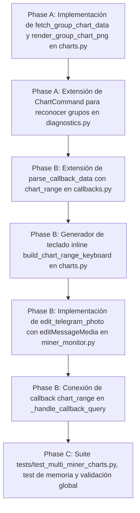

# Tasks: Spec 064 — Telemetría Visual y Gráficos Comparativos Multi-Miner en Telegram (UX-01)

**Branch**: `codex/022-adaptive-acquisition` | **Date**: 2026-09-15 | **Plan**: [plan.md](plan.md)
**Status**: Completed

---

## Task Dependencies & Flow

---

## Tasks

### Fase A: Gráficos de Grupo y Multi-Miner
- [x] **T001**: Implementar `fetch_group_chart_data(db_path, group_name, configured_miners, hours, now_ts)` y `render_group_chart_png(group_data, hours)` en `app/telegram/charts.py` con subplots duales (hashrate superior, temperatura inferior) y colores consistentes.
- [x] **T002**: Extender `ChartCommand` en `app/telegram/commands/diagnostics.py` para detectar objetivos de grupo eléctrico (ej. `elevator_1`, `elevator_2`) y adjuntar el teclado inline de rangos temporales.

### Fase B: Selector Interactivo y Actualización In-Place
- [x] **T003**: Extender `parse_callback_data()` en `app/telegram/callbacks.py` para soportar la acción `chart_range:<target>:<hours>`.
- [x] **T004**: Implementar la función auxiliar `build_chart_range_keyboard(target, current_hours)` en `app/telegram/charts.py` generando botones `[ 1h ] [ 6h ] [ 24h ] [ 7d ]` con indicación visual del rango activo.
- [x] **T005**: Implementar `edit_telegram_photo(bot_token, chat_id, message_id, photo_bytes, caption, reply_markup)` en `app/miner_monitor.py` utilizando `editMessageMedia` con `multipart/form-data` y `attach://file_0`.
- [x] **T006**: Conectar el procesamiento de callbacks `chart_range` en `_handle_callback_query` de `app/miner_monitor.py`, actualizando la imagen in-place y respondiendo con popup de confirmación vía `answer_callback_query`.

### Fase C: Validación, Rendimiento de Memoria y Cierre
- [x] **T007**: Desarrollar suite completa en `tests/test_multi_miner_charts.py` cubriendo gráficos de grupo, teclado inline, `edit_telegram_photo`, prueba de estabilidad de memoria (100 renders sin fugas en `matplotlib`) y certificar 985+ tests globales PASS.
