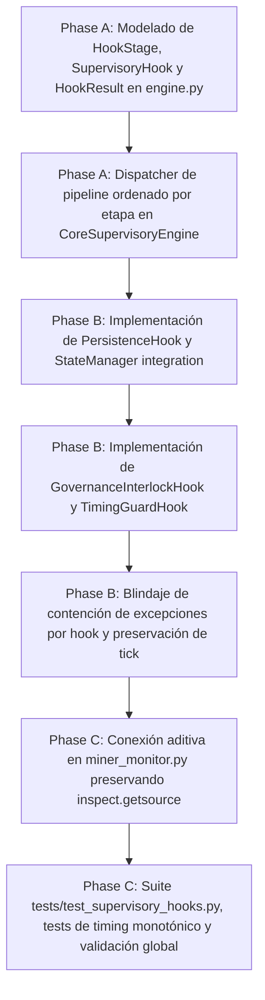

# Tasks: Spec 065 — Pipeline Declarativo de Hooks en CoreSupervisoryEngine (ST-04)

**Branch**: `codex/022-adaptive-acquisition` | **Date**: 2026-09-15 | **Plan**: [plan.md](plan.md)
**Status**: Completed

---

## Task Dependencies & Flow

---

## Tasks

### Fase A: Abstracción de Etapas y Modelo de Hooks
- [x] **T001**: Definir `HookStage` (enum ordenado con etapas `PRE_TICK`, `ACQUISITION`, `DETECTION`, `GOVERNANCE`, `ACTUATOR`, `PERSISTENCE`, `POST_TICK`), clase base `SupervisoryHook` y dataclass `HookResult` en `app/core/engine.py`.
- [x] **T002**: Extender `CoreSupervisoryEngine` con `register_hook(hook)` y método de ejecución por etapas `execute_tick(states, last_update_id_ref, now_ts)` asegurando orden determinista.

### Fase B: Hooks Canónicos y Contención Defensiva
- [x] **T003**: Implementar `PersistenceHook` en `app/core/engine.py` delegando en `StateManager.save()` fuera de `state_lock`.
- [x] **T004**: Implementar `GovernanceInterlockHook` (evaluación de expiración de gobernanza y ventanas de mantenimiento) y `TimingGuardHook` (medición y telemetría de latencia de etapas).
- [x] **T005**: Incorporar bloque de contención defensiva en `execute_tick()`: captura de excepciones por hook individual, registro en `TickResult.errors` y garantía de continuidad para etapas críticas de persistencia.

### Fase C: Integración Aditiva y Validación Integral
- [x] **T006**: Conectar el pipeline declarativo de hooks en `main()` de `miner_monitor.py` de forma aditiva y transparente, verificando la compatibilidad estricta con todos los tests de `inspect.getsource(main)`.
- [x] **T007**: Desarrollar suite completa en `tests/test_supervisory_hooks.py` (orden de etapas, aislamiento de errores, test de timing monotónico ante hooks rápidos vs lentos) y certificar 996+ tests globales PASS con el servicio Windows `MinerAlerts` activo.

