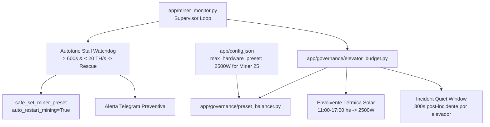

# Implementation Plan: Spec 078 — Supresión de Ruido Eléctrico en Elevadores, Watchdog Anti-Autotune Stall y Gobernanza Térmica Solar

## 1. Arquitectura y Módulos Afectados

### Componente 1: `app/governance/elevator_budget.py` (Extensiones de Dominio Puro)
1. **Incident Quiet Window (300s)**:
   - Añadir a `FacilityBudgetState`:
     - `incident_quiet_window_s: float = 300.0`
     - `last_group_incident_ts: Dict[str, float] = field(default_factory=dict)`
     - Método `record_group_incident(group_name: str, now_ts: float) -> None`
     - Método `is_group_in_incident_quiet(group_name: str, now_ts: float) -> Tuple[bool, float]`
   - En `can_facility_transition_miner`:
     - Si el grupo del minero está en reposo post-incidente, rechazar la transición con motivo `INCIDENT_QUIET_WINDOW`.
2. **Envolvente Térmica Solar (Solar Thermal Envelope)**:
   - Función pura `evaluate_solar_thermal_envelope(now_dt: datetime, max_chip_temp_c: float = 0.0) -> Tuple[bool, str, str]`:
     - Ventana 11:00 a 17:00 hs (hora local UTC-3):
       - Techo base: `"2500W"`.
       - Si `max_chip_temp_c >= 82.0°C`, gatillo preventivo forzado a `"2500W"`.
       - Retorna `(is_solar_window, target_preset, reason)`.
3. **Soporte para `max_hardware_preset` por Minero**:
   - `get_miner_max_hardware_preset(miner_config: dict, default_preset: str = "2700W") -> str`
   - En `choose_optimal_pair_presets`: limitar la potencia máxima de cada minero a su techo físico.

### Componente 2: `app/governance/preset_balancer.py` (Lógica de Decisión)
1. Inyectar `max_hardware_preset` en la evaluación de candidatos:
   - Si un minero tiene `current_power >= hardware_limit_w`, retornar `ACTION_HOLD_HARDWARE_LIMIT`.
2. Integrar `is_group_in_incident_quiet`:
   - Si el grupo sufrió un incidente reciente ($< 300\text{s}$), retornar `ACTION_HOLD_INCIDENT_QUIET`.

### Componente 3: `app/miner_monitor.py` (Watchdog de Producción y Orquestación)
1. **Watchdog Anti-Autotune Stall**:
   - En el ciclo de supervisión, trackear el tiempo acumulado continuo en estado `auto-tuning`.
   - Si `autotune_duration > autotune_timeout_s` (600s) y `hashrate < 20.0 TH/s`:
     - Disparar desescalada inmediata de rescate (`safe_set_miner_preset` con `auto_restart_mining=True`).
     - Activar cerrojo `hardware_ceiling_lock[miner_name] = True`.
     - Enviar alerta preventiva a Telegram.
2. **Registro de Incidentes en Grupos Eléctricos**:
   - En eventos de reinicio inesperado o disparo de contingencia adaptativa, invocar `facility_budget_state.record_group_incident(group_name, now_ts)`.
3. **Integración de Envolvente Solar**:
   - En horario 11:00-17:00 hs, aplicar el techo solar de 2500W con prioridad sobre el modo valle estándar.

### Componente 4: Configuración y Documentación
- Actualizar `app/config.example.json` documentando `max_hardware_preset`, `autotune_timeout_s` y `incident_quiet_window_s`.

---

## 2. Fases de Ejecución

- **Fase 1**: Crear especificación (`spec.md`), plan (`plan.md`) y tareas (`tasks.md`). Actualizar `.specify/feature.json`.
- **Fase 2**: Implementar extensiones de dominio puro en `app/governance/elevator_budget.py` y tests unitarios en `tests/test_elevator_budget.py`.
- **Fase 3**: Implementar integración con `app/governance/preset_balancer.py`.
- **Fase 4**: Implementar watchdog anti-autotune stall y orquestación en `app/miner_monitor.py`.
- **Fase 5**: Desarrollar suite de pruebas dedicada en `tests/test_autotune_watchdog.py`.
- **Fase 6**: Ejecución de suite de regresión completa ($\ge 1300$ tests PASS) y verificación de sintaxis (`py_compile`).
- **Fase 7**: Registro en `docs/audit/DEVELOPMENT_LOG.md`, actualización de `ROADMAP.md` y `evidence.md`.
