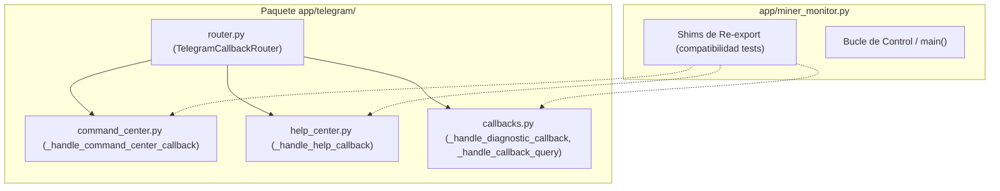

# Implementation Plan: Spec 087 — Desacoplamiento de Callbacks de Telegram

**Feature**: `087-telegram-callbacks-decoupling`  
**Baseline**: 1522 tests PASS, 75 subtests PASS  
**Target Reduction**: -1.450 LOC en `app/miner_monitor.py`  

---

## 1. Technical Architecture & Module Placement



---

## 2. Step-by-Step Implementation Sequence

### Paso 1: Migración de `_handle_command_center_callback`
* **Origen**: [`app/miner_monitor.py`](file:///F:/02-ASIC%20-%20mineros/miner-alerts/app/miner_monitor.py#L3755-L4261) (aprox. 506 líneas).
* **Destino**: [`app/telegram/command_center.py`](file:///F:/02-ASIC%20-%20mineros/miner-alerts/app/telegram/command_center.py).
* **Dependencias**: Importar helpers de envío (`edit_message_text`, `answer_callback_query`) desde `app.telegram.messages` o via context.
* **Verificación**: `pytest tests/test_telegram_callbacks.py` (PASS).

### Paso 2: Migración de `_handle_help_callback`
* **Origen**: [`app/miner_monitor.py`](file:///F:/02-ASIC%20-%20mineros/miner-alerts/app/miner_monitor.py#L4262-L4307) (aprox. 45 líneas).
* **Destino**: [`app/telegram/help_center.py`](file:///F:/02-ASIC%20-%20mineros/miner-alerts/app/telegram/help_center.py).
* **Verificación**: `pytest tests/test_help_center.py` (PASS).

### Paso 3: Migración de `_handle_diagnostic_callback` y `_handle_callback_query`
* **Origen**: [`app/miner_monitor.py`](file:///F:/02-ASIC%20-%20mineros/miner-alerts/app/miner_monitor.py#L4308-L5228) (aprox. 920 líneas).
* **Destino**: [`app/telegram/callbacks.py`](file:///F:/02-ASIC%20-%20mineros/miner-alerts/app/telegram/callbacks.py).
* **Verificación**: `pytest tests/test_telegram_callbacks.py` (PASS).

### Paso 4: Desacoplamiento de `app/telegram/router.py`
* En [`app/telegram/router.py`](file:///F:/02-ASIC%20-%20mineros/miner-alerts/app/telegram/router.py#L154-L195):
  - Reemplazar los `from app.miner_monitor import _handle_command_center_callback` por:
    `from app.telegram.command_center import _handle_command_center_callback`
    `from app.telegram.help_center import _handle_help_callback`
    `from app.telegram.callbacks import _handle_diagnostic_callback`
* El despachador de callbacks de Telegram queda 100% autocontenido en el paquete `app.telegram`.

### Paso 5: Re-exports de Compatibilidad en `app/miner_monitor.py`
* Reemplazar las 1.450 líneas eliminadas en `miner_monitor.py` con:
  ```python
  from app.telegram.command_center import _handle_command_center_callback
  from app.telegram.help_center import _handle_help_callback
  from app.telegram.callbacks import _handle_diagnostic_callback, _handle_callback_query
  ```
* Ningún test unitario existente se rompe porque las funciones siguen importables desde `app.miner_monitor`.

---

## 3. Verification & Quality Gates

1. **Compilación de Sintaxis**:
   ```powershell
   & ".\.venv\Scripts\python.exe" -m py_compile app\telegram\command_center.py
   & ".\.venv\Scripts\python.exe" -m py_compile app\telegram\help_center.py
   & ".\.venv\Scripts\python.exe" -m py_compile app\telegram\callbacks.py
   & ".\.venv\Scripts\python.exe" -m py_compile app\telegram\router.py
   & ".\.venv\Scripts\python.exe" -m py_compile app\miner_monitor.py
   ```
2. **Suite de Pruebas Unitarias**:
   ```powershell
   & ".\.venv\Scripts\python.exe" -m pytest -q
   ```
   * Requisito: $\ge 1522$ tests PASS, 0 fallos, 0 errores.
3. **Compuerta de Preflight**:
   ```powershell
   & ".\tools\preflight_stabilize.ps1"
   ```
   * Requisito: 8/8 gates PASS.
4. **Reinicio Seguro de Servicio Windows**:
   ```powershell
   Restart-Service MinerAlerts
   ```
   * Requisito: `SERVICE_RUNNING` sin excepciones en `logs/err.log`.
