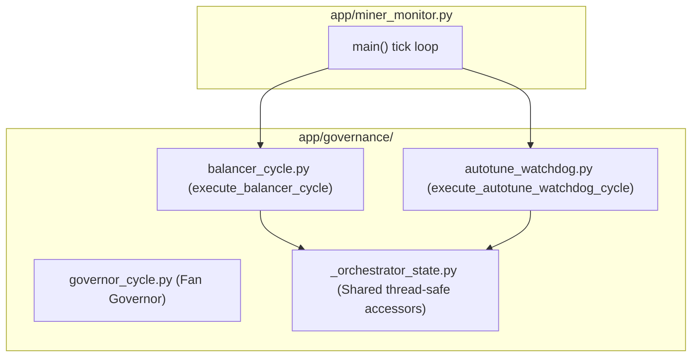

# Implementation Plan: Spec 088 — Desacoplamiento de Ciclos de Gobernanza

**Feature**: `088-governance-cycles-decoupling`  
**Dependencies**: Requiere Spec 087 cerrada  
**Target Reduction**: -850 LOC en `app/miner_monitor.py`  

---

## 1. Technical Architecture & Module Placement



---

## 2. Step-by-Step Implementation Sequence

### Paso 1: Creación de `app/governance/balancer_cycle.py`
* Migrar `execute_balancer_cycle` de `miner_monitor.py` (L3362-L3614).
* Conectar con `app.governance.preset_balancer` y `app.governance.intervention_policy`.
* Proteger mutaciones de presets bajo `state_lock`.

### Paso 2: Encapsulamiento en `app/governance/autotune_watchdog.py`
* Migrar `check_autotune_watchdog` de `miner_monitor.py` (L3615-L3754) como `execute_autotune_watchdog_cycle`.
* Conectar con `app.vnish.presets.safe_set_miner_preset`.

### Paso 3: Re-exports y Wiring en `app/miner_monitor.py`
* En `miner_monitor.py`, re-exportar:
  ```python
  from app.governance.balancer_cycle import execute_balancer_cycle
  from app.governance.autotune_watchdog import check_autotune_watchdog
  ```
* En el bucle principal de `main()`, invocar las funciones modularizadas.

---

## 3. Verification & Quality Gates

1. `py_compile app/governance/balancer_cycle.py app/governance/autotune_watchdog.py app/miner_monitor.py`.
2. `pytest tests/test_autotune_watchdog.py tests/test_reboot_decision_audit.py` (PASS).
3. Suite global `pytest -q` ($\ge 1522$ tests PASS).
4. `preflight_stabilize.ps1` (8/8 gates PASS).
5. Reinicio seguro de servicio Windows `MinerAlerts`.
