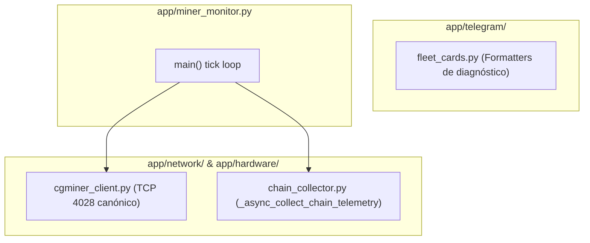

# Implementation Plan: Spec 089 — Telemetría de Cadenas & Sockets ASIC

**Feature**: `089-hardware-telemetry-decoupling`  
**Dependencies**: Requiere Spec 088 cerrada  
**Target Reduction**: -1.000 LOC en `app/miner_monitor.py`  

---

## 1. Technical Architecture & Module Placement

---

## 2. Step-by-Step Implementation Sequence

### Paso 1: Creación de `app/hardware/chain_collector.py`
* Migrar `_async_collect_chain_telemetry` y `_async_evaluate_predictive_chain_break` (L2944–L3361).
* Conectar con `app.vnish.client` y SQLite EventStore.

### Paso 2: Eliminación de Sockets Duplicados en `miner_monitor.py`
* Eliminar implementaciones redundantes de `read_summary`, `read_stats_snapshot`, `read_pools`, `read_version` (L1078–L1107).
* Re-exportar desde `app/network/cgminer_client.py`.

### Paso 3: Migración de Formateadores de Texto
* Mover `build_stability_health_text`, `build_mining_quality_text`, `build_firmware_events_text`, `build_miner_diagnosis_text` (L2150–L2436) a `app/telegram/fleet_cards.py`.
* Dejar shims de re-export en `miner_monitor.py`.

---

## 3. Verification & Quality Gates

1. `py_compile app/hardware/chain_collector.py app/network/cgminer_client.py app/telegram/fleet_cards.py app/miner_monitor.py`.
2. `pytest tests/test_chain_health.py tests/test_mining_quality.py tests/test_stability_profile.py` (PASS).
3. Suite global `pytest -q` ($\ge 1522$ tests PASS).
4. `preflight_stabilize.ps1` (8/8 gates PASS).
5. Reinicio seguro de servicio Windows `MinerAlerts`.
