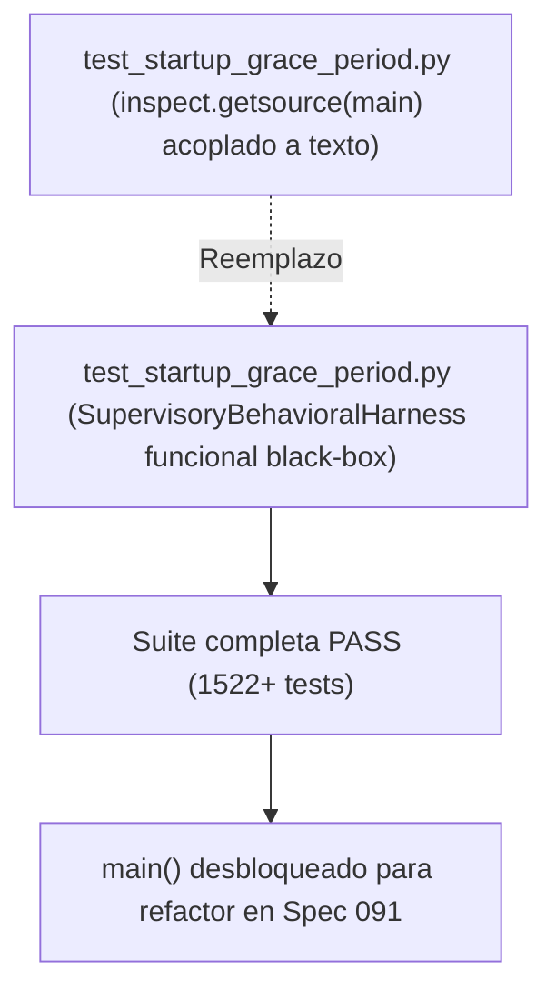

# Implementation Plan: Spec 090 — Modernización de Tests Invariantes

**Feature**: `090-test-invariants-modernization`  
**Dependencies**: Requiere Spec 089 cerrada  
**Target Outcome**: Desbloqueo arquitectónico de `main()` sin relajar contratos de seguridad.

---

## 1. Technical Architecture & Verification Strategy

---

## 2. Step-by-Step Implementation Sequence

### Paso 1: Refactorización de `TestStartupGraceInvariantContracts`
* En `tests/test_startup_grace_period.py`:
  - Reemplazar las comprobaciones de `source.index(...)` por pruebas conductuales directas:
    * Escenario A: `startup_guard_active == True` $\rightarrow$ auto-reboot bloqueado.
    * Escenario B: `sustained_low < threshold` $\rightarrow$ auto-reboot bloqueado por `not_sustained`.
    * Escenario C: `interlock.allowed == False` $\rightarrow$ auto-reboot bloqueado por interlock.
    * Escenario D: `cooldown active` $\rightarrow$ auto-reboot bloqueado por cooldown.
    * Escenario E: Todas las compuertas superadas $\rightarrow$ Hashcore ejecutado.
  - Esto valida matemáticamente la precedencia exacta sin acoplarse al código fuente plano de `main`.

### Paso 2: Auditoría Integral de `inspect.getsource`
* Ejecutar búsqueda en `tests/` para verificar que ninguna otra prueba inspeccione el texto de `main()`.

---

## 3. Verification & Quality Gates

1. `pytest tests/test_startup_grace_period.py` (PASS).
2. Suite global `pytest -q` ($\ge 1522$ tests PASS).
3. `preflight_stabilize.ps1` (8/8 gates PASS).
